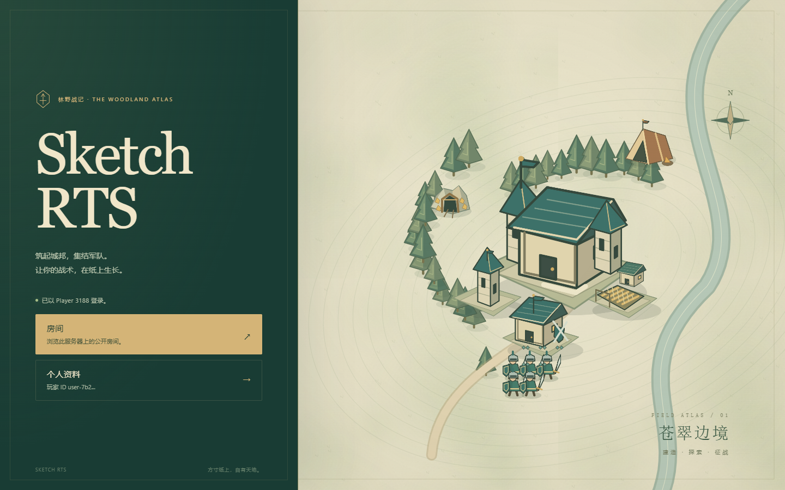
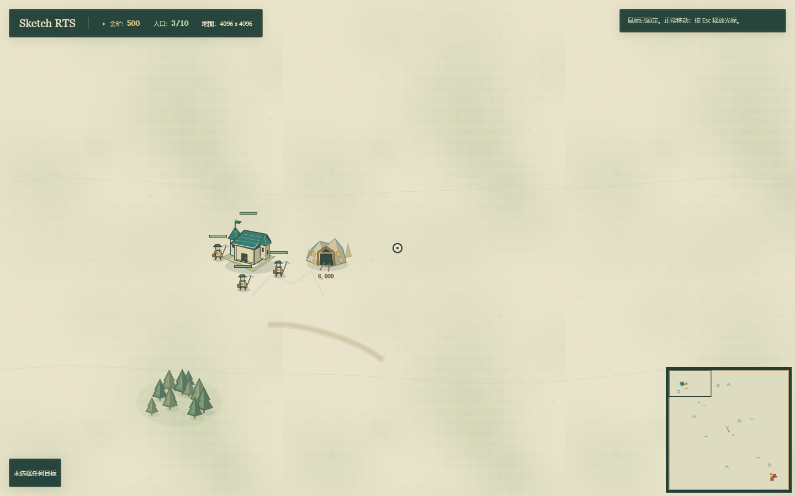
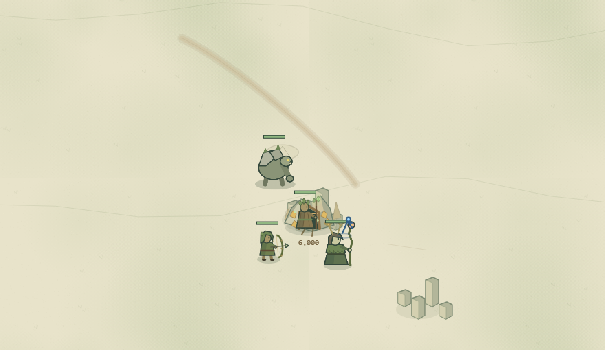
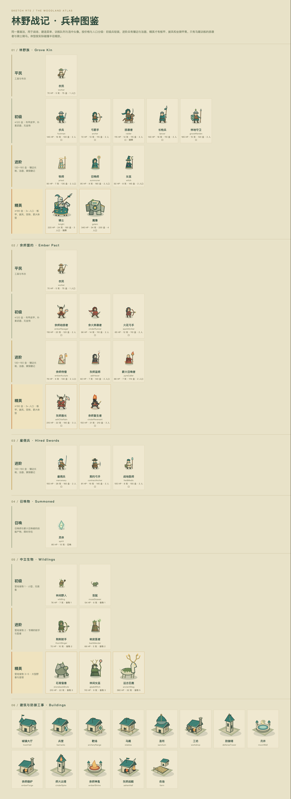

# Sketch RTS

**A browser RTS with a hand-drawn world and programmable opponents.**

[中文说明](docs/README.zh.md) · [Quick start](#quick-start) · [Screenshots](#screenshots) · [SDK & AI](#sdk--ai) · [Art notes](docs/woodland-atlas.md)



Build a base, send workers to the gold mines, and lead your army across the map. Train melee, ranged, and caster units; contest neutral camps; recruit mercenaries; and use items and upgrades to turn a fight.

Play in the browser, face a computer opponent, or write one yourself. The SDK, replay tools, and AI benchmarks use the same command-frame simulation as the game.

> **In development.** Browser play, multiplayer, and AI tooling are being actively refined. The current visual style is **Woodland Atlas**: parchment maps, evergreen panels, brass accents, and illustrated units and buildings.

## What you can do

| Play | Build and experiment |
| --- | --- |
| Gather gold, build bases, and train armies | Control matches through a TypeScript SDK |
| Explore maps with neutral camps, mercenaries, and items | Compose AI policies that issue ordinary player commands |
| Set up rooms, play against AI, and spectate hosted matches | Inspect snapshots, advance simulation ticks, and save or replay matches |
| Run locally in the browser or share a hosted server | Compare AI versions with parallel benchmarks and a dashboard |

## Races and units

Both races build town halls, farms, and defense towers, train workers, and can hire mercenaries (mercenary, contract archer, field medic) at neutral camps. Everything else differs.

| | Grove Kin | Ember Pact |
| --- | --- | --- |
| Basic troops | Footman, lancer, grove warden (barracks); archer (archery range); raider (stables) | Ember ravager, cinder runner (ember forge); spark archer (cinder spire) |
| Casters | Priest, summoner, witch (sanctum) | Ember acolyte, ash hexer, pyre caller (cinder spire) |
| Elites | Knight (stables); golem (workshop) | Ash chieftain, cinder revenant (ashen hall) |
| Healing building | Moon well | Ember shrine |

- **Heavy armor.** The four elites take half damage from shooters and casters and 70% from towers. Melee blows land in full.
- **Ember's elites have their own jobs.** The ash chieftain deals 50% extra damage to casters and summoned units. The cinder revenant has less health but regenerates 7 health per second.
- **Units fight back.** A unit hit while it has no orders turns on its attacker, and idle soldiers within 300 come to help, so a shooter can't pick off an idle army from outside its reach. A unit that starts its own chase gives up after 600 and walks back. Move orders and orders you give yourself are never overridden.

## Quick start

Use **Node.js 20.19+ or 22.12+** and npm.

```bash
git clone https://github.com/shuxueshuxue/sketch-rts.git
cd sketch-rts
npm ci
npm run dev
```

Open **[localhost:5173](http://127.0.0.1:5173/)**. This starts the hosted development server, including the room API and SDK endpoints.

1. Open **Rooms → Create Room**.
2. Choose a map. Keep one human slot and one computer slot for a first match.
3. Start the match and click the mouse-lock prompt to enter the battlefield.
4. Select a worker, right-click a gold mine, then build a barracks and train your first soldiers.

The interface follows your browser language: English or Simplified Chinese.

| Control | Action |
| --- | --- |
| Left-click / drag | Select a unit or building / select multiple units |
| Right-click | Move, gather gold, or attack the clicked target |
| `B` with a worker selected | Open the building palette |
| Button hotkeys | Build, train, research, or cast the displayed command |
| Arrow keys / `WASD` | Move the camera; available command hotkeys take priority |
| `Esc` | Release the mouse; cancel an active targeting mode |

## Screenshots

A match in progress: workers gathering gold, a barracks under construction, and a worker in the training queue.



A neutral camp guarding a gold mine: a stoneback brute, a thorn slinger, a bark mender, and a glade witch.



<details>
<summary><strong>View all 30 unit designs, grouped by faction and tier, and 13 building designs</strong></summary>



</details>

The illustrations are drawn with Canvas and reused across the battlefield, portraits, and command buttons. How much gear a unit wears follows its cost: basic troops (≤120 gold) wear cloth and leather, advanced casters and mercenaries (130–160 gold) get trimmed robes and focus items, and elites (190+ gold, 3+ supply) get plate, capes, and plumes. Only stables units — the raider and the knight — ride. See the [art notes and placement preview](docs/woodland-atlas.md) for a closer look.

## Choose a runtime

| Mode | Use it for | Where the match runs |
| --- | --- | --- |
| Static browser | Local games against AI; static hosting | In the browser, without a game backend |
| Hosted server | Shared rooms, multiplayer, spectators, SDK access, and benchmarks | A server manages rooms and coordinates command frames |

### Static browser

After installing dependencies, start a local game without the room backend:

```bash
npm run dev:static
```

Build a static site with `npm run build:static` and serve the generated `dist/` directory.

<details>
<summary>Windows PowerShell commands</summary>

The static npm scripts use Bash-style environment assignments. In PowerShell, set the variable explicitly:

```powershell
$env:VITE_SKETCH_RTS_DEPLOYMENT = 'static'
npx vite --host 127.0.0.1 --port 5173
```

For a static production build, use `npm run build` with that variable set. To return to hosted mode, remove it with `Remove-Item Env:VITE_SKETCH_RTS_DEPLOYMENT`.

</details>

### Hosted server

For local development, use `npm run dev`. To serve a production build on your network:

```bash
npm run build
NODE_ENV=production HOST=0.0.0.0 PORT=34573 npm run server
```

<details>
<summary>Windows PowerShell commands</summary>

```powershell
npm run build
$env:NODE_ENV = 'production'
$env:HOST = '0.0.0.0'
$env:PORT = '34573'
npm run server
```

</details>

Room links use hash routes such as `#room=room-id`, including when the game is hosted under a subpath. See [deployment details](docs/development.md#deployment-modes) for the server endpoints and runtime responsibilities.

## SDK & AI

The TypeScript SDK can create rooms, reset scenarios, inspect snapshots, issue commands, advance ticks, and save or replay matches. Run a hosted server first; import the SDK from this repository.

```ts
import { SketchRtsSdk } from './src/sdk/client';

const sdk = new SketchRtsSdk('http://127.0.0.1:5173');
const room = await sdk.createRoom({
  id: 'sdk-demo',
  host: { id: 'agent-host', name: 'Agent Host' },
  mapId: 'bareDuel',
  visibility: 'private',
  humanCount: 1,
  aiCount: 1,
});

const { snapshot } = await sdk.resetRoom(room.id, 'bareDuel', {
  aiPlayers: ['enemy'],
  races: { player: 'grove', enemy: 'ember' },
});

const worker = snapshot.units.find(u => u.owner === 'player' && u.kind === 'worker');
const mine = snapshot.resources.find(r => r.id === 'gold-player-main');
if (!worker || !mine) throw new Error('Missing starting worker or mine');

await sdk.roomCommand(room.id, 'player', {
  type: 'mine',
  unitIds: [worker.id],
  resourceId: mine.id,
});
```

AI policies read snapshots and emit ordinary `GameCommand` entries. Browser input, internal AI, external SDK agents, replays, and benchmarks all feed the shared command-frame runtime.

For a reproducible AI match from the terminal:

```bash
npm run play:ai -- new --file .playtest/match.json --map bareDuel --you v2 --enemy v1
npm run play:ai -- step-until --file .playtest/match.json --condition tick --tick 1200
npm run play:ai -- plan --file .playtest/match.json --owner v2
npm run play:ai -- commands
```

The last command prints the machine-readable command manifest. Full examples, AI policy composition, replay workflows, and benchmark commands are in the [developer guide](docs/development.md).

## Development

| Command | Purpose |
| --- | --- |
| `npm run dev` | Start the hosted development server |
| `npm run build` | Type-check and build the frontend |
| `npm run build:production` | Build the frontend and server bundle |
| `npm test -- --run` | Run the test suite once |
| `npx vitest --run src/client` | Run the frontend tests |
| `npm run test:sdk-smoke` | Start a test server and run SDK smoke checks |
| `npm run benchmark:ai` | Run AI benchmarks |

The hosted server also serves the benchmark dashboard at `benchmark.html`. See [the developer guide](docs/development.md#benchmark-system) and [AI specifications](docs/ai-spec.md) for experiment design and benchmark workflows.

### Adding a unit or building

A unit or building lives in two places:

1. **Rules:** a row in `UNIT_RULES` or `BUILDING_RULES` in [`src/shared/catalog.ts`](src/shared/catalog.ts). The row holds the stats, the building that trains the unit (`trainedAt`), its race, and any special rules as data (`armor`, `casterSlayer`, `regenPerSecond`). Unit and building kinds, each building's training list, and each race's roster are derived from these rows.
2. **Card:** an entry in [`src/client/content/`](src/client/content/). The card holds the English and Chinese name and description, the command icon and hotkey, the glyph, the art tier, and the function that draws it. Labels, tooltips, the command card, and the unit sheet all read from the cards.

If a card is missing, TypeScript reports it. `src/client/content/cards.test.ts` checks that every name and description exists in both languages, that each unit is trained at a building its race can build, and that no building or build menu repeats a hotkey. To see every unit and building drawn by the game's own code, run `npx vite` and open `/unit-sheet.html`.

## Roadmap

- More races, distinct tech trees, and unit abilities.
- Stronger AI, including experiments with LLM-driven scouting and strategy.
- Better reconnection, spectator tools, and multiplayer performance.
- Unit animation, richer combat feedback, and clearer onboarding.
- Map, campaign, and mod authoring tools.
- Easier distribution of the SDK and CLI for external agents.

## Credits

Sketch RTS is developed and discussed with the community on [linux.do](https://linux.do/).

The game takes inspiration from **Warcraft III**: workers and bases, neutral camps, distinct races, and the pacing of a small army growing into a larger battle.
