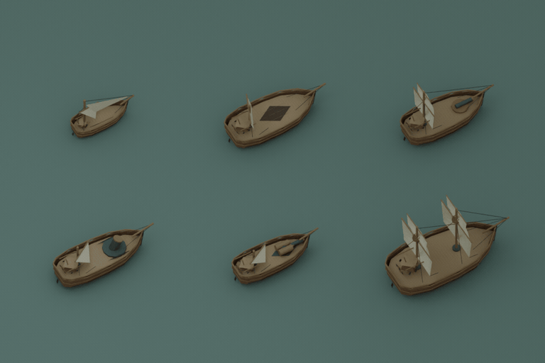
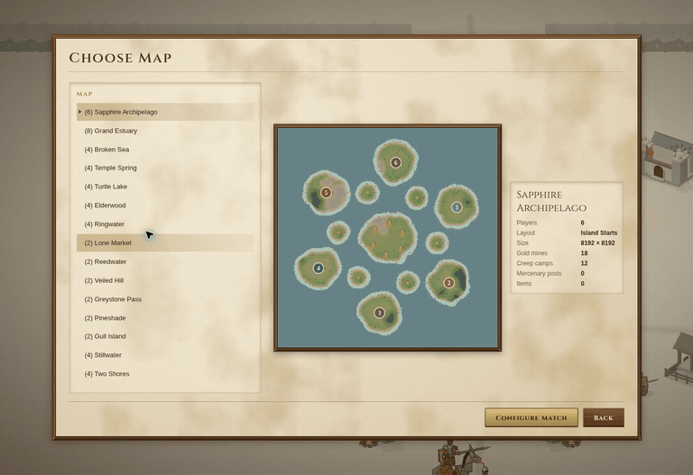
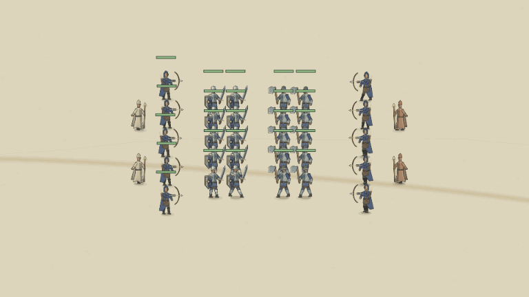

# Sketch RTS

A browser real-time strategy game built around physical land and sea combat. Grow an economy, command mixed armies, and turn ships into fighting platforms with real crews, cargo and weapons.

[Play online](https://lexicalmathical.com/sketch-rts/) · [中文](docs/README.zh.md) · [Developer guide](docs/development.md)



## What makes it different

- **Movement matters.** Ranged units aim before firing; moving beyond their aiming tolerance loses that preparation. Cavalry, melee troops and ranged units have different ways to approach a fight. Pre-aim a position to prepare an ambush.
- **Ships have working decks.** Crew occupy space and can cross touching decks or walk between a ship and the shore. Fit cannons to compatible mounts, bring a broadside to bear, repair damaged parts with workers, or board and capture an unguarded ship. Cutters retain their own bow attack independently of mounted guns.
- **Equipment has a physical place.** Characters wear head, body and foot equipment and share four carrying slots between hands and back. Ship holds carry goods and heavy weapons. Shops can deliver purchases directly to a chosen nearby character or ship.
- **Economy and terrain shape the match.** Grove and Ember have different rosters and technologies. Expand to gold mines, contest neutral camps and mercenary posts, and fight across islands, rivers and woodland. The named 2-, 4-, 6- and 8-player maps use reproducible generated layouts and ecological terrain fields.
- **Humans and programs share the game.** Play solo or multiplayer, choose V5/V7/V8 opponents, or write a controller with the TypeScript SDK. Commands, replays and AI benchmarks use the same simulation.

The project is in active development. English and Simplified Chinese are supported; playing requires a desktop keyboard and mouse. Ships and buildings use real-time 3D models with illustrated unit cards, Canvas terrain and interface overlays, with a Canvas fallback when WebGL2 is unavailable.

## Start playing

1. Open the [online game](https://lexicalmathical.com/sketch-rts/), choose a map, then configure the match.
2. Set teams, factions and human or AI seats. Choose a faction first to select a specific AI version; a random faction also uses a random compatible AI.
3. Create the room, invite friends if desired, and start when the human players are ready.

The address bar is the share link: the configuration URL carries the selected map and seat setup; after creation, the room URL identifies the room. Share the URL at the stage you want others to open.



Select a worker and right-click a gold mine to begin. Build your economy, train an army, and inspect command tooltips for costs, requirements and hotkeys. Select a ship and open **Hold / Fittings** to arrange its crew, cargo and weapons.

| Control | Action |
| --- | --- |
| Left-click / drag | Select / select a group |
| Right-click | Move or interact with the target |
| `A`, then click | Attack-move |
| `Shift` + order | Queue an order |
| `Shift` + `1`–`9` / `1`–`9` | Assign / recall a control group |
| `Tab` | Switch the focused unit type |
| `B` | Open a worker's build menu |
| `I` | Open character equipment or ship hold and fittings |
| `J`, then click | Pre-aim a position with eligible ranged units |
| Arrow keys / screen edges / minimap | Move the camera |
| `Esc` | Cancel targeting, close a panel or release the mouse |



## Run locally

Requires **Node.js 20.19+ or 22.12+** and npm.

```bash
git clone https://github.com/shuxueshuxue/sketch-rts.git
cd sketch-rts
npm ci
npm run dev
```

Open [localhost:5173](http://localhost:5173/).

| Command | Purpose |
| --- | --- |
| `npm run dev` | Game server with rooms and SDK endpoints |
| `npm run dev:static` | Local browser play without a backend |
| `npm test -- --run` | Run the test suite |
| `npm run build:production` | Build the client and server |
| `npm run record -- --list` | List reproducible recording scenes |

## Documentation

- [Developer guide](docs/development.md) — architecture, deployment, SDK, AI tools, sound packs and recording.
- [Physical naval combat and equipment (Chinese)](docs/physical-naval-and-equipment.zh.md) — decks, boarding, gun arcs, repair and item transfers.
- [World rendering (Chinese)](docs/rendering/world3d.zh.md) — real-time models, unit cards, resource loading and fallback rendering.
- [AI specification](docs/ai-spec.md) — policy architecture and behavior.

The ship GIF renders the current Blender models; the combat GIF records the shared simulation with the Node Canvas recorder; the setup GIF uses the live browser interface. Recording details are in the developer guide.

## Credits

Inspired by Warcraft III. Developed and discussed with the [linux.do](https://linux.do/) community. See [asset credits](docs/credits.md) for sound sources, font licenses and attribution. The repository includes a CC0 sound pack; separately hosted packs are not redistributed here.
