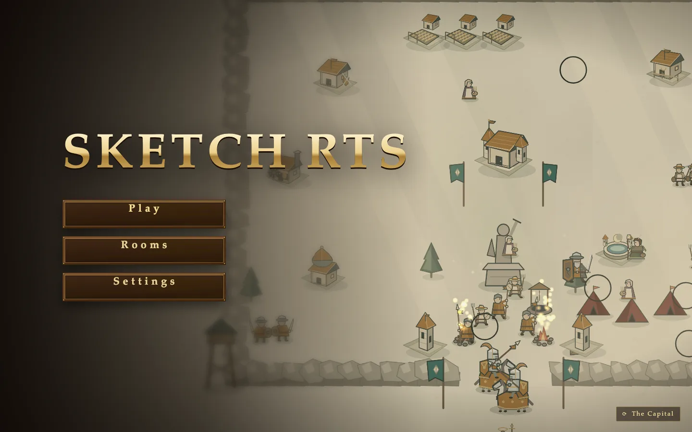
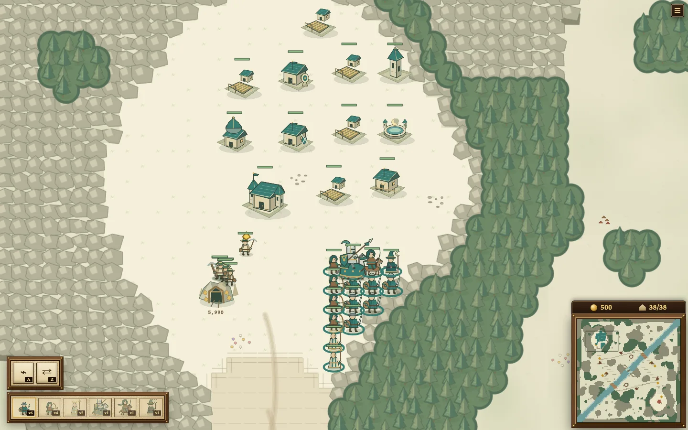
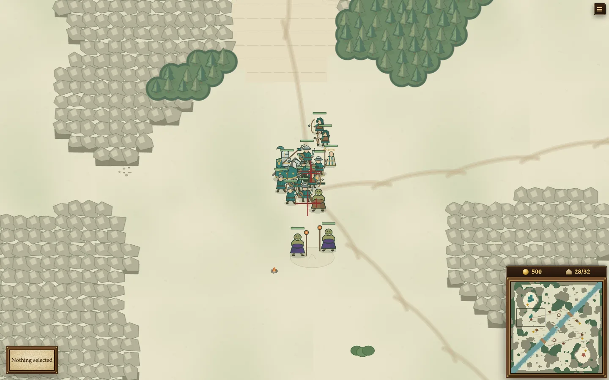
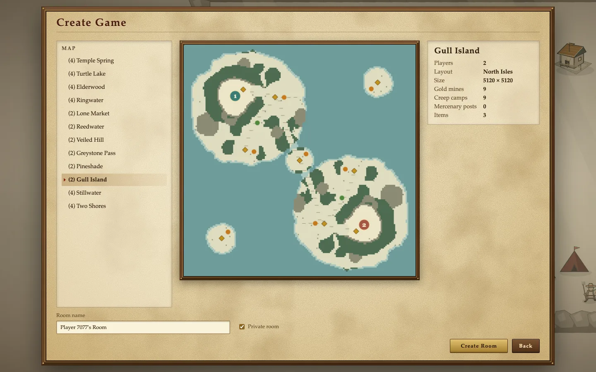
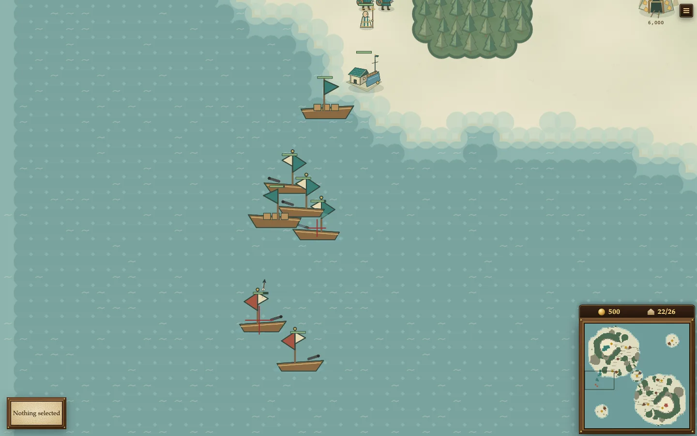
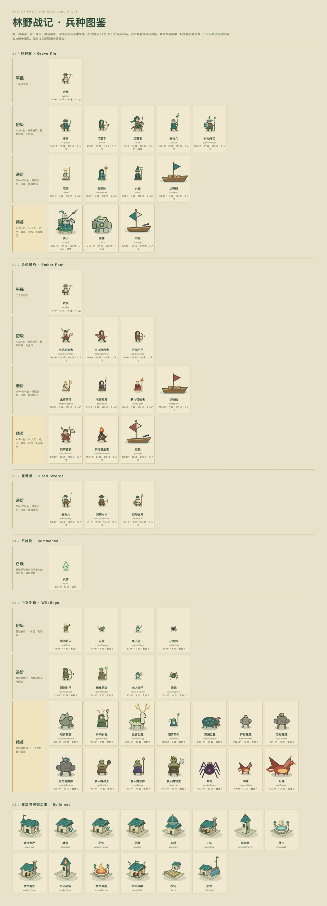

# Sketch RTS

**A browser real-time strategy game in the spirit of Warcraft III, with a hand-drawn world and programmable opponents.**

[中文说明](docs/README.zh.md) · [Play online](https://lexicalmathical.com/sketch-rts/) · [Quick start](#quick-start) · [How to play](#how-to-play) · [AI](#ai) · [Development](#development)



Build a base, send workers to the gold mines, and grow a small army into a large one. Two races with their own buildings and tech; casters, cavalry charges and heavy elites; neutral camps that guard the best mines, mercenaries for hire, and shops; warships and transports for maps cut by water. Every match runs on twelve maps drawn by a seeded generator after classic ladder maps.

Play in the browser against the computer, host a room for friends, or write an opponent yourself: the SDK, the replay tools, the AI benchmarks and the game all run the same command-frame simulation.

> **In development.** The rules, the AI and the maps change often; the hosted game follows the repository's `main` with some delay.

## The game



### Two races

Both races build town halls (which train workers), farms, defense towers and shipyards. Everything else is their own.

| | Grove Kin | Ember Pact |
| --- | --- | --- |
| Basic troops | Footman, lancer, grove warden (barracks); archer (archery range) | Ember ravager, cinder runner (ember forge); spark archer (cinder spire) |
| Advanced — supply cap 42 | Raider (stables); priest, summoner, witch (sanctum) | Ember acolyte, ash hexer, pyre caller (cinder spire) |
| Elite — supply cap 60 | Knight (stables); golem (workshop) | Ash chieftain, cinder revenant (ashen hall) |
| Healing building | Moon well | Ember shrine |
| Ships (shipyard) | Transport, warship | Transport, warship |

- **Supply is the tech.** Advanced units unlock at a supply cap of 42 and elites at 60. The cap counts the halls and farms you have built, not the supply in use: a farm gives 6 for 120 gold, a town hall 8. A locked unit stays on the command card, greyed, with the cap it waits for.
- **Upkeep.** From 51 supply in use, mined gold comes in at 70%; from 81, at 40%.
- **Heavy armor.** The four elites take half damage from shooters and casters and 70% from towers; melee blows land in full.
- **Spells have their own cooldowns**, as in Warcraft III: a caster casts whenever its spell is ready, whatever its weapon is doing. A heal restores 55 health every 12 seconds; the witch's curse takes 60% off a unit's damage for 18 seconds and deals 100 damage to a summoned unit. Every spell can be switched to cast on its own (right-click its button). A spell aimed beyond its range is walked to and cast on arrival.
- **Cavalry charges.** The raider and the knight charge an enemy 180 to 300 away for a double blow; a target farther off is ridden up to first.
- **Melee stances.** Melee units fight in one of three stances (`Z`): *pursue* (chase and strike, the all-round choice), *brace* (each blow shoves the enemy back) and *shock* (each blow shoves the enemy and carries the unit in after it).
- **Ember's elites have jobs of their own.** The ash chieftain deals 50% more damage to casters and summoned units; the cinder revenant has less health but regenerates 7 health per second.
- **Units fight back.** A unit hit while it has no orders turns on its attacker, and idle soldiers nearby come to help; a unit that starts its own chase gives up after a while and walks back. Orders you give are never overridden.
- **Buildings take whole cells,** as in Warcraft III. The build preview snaps to the grid and shows the cells a building would take, green where it can stand and red where it cannot.

### Neutrals, mercenaries and items



Neutral camps guard the gold mines away from your main: wildlings, murlocs, golems, ogres, spiders and dragons, in camps of rising strength. The strongest have abilities of their own — a golem's stomp, an ogre mage's bloodlust, a spider queen's web. Camps pay gold and experience when cleared, and some drop items. Units gain levels from experience.

Mercenary posts hire out mercenaries, contract archers and field medics. Shops sell speed boots, regeneration rings, healing scrolls and ivory towers. The stronger camps guard a treasure — a flame cloak, a lightning rod, a storm staff, a guardian scroll, an experience book or a breach charge — that one of their creeps carries, and uses, until it falls. A unit carries up to six items and uses them with the number keys.

### Maps



The map pool holds twelve maps, each drawn by the generator on one idea taken from a Warcraft III ladder map:

| Map | Players | Idea |
| --- | --- | --- |
| Temple Spring | 4 | A ring of mines round a temple in the middle (Lost Temple) |
| Turtle Lake | 4 | An island in a lake, the richest mine on it (Turtle Rock) |
| Elderwood | 4 | Ways twisting between thick woods (Twisted Meadows) |
| Ringwater | 4 | A sea all round the edge, an island mine in every bay |
| Lone Market | 2 | Two big isles and the only shop between them (Echo Isles) |
| Reedwater | 2 | A valley floor under shallow water, dry ridges across (Secret Valley) |
| Veiled Hill | 2 | An H of two long strips joined by a crossbar (Concealed Hill) |
| Greystone Pass | 2 | A river between the starts, crossed by two bridges (Terenas Stand) |
| Pineshade | 2 | Narrow ways through a dark jungle (Amazonia) |
| Gull Island | 2 | Home islands, a contested isle between them, mines only ships reach (Northern Isles) |
| Stillwater | 4 | Two teams across a river, forded and bridged, a shop on each bank (Gnoll Wood) |
| Two Shores | 4 | Two teams on the banks of a strait, its mines on islands between the fords |

What every map shares: each main sits on a plateau with a single ramp, its natural expansion at the ramp's foot behind a guard camp; forests, rock piles and gates narrow the ways into chokes; and wherever there is open water, every start has a beach for a shipyard. The generator also draws fresh maps for any seed and any number of players (the `ladder` map).

### Navy and islands



A shipyard stands on a beach. Warships fight at long range on water; transports carry eight soldiers — right-click your soldiers onto a transport to board it, and unload them (`D`) on another shore. Island mines, the far side of a strait and the backs of bases on a sea map are reached by ship.

### Units and buildings

<details>
<summary><strong>Every unit and building, drawn by the game's own code</strong></summary>



</details>

The art is drawn with Canvas and reused on the battlefield, in portraits and on command buttons. Run `npm run dev` and open `/unit-sheet.html` to see the catalog live. See the [art notes](docs/woodland-atlas.md) for how it is built.

## How to play

**Online:** [lexicalmathical.com/sketch-rts](https://lexicalmathical.com/sketch-rts/). **Locally:** see [Quick start](#quick-start).

1. **Play → choose a map → Create Room.** The room has your seat and a computer seat; pick each seat's race and the computer's version (V5, V7 or V8), then **Start Match**.
2. On a desktop, click the battlefield to lock the mouse to it (`Esc` releases it).
3. Select a worker, right-click a gold mine, press `B` to open the building palette, build a barracks and train your first soldiers.

| Control | Action |
| --- | --- |
| Left-click / drag | Select a unit or building / select several units |
| Right-click | Move, gather, attack, or board a transport — whatever fits the target |
| `Shift` + order | Queue the order after the current ones |
| `A`, then click | Attack-move |
| `B` (worker selected) | Building palette |
| Command-button hotkeys | Build, train, research, cast (shown on each button) |
| `Z` / `D` | Melee stance menu / unload a transport |
| `Shift` + `1`–`9`, then `1`–`9` | Assign a control group, then select it (twice to center the camera) |
| `Tab` | Cycle the focused unit type in a mixed selection |
| Arrow keys / `WASD`, window edges, minimap | Move the camera (command hotkeys take priority over `WASD`) |
| `Esc` | Cancel targeting; release the mouse |
| ≡ (top right) | The match menu: the map's name, and conceding where the deployment allows it |

The interface follows your browser language: English or Simplified Chinese. On a phone the menus and the battlefield display properly, but there are no touch controls for commanding units yet.

## AI

The computer players are scripted AIs that read the game state and issue the same commands a player does. Rooms offer three of them:

- **V5** — the hybrid playbook the later versions build on: economy and expansions, clearing camps, towers, and army control around a shooter core.
- **V7** — plays without being told whom it faces, as either race, and reads the opponent from the board.
- **V8** — like V7, but fights at arm's length with no shooters or summoners: melee lines, healers and cavalry charges.

**V9** is the current subject of work: it plays **1 against 3** — V5, V7 and V8 at once — on the generated maps, and is measured by a 500-game gauntlet; it currently wins about half of them. Earlier versions (V1–V4, V6) remain for benchmarks.

```bash
npm run benchmark:ai-v9-gauntlet -- --seed v5-hybrid-50-2026-06-12 --map-count 50
npm run play:ai -- new --file .playtest/match.json --map bareDuel --you v2 --enemy v1
npm run play:ai -- step-until --file .playtest/match.json --condition tick --tick 1200
```

The hosted server serves a benchmark dashboard at `benchmark.html`. See the [developer guide](docs/development.md#benchmark-system) and the [AI specification](docs/ai-spec.md).

## Development

### Quick start

Use **Node.js 20.19+ or 22.12+** and npm.

```bash
git clone https://github.com/shuxueshuxue/sketch-rts.git
cd sketch-rts
npm ci
npm run dev
```

Open **[127.0.0.1:5173](http://127.0.0.1:5173/)**. This is the hosted development server, with rooms, the SDK endpoints and the benchmark dashboard.

| Command | Purpose |
| --- | --- |
| `npm run dev` | Hosted development server (rooms, SDK, dashboard) |
| `npm run dev:static` | The game alone in the browser, against the AI, with no backend |
| `npm run build` | Type-check and build the frontend |
| `npm run build:production` | Frontend plus the server bundle (`dist-server/index.mjs`) |
| `npm run build:static` | A static site in `dist/` |
| `npm test -- --run` | The test suite, once |
| `npm run test:sdk-smoke` | Start a test server and run the SDK smoke checks |
| `npm run benchmark:ai-v9-gauntlet` | The V9 1v3 gauntlet (see [AI](#ai)) |
| `npm run record -- --scene infantry-clash` | Film a scene to MP4/GIF without a browser |

### Runtimes

| Mode | Use it for | Where the match runs |
| --- | --- | --- |
| Static browser | Local games against the AI; static hosting | In the browser, with no game backend |
| Hosted server | Rooms, multiplayer, spectators, the SDK, benchmarks | A server keeps the rooms and coordinates command frames |

To serve a production build: `npm run build:production`, then `NODE_ENV=production HOST=0.0.0.0 PORT=34573 node dist-server/index.mjs`. Under a subpath, set `SKETCH_RTS_BASE_PATH` and `VITE_SKETCH_RTS_BASE_PATH` (for example `/sketch-rts/`) for both the build and the server. On Windows PowerShell, set each variable with `$env:NAME = 'value'` before the command. Room links use hash routes such as `#room=room-id`. See [deployment details](docs/development.md#deployment-modes).

### SDK

The TypeScript SDK creates rooms, resets scenarios, reads snapshots, issues commands, advances ticks, and saves or replays matches. Start a hosted server first.

```ts
import { SketchRtsSdk } from './src/sdk/client';

const sdk = new SketchRtsSdk('http://127.0.0.1:5173');
const room = await sdk.createRoom({
  id: 'sdk-demo',
  host: { id: 'agent-host', name: 'Agent Host' },
  mapId: 'bareDuel',
  visibility: 'private',
  humanCount: 1,
  aiCount: 1,
});

const { snapshot } = await sdk.resetRoom(room.id, 'bareDuel', {
  aiPlayers: ['enemy'],
  races: { player: 'grove', enemy: 'ember' },
});

const worker = snapshot.units.find(u => u.owner === 'player' && u.kind === 'worker');
const mine = snapshot.resources.find(r => r.id === 'gold-player-main');
if (!worker || !mine) throw new Error('Missing starting worker or mine');

await sdk.roomCommand(room.id, 'player', { type: 'mine', unitIds: [worker.id], resourceId: mine.id });
```

Browser input, the built-in AI, SDK agents, replays and benchmarks all feed the same command-frame runtime. More in the [developer guide](docs/development.md).

### Adding a unit or building

A unit or building lives in two places:

1. **Rules:** a row in `UNIT_RULES` or `BUILDING_RULES` in [`src/shared/catalog.ts`](src/shared/catalog.ts) — its stats, where it is trained (`trainedAt`), its race, and special rules as data (`armor`, `casterSlayer`, `regenPerSecond`). Kinds, training lists and race rosters are derived from these rows.
2. **Card:** an entry in [`src/client/content/`](src/client/content/) — the English and Chinese name and description, the command icon and hotkey, and the function that draws it. Labels, tooltips, the command card and the unit sheet read from the cards.

TypeScript reports a missing card, and `src/client/content/cards.test.ts` checks both languages, that each unit is trained at a building its race can build, and that no menu repeats a hotkey.

### Sound packs

The game is silent until a sound pack is chosen in **Settings → Sound pack**. A pack is a folder `audio-packs/<id>/` with a `pack.json` and the files it names:

```json
{
  "name": "My pack",
  "sounds": {
    "melee": { "pitch": 0.08, "max": 4, "kinds": { "footman": { "file": "sword.ogg" }, "golem": { "file": "rock.ogg", "volume": 1.2 } } },
    "arrowShot": { "file": "bow.ogg" },
    "click": { "file": "click.ogg" }
  }
}
```

The events are `melee`, `arrowShot`, `arrowHit`, `death`, `construction` (a building placed), `built`, `buildingDown` and `click`; an event a pack leaves out is silent. An event plays one recording, or one per unit kind of whoever caused it (`kinds`). `volume` 1 is as recorded, `pitch` is how far each play may stray (0.08 is 8%), and `max` is how many plays of the event may sound at once.

There are two ways for a game to find packs:

- **Built in:** packs under `audio-packs/` are found when the game is built or served. The repository carries only `audio-packs/cc0`; git ignores every other folder there. `VITE_SOUND_PACK=<id>` picks the pack played until the player chooses one.
- **Served:** the client also reads `audio-packs/served.json` next to the page — `{"packs": ["<id>"], "default": "<id>"}` — and loads the listed packs from the folders beside it. The repository's file lists none; a server puts its own folder at that path to offer packs without a new build, and withdraws one by removing it from the list.

### Recording clips

`npm run record` films a scene in Node, with no browser: it runs the match on the game's command-frame runtime and draws every frame with the client's own world renderer.

```bash
npm run record -- --list
npm run record -- --scene infantry-clash --seconds 14 --size 1280x720 --out clip.mp4 --out clip.gif --gif-size 640x360
npm run record -- --scene cavalry-flank --follow 'owner=north,kind=raider|knight' --zoom 1.2
```

A scene module exports a `RecordingScene` ([`src/recorder/scene.ts`](src/recorder/scene.ts)); the built-in scenes in [`src/recorder/scenes/`](src/recorder/scenes/) are worked examples. `npm run record -- --help` lists every option.

## Roadmap

- Touch controls for phones and tablets.
- A V9 that beats three opponents at once with solid play across every unit type and map.
- More races and abilities; a campaign built on the story tools in `src/story/`.
- Better reconnection and spectator tools.
- Map and mod authoring.

## Credits

Sketch RTS is developed and discussed with the community on [linux.do](https://linux.do/).

The game takes its inspiration from **Warcraft III**: workers and bases, neutral camps, races with their own tech, and the map ideas named above.

The `cc0` sound pack is made of recordings from [Freesound](https://freesound.org), all released under [CC0 1.0](https://creativecommons.org/publicdomain/zero/1.0/), cut and levelled for the game:

| File | Recording | Author |
| --- | --- | --- |
| `melee.ogg` | [Sword_Clash (7).wav](https://freesound.org/people/JohnBuhr/sounds/326868/) | JohnBuhr |
| `arrowShot.ogg` | [Arrow Loose and Flyby](https://freesound.org/people/saturdaysoundguy/sounds/394180/) | saturdaysoundguy |
| `arrowHit.ogg` | [Arrow Impact 2](https://freesound.org/people/Ali_6868/sounds/384913/) | Ali_6868 |
| `death.ogg` | [Grunt1 - Death Pain.wav](https://freesound.org/people/tonsil5/sounds/416839/) | tonsil5 |
| `built.ogg` | [Hammer on Wood](https://freesound.org/people/L.i.Z.e.L.l.E_+/sounds/707864/) | L.i.Z.e.L.l.E_+ |
| `buildingDown.ogg` | [Big falling debris (crash)](https://freesound.org/people/xkeril/sounds/703247/) | xkeril |
| `click.ogg` | [Basic Click Wooden](https://freesound.org/people/GameAudio/sounds/220200/) | GameAudio |

This repository contains no Warcraft III files and does not distribute any. The hosted game at lexicalmathical.com plays a sound pack taken from Warcraft III game files, provided by that site separately from the repository; those sounds are © Blizzard Entertainment.
