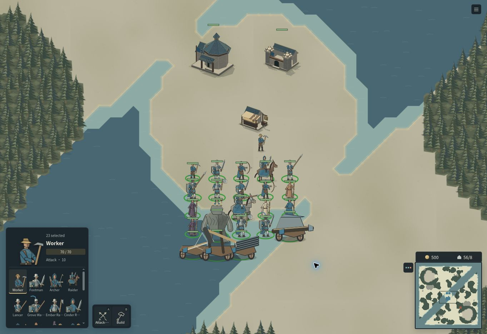

# Sketch RTS

**一款致敬魔兽争霸 3 的浏览器即时战略游戏：手绘风格的世界，可以编程的对手。**

[English](../README.md) · [在线游玩](https://lexicalmathical.com/sketch-rts/) · [快速开始](#快速开始) · [怎么玩](#怎么玩) · [AI](#ai) · [开发](#开发)



建造基地，派农民采金，把一支小部队养成大军。两个种族，各有自己的建筑和科技；有法师、骑兵冲锋和重甲精英；野怪营地守着最好的金矿，有雇佣兵可雇，有商店；跨海作战有六种船只，地面攻坚有四种工程武器。地图池有十三张地图，还能按种子生成新布局。

你可以在浏览器里和电脑打，开房间和朋友联机，也可以自己写一个对手：SDK、回放工具、AI 基准测试和游戏本身跑的是同一套按命令帧推进的模拟。

> **持续开发中。** 规则、AI 和地图都在频繁变化；线上构建也可从审阅中的开发分支部署。战役模式已撤下，当前可玩模式是单人或多人遭遇战。

## 游戏

### 两个种族

两个种族都能造城镇大厅（训练农民）、农场、防御塔、工坊和船坞，其余建筑各有区别。

| | 林野族 Grove Kin | 余烬盟约 Ember Pact |
| --- | --- | --- |
| 基础兵 | 步兵、长枪兵、林地守卫（兵营）；弓箭手（靶场） | 余烬劫掠者、余火奔袭者（余烬熔炉）；火花弓手（烬火尖塔） |
| 进阶（人口上限 42） | 掠袭者（马厩）；牧师、召唤师、女巫（圣所） | 余烬侍僧、灰烬巫师、薪火召唤者（烬火尖塔） |
| 精英（人口上限 60） | 骑士（马厩）；魔像（工坊） | 灰烬酋长、余烬复生者（灰烬战殿） |
| 治疗建筑 | 月井 | 余烬神龛 |
| 船（船坞） | 运输船、战船、巡海快艇、臼炮舰、火船、远洋运兵舰 | 同样六种船只 |

- **人口就是科技**：进阶兵种要人口上限达到 42，精英要 60。上限按已建成的城镇大厅和农场算，不看已用人口：农场 120 金提供 6 人口，城镇大厅提供 8。未解锁的兵种留在指令卡上显示为灰色，并标出所需上限。
- **维护费**：已用人口达到 51 起，采金收入按 70% 计；达到 81 起按 40%。
- **重甲**：四种精英受到射手和法师的攻击只承受一半伤害，受防御塔 70%，近战照常。
- **法术单独冷却**，和魔兽争霸 3 一样：法术一好就能放，不受普攻影响。治疗每 12 秒回复 55 点生命；女巫的诅咒让目标伤害降低 60%，持续 18 秒，对召唤生物造成 100 点伤害。支持自动施放的法术可右键按钮切换；工程武器和战船的物理主动技能需要手动指定目标。目标在射程外时，施法者会先走过去，到了再放。
- **骑兵冲锋**：掠袭者和骑士可以冲锋 180 到 300 外的敌人，造成双倍一击；更远的目标会先骑过去再冲。
- **近战姿态**：近战单位有三种姿态（`Z`）：*追击*（贴住目标一直打，最通用）、*坚阵*（每一刀把敌人顶退）、*陷阵*（每一刀把敌人顶退，自己跟着冲上去）。
- **余烬精英各有分工**：灰烬酋长对法师和召唤生物多造成 50% 伤害；余烬复生者生命值较低，但每秒恢复 7 点生命。
- **单位会还手**：没有命令的单位挨打时会转身反击，附近闲着的士兵也会过来帮忙；单位自己发起的追击，追远了会放弃并走回来。你亲手下的命令不会被打断。
- **建筑占整格**，和魔兽争霸 3 一样。建造预览会吸附到格子上，画出建筑要占的格子：能放的格子是绿色，不能放的是红色。远处的建造命令只是农民的私人意图；到达工地后才产生建筑实体、碰撞和金币扣款，对方无法攻击尚未开工的意图。

### 野怪、雇佣兵和物品

中立野怪营地守着主基地以外的金矿：林间野人、鱼人、魔像、食人魔、蜘蛛和龙，营地由弱到强。最强的几种有自己的技能：魔像的践踏、食人魔法师的嗜血、蛛后的结网。清掉营地能拿到金币和经验；单位靠经验升级。

雇佣兵营地可以雇佣雇佣兵、契约弓手和战地医师。商店卖速度之靴、回复戒指、治疗卷轴和象牙塔。较强的营地守着一件宝物：烈焰斗篷、闪电权杖、风暴法杖、守护卷轴、经验书或破城炸药。宝物由营地里的一只野怪带着，它也会用，直到它倒下。一个单位最多带六件物品，用数字键使用。地面物品、背包和商店共用手绘物品模型。购买交给店旁最近的可携带友军；购买后继续查看物品，保留接收者的背包。右键背包格可丢弃物品。

### 地图

地图池有十三张布局。多数参考经典天梯地图；碎海用于独立岛屿出生和大陆争夺：

| 地图 | 人数 | 构思 |
| --- | --- | --- |
| 神泉殿 | 4 | 中央神殿周围一圈金矿（Lost Temple） |
| 龟湖 | 4 | 湖心一座岛，最富的矿在岛上（Turtle Rock） |
| 古木林 | 4 | 道路在密林之间弯来绕去（Twisted Meadows） |
| 环海 | 4 | 地图边上一圈海，每个海湾里一座有矿的小岛 |
| 孤市 | 2 | 两座大岛，全图唯一的商店在两岛之间（Echo Isles） |
| 芦苇泽 | 2 | 谷底泡在浅水里，干燥的山脊横贯其间（Secret Valley） |
| 雾丘 | 2 | 两条长带由一道横梁连成 H 形（Concealed Hill） |
| 灰岩隘口 | 2 | 两家之间一条河，两座桥（Terenas Stand） |
| 松影林 | 2 | 幽暗丛林里的窄路（Amazonia） |
| 鸥岛 | 2 | 各自的主岛、中间一座兵家必争的小岛，还有只有船能到的矿（Northern Isles） |
| 静水原 | 4 | 两队隔河对阵，有浅滩和桥，两岸各一个商店（Gnoll Wood） |
| 双岸 | 4 | 两队分据海峡两岸，矿在浅滩之间的小岛上 |
| 碎海 | 4 | 6144 × 6144 海域，独立出生岛和富矿中央大陆 |

经典陆地图的主基地通常在只有一条坡道的高地上，分矿在坡下，由一个营地守着；森林、石堆和石门把道路收窄成隘口；只要有开阔水面，每家都有一片能造船坞的海滩。生成器还能按任意种子、任意人数画出新地图（`ladder` 地图）。

### 海军和上岛

船坞造在海滩上。选中陆军，右键自己的运输船登船，按 `D` 指定卸载地点。容量按人口计算：运输船装 8 人口，远洋运兵舰装 24 人口。登船部队和空闲船只共用可达的接驳点。

| 船只 | 分工 | 主动技能 |
| --- | --- | --- |
| 运输船 | 早期渡运，8 人口 | 卸载 |
| 战船 | 通用水面作战 | — |
| 巡海快艇 | 侦察、追击 | — |
| 臼炮舰 | 远距离攻岸、拆建筑，有最小射程 | 攻城齐射 |
| 火船 | 近距离燃烧攻击 | 火焰舷射 |
| 远洋运兵舰 | 大部队登陆，24 人口 | 卸载 |

农民可以修理岸边够得着的受损友军船只：选中农民，右键船只。修理需要金币，深海中的船要先回岸边。船坞也会花费金币维修附近脱离战斗的友军船只。

工坊训练撞城锤、弩炮、抛石机和连弩炮，各自有不同的普攻、投射物和主动技能：冲撞、连弩齐射、攻城齐射和霰弹。攻城炮械遵守最小射程；物理主动技能独立冷却，不耗法力。

### 单位和建筑

美术用 Canvas 绘制，战场、头像和指令按钮共用同一套画法。建筑使用立体面投影和贴地阴影；单位死亡后留下持续保留的素描尸体。物品画法集中在 `src/client/art/items.ts`。运行 `npm run dev` 后打开 `/unit-sheet.html` 可以看到实时的图鉴。画法见[美术设计说明](woodland-atlas.md)。

左下角按兵种显示自动换行的头像网格。点击头像或按 `Tab` 切换当前指令对象，上方独立显示生命与攻击；混编种类多时只在面板内纵向滚动，不出现横向滚动条，也不挤走指令区。界面刷新保留滚动位置，切换到屏外兵种时自动带入视野。

## 怎么玩

**在线**：[lexicalmathical.com/sketch-rts](https://lexicalmathical.com/sketch-rts/)。**本地**：见[快速开始](#快速开始)。

1. 「**开始游戏 → 选地图 → 创建房间**」。房间里有你的座位和一个电脑座位；为每个座位选种族，为电脑选版本（V5、V7 或 V8），然后「**开始比赛**」。
2. 在电脑上，点一下战场把鼠标锁进去（`Esc` 释放）。
3. 选中农民，右键金矿开始采金，按 `B` 打开建造菜单，造一座兵营，训练第一批士兵。

| 操作 | 作用 |
| --- | --- |
| 左键单击 / 拖动 | 选择单位或建筑 / 框选多个单位 |
| 右键 | 按目标移动、采集、攻击、维修建筑/船只或登船 |
| `Shift` + 命令 | 排在当前命令之后 |
| `A` 后点击 | 攻击移动 |
| `B`（选中农民） | 建造菜单 |
| 按钮上的快捷键 | 建造、训练、研究、施法（按钮上标着） |
| `Z` / `D` | 近战姿态菜单 / 运输船卸载 |
| `Shift` + `1`–`9`，再按 `1`–`9` | 编队，再选中编队（连按两下镜头跳过去） |
| `Tab` | 在混编选中里切换当前兵种 |
| 方向键 / `WASD`、窗口边缘、小地图 | 移动镜头（命令快捷键优先于 `WASD`） |
| `Esc` | 取消目标选择；释放鼠标 |
| 右上角 ≡ | 对局菜单：地图名，以及部署方式支持时的认输 |

界面跟随浏览器语言，显示英文或简体中文。手机上菜单和战场都能正常显示，但还没有用触屏指挥单位的操作。

## AI

电脑玩家是脚本 AI：读取局面，下和玩家一样的命令。房间里可以选其中三个：

- **V5**：后续版本的基础打法：经济和扩张、清野、造塔，以射手为核心的部队操控。
- **V7**：不被告知对手是谁，两个种族都能打，从局面上看出对手。
- **V8**：和 V7 一样，但不用射手和召唤师，靠近战阵线、治疗和骑兵冲锋打正面。

**V9** 保留为实验性的 **1 打 3** 基准对手。历史胜率不代表当前规则和平衡。更早的版本（V1–V4、V6）留作基准测试。

共用遭遇战策略根据地形连通性决定工程武器、海战、接驳、岛屿建基地和农民迁移，不读取地图名字来写特殊分支。可以安全开发的陆地金矿优先于海外扩张；有守军的经济登陆需要足够兵力。本地矿空了不等于全图资源耗尽：还有活着的闲置农民和可达或可渡运的金矿时，应按经济 AI 故障审计。

原生海图自我对局（包含未见过的生成布局）：

```bash
SELFPLAY_TICKS=90000 node --import tsx scripts/naval-selfplay.ts /tmp/naval-selfplay.json
```

测试结果和已知边界见[遭遇战修复记录](reviews/skirmish-naval-repair.zh.md)。

```bash
npm run benchmark:ai-v9-gauntlet -- --seed v5-hybrid-50-2026-06-12 --map-count 50
npm run play:ai -- new --file .playtest/match.json --map bareDuel --you v2 --enemy v1
npm run play:ai -- step-until --file .playtest/match.json --condition tick --tick 1200
```

联机服务器在 `benchmark.html` 提供基准测试面板。详见[开发指南](development.md#benchmark-system)和 [AI 规格](ai-spec.md)。

## 开发

### 快速开始

需要 **Node.js 20.19+ 或 22.12+**，以及 npm。

```bash
git clone https://github.com/shuxueshuxue/sketch-rts.git
cd sketch-rts
npm ci
npm run dev
```

打开 **[127.0.0.1:5173](http://127.0.0.1:5173/)**。这是联机开发服务器，带房间、SDK 接口和基准测试面板。

| 命令 | 用途 |
| --- | --- |
| `npm run dev` | 联机开发服务器（房间、SDK、面板） |
| `npm run dev:static` | 只在浏览器里跑游戏，和 AI 对战，不要后端 |
| `npm run build` | 类型检查并构建前端 |
| `npm run build:production` | 前端加服务器包（`dist-server/index.mjs`） |
| `npm run build:static` | 构建静态站点到 `dist/` |
| `npm test -- --run` | 跑一遍测试 |
| `npm run test:sdk-smoke` | 启动测试服务器并跑 SDK 冒烟检查 |
| `npm run benchmark:ai-v9-gauntlet` | V9 的 1 打 3 考场（见 [AI](#ai)） |
| `npm run record -- --scene infantry-clash` | 不开浏览器，把一段场景录成 MP4/GIF |

### 运行方式

| 方式 | 适合 | 对局在哪里跑 |
| --- | --- | --- |
| 静态浏览器 | 本地和 AI 对战；静态托管 | 浏览器里，没有游戏后端 |
| 联机服务器 | 房间、联机、观战、SDK、基准测试 | 服务器管理房间并协调命令帧 |

部署生产版本：先 `npm run build:production`，再 `NODE_ENV=production HOST=0.0.0.0 PORT=34573 node dist-server/index.mjs`。挂在子路径下时，构建和服务器都要设置 `SKETCH_RTS_BASE_PATH` 和 `VITE_SKETCH_RTS_BASE_PATH`（例如 `/sketch-rts/`）。Windows PowerShell 里用 `$env:NAME = 'value'` 先设变量。房间链接使用 `#room=room-id` 这样的哈希路由。详见[部署说明](development.md#deployment-modes)。

### SDK

TypeScript SDK 可以创建房间、重置场景、读取快照、下命令、推进 tick、保存或回放比赛。先启动联机服务器。

```ts
import { SketchRtsSdk } from './src/sdk/client';

const sdk = new SketchRtsSdk('http://127.0.0.1:5173');
const room = await sdk.createRoom({
  id: 'sdk-demo',
  host: { id: 'agent-host', name: 'Agent Host' },
  mapId: 'bareDuel',
  visibility: 'private',
  humanCount: 1,
  aiCount: 1,
});

const { snapshot } = await sdk.resetRoom(room.id, 'bareDuel', {
  aiPlayers: ['enemy'],
  races: { player: 'grove', enemy: 'ember' },
});

const worker = snapshot.units.find(u => u.owner === 'player' && u.kind === 'worker');
const mine = snapshot.resources.find(r => r.id === 'gold-player-main');
if (!worker || !mine) throw new Error('Missing starting worker or mine');

await sdk.roomCommand(room.id, 'player', { type: 'mine', unitIds: [worker.id], resourceId: mine.id });
```

浏览器操作、内置 AI、SDK 智能体、回放和基准测试都走同一套命令帧运行时。更多见[开发指南](development.md)。

### 添加单位或建筑

一个单位或建筑分两处：

1. **规则**：[`src/shared/catalog.ts`](../src/shared/catalog.ts) 里 `UNIT_RULES` 或 `BUILDING_RULES` 的一行：数值、在哪里训练（`trainedAt`）、种族，以及写成数据的特殊规则（`armor`、`casterSlayer`、`regenPerSecond`）。兵种、训练列表和种族名单都从这些行推导。
2. **卡片**：[`src/client/content/`](../src/client/content/) 里的一项：中英文名称和说明、指令图标和快捷键、画它的函数。标签、提示、指令卡和图鉴都读卡片。

缺卡片时 TypeScript 会报错；`src/client/content/cards.test.ts` 检查中英文都齐、每个单位都在它的种族能造的建筑里训练、菜单里没有重复的快捷键。

### 音效包

在「**设置 → 音效包**」里选一个音效包之前，游戏是静音的。音效包是一个文件夹 `audio-packs/<id>/`，里面有一个 `pack.json` 和它用到的文件：

```json
{
  "name": "My pack",
  "sounds": {
    "melee": { "pitch": 0.08, "max": 4, "kinds": { "footman": { "file": "sword.ogg" }, "golem": { "file": "rock.ogg", "volume": 1.2 } } },
    "arrowShot": { "file": "bow.ogg" },
    "click": { "file": "click.ogg" }
  }
}
```

事件有 `melee`、`arrowShot`、`arrowHit`、`death`、`construction`（放下建筑）、`built`、`buildingDown` 和 `click`，包里没写的事件就不出声。一个事件放一段录音，或者按引发它的单位种类各放一段（`kinds`）。`volume` 为 1 是原音量，`pitch` 是每次播放音高最多偏多少（0.08 即 8%），`max` 是同一事件最多同时响几个。

游戏有两种找包的方式：

- **构建进去**：`audio-packs/` 下的包在构建或启动开发服务器时找到。仓库里只有 `audio-packs/cc0`，其余文件夹 git 都忽略。`VITE_SOUND_PACK=<id>` 指定玩家自己选之前默认播放的包。
- **由服务器提供**：客户端还会读页面旁边的 `audio-packs/served.json`，格式是 `{"packs": ["<id>"], "default": "<id>"}`，并从旁边的同名文件夹加载列出的包。仓库里的这个文件不列任何包；服务器在这个路径放上自己的文件夹，就能不重新构建而提供音效包，把某个包从列表里删掉就撤下了。

### 录制片段

`npm run record` 在 Node 里录一段场景，不开浏览器：用游戏的命令帧运行时跑对局，每一帧都用客户端自己的世界渲染器画。

```bash
npm run record -- --list
npm run record -- --scene infantry-clash --seconds 14 --size 1280x720 --out clip.mp4 --out clip.gif --gif-size 640x360
npm run record -- --scene cavalry-flank --follow 'owner=north,kind=raider|knight' --zoom 1.2
```

场景模块导出一个 `RecordingScene`（[`src/recorder/scene.ts`](../src/recorder/scene.ts)）；[`src/recorder/scenes/`](../src/recorder/scenes/) 里的内置场景就是示例。`npm run record -- --help` 列出全部选项。

## 路线图

- 手机和平板的触屏操作。
- 让 V9 以扎实的打法、在所有兵种和地图上，同时赢下三个对手。
- 更多种族和技能；基于 `src/story/` 剧情工具的战役。
- 更好的断线重连和观战工具。
- 地图和模组编辑。

## 致谢

Sketch RTS 在 [linux.do](https://linux.do/) 社区开发和讨论。

游戏的灵感来自**魔兽争霸 3**：农民和基地、中立营地、各有科技的种族，以及上面提到的那些地图构思。

`cc0` 音效包由 [Freesound](https://freesound.org) 上的录音组成，全部以 [CC0 1.0](https://creativecommons.org/publicdomain/zero/1.0/) 发布，为游戏剪辑并统一了音量：

| 文件 | 录音 | 作者 |
| --- | --- | --- |
| `melee.ogg` | [Sword_Clash (7).wav](https://freesound.org/people/JohnBuhr/sounds/326868/) | JohnBuhr |
| `arrowShot.ogg` | [Arrow Loose and Flyby](https://freesound.org/people/saturdaysoundguy/sounds/394180/) | saturdaysoundguy |
| `arrowHit.ogg` | [Arrow Impact 2](https://freesound.org/people/Ali_6868/sounds/384913/) | Ali_6868 |
| `death.ogg` | [Grunt1 - Death Pain.wav](https://freesound.org/people/tonsil5/sounds/416839/) | tonsil5 |
| `built.ogg` | [Hammer on Wood](https://freesound.org/people/L.i.Z.e.L.l.E_+/sounds/707864/) | L.i.Z.e.L.l.E_+ |
| `buildingDown.ogg` | [Big falling debris (crash)](https://freesound.org/people/xkeril/sounds/703247/) | xkeril |
| `click.ogg` | [Basic Click Wooden](https://freesound.org/people/GameAudio/sounds/220200/) | GameAudio |

标题和按钮里的拉丁字母使用 Natanael Gama 设计的 [Cinzel](https://github.com/NDISCOVER/Cinzel) 字体（© 2020 The Cinzel Project Authors），按 [SIL Open Font License 1.1](../src/client/fonts/cinzel/OFL.txt) 授权；字体文件由游戏自带，放在 `src/client/fonts/cinzel/`。

本仓库不包含、也不分发任何魔兽争霸 3 的文件。lexicalmathical.com 上的线上版本播放一个取自魔兽争霸 3 游戏文件的音效包，由该站点独立于仓库另行提供；这些声音的版权归 Blizzard Entertainment 所有。
