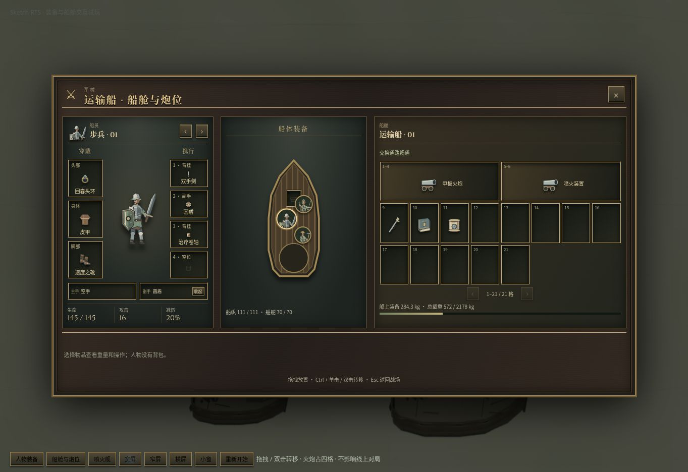
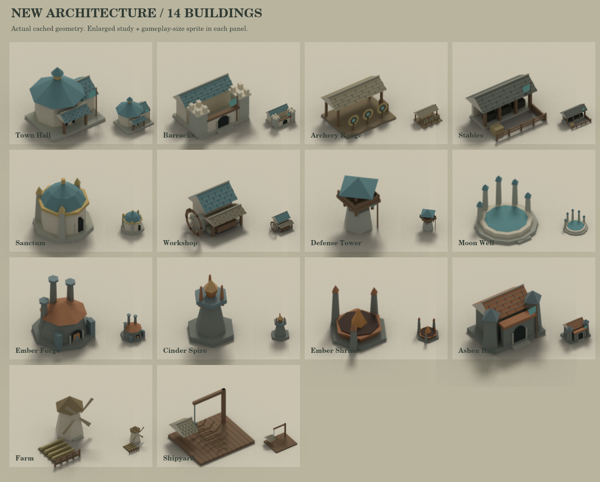

# Naval combat and presentation repair

Ships share ordinary units' automatic target selection and aiming. Idle player ships guard nearby water; AI fleet planners issue attack-move destinations, while retaliation and target changes happen in the simulation. Travel tasks can pause to defend a convoy and resume afterwards. Explicit player moves and AI withdrawal orders suppress retaliation; a manual attack retains its selected target.

Range checks and aim points use the nearest physical hull or building surface. Mounted guns use their actual world pivots. Projectile identity follows the launched weapon through rendering, sound and impact; hull part damage uses the real impact location rather than the ship centre.

Navigation checks moving hulls in configuration space, caches shape geometry and limits traffic searches deterministically. Budget exhaustion returns a resumable partial route, never a false arrival. The ship scale is 1.1 across deck space, rendering, collision and navigation.

The equipment panel fits wide, narrow, short and standalone-unit states without top-level scrolling. Crew portraits can be dragged to valid positions on the deck; invalid placement reports feedback. All 25 building sprites were re-rendered with Blender shadow catchers; the fabricated ellipse shadow was removed. Swappable ship weapons include their complete carriage or flame apparatus.

## Validation

- Full suite: 239 files, 1,967 tests passed; production TypeScript/client/server build passed.
- V5, V7 and V8 each completed worker transport, landing, island hall construction and island mining in an end-to-end simulation test.
- Regressions cover idle guard, hold-position aiming, convoy retaliation and resumption, withdrawal, manual target preservation, intervening hostile ships, consecutive ship/dock attacks, projectile identity and saved partial navigation.
- Fifteen-minute four-player Broken Sea run: 18,000 steps, average 1.65 ms, p99 21.55 ms, maximum 86.27 ms, eight steps over 50 ms; 59 units and 14 ships remained. These are container measurements, not a guarantee for every map or browser.
- The full AI trace ends with two completed halls for V7; V5 and V8 retain active ships and transport tasks. The calm-sea tests establish expansion capability without claiming every wartime match expands successfully.

Small-angle sprite reprojection/interpolation remains a separate rendering task; this repair does not rotate the entire ship image and tilt its mast.
