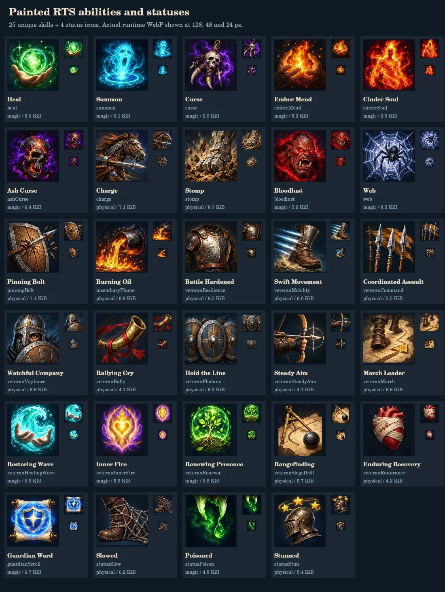

# 技能与状态图标重绘

这轮为当前目录中的 **25 个不同技能**绘制独立图标：12 个基础／野怪技能，以及 13 个三星老兵技能（其中 3 个主动技能已经计入 `ABILITY_KINDS`，不重复绘制）。额外绘制守护卷轴、减速、中毒、眩晕 4 个状态图标。命令卡、三星学习选项和单位状态栏使用同一套资源标识。

物理／战斗技能主要使用铁、木、皮革、黄铜，依靠马头、践踏石足、弩矢、盾墙、战号、靴子等轮廓区分。魔法／精神技能使用绿色治疗、青色召唤、紫色诅咒、橙色余烬、金紫色心灵之火等色彩；治疗与余烬疗愈、召唤与余火魂灵、诅咒与灰烬诅咒分别绘制。原图和生产图中没有文字、字母或 emoji。

图案由 `image_gen` 原创生成，再按实际格线裁切；生成画板的格子并非严格等宽等高，导出脚本记录人工检查后的边界，保留画面比例并排除相邻图案。原始 PNG 留在工作目录；仓库保留两个压缩的创作源文件，方便重新导出。源文件和检查大图位于 `assets/abilities/`，游戏不请求它们。

每张生产图为 **128 × 128 WebP**，路径为 `public/art/abilities/<id>.webp`，通常在命令卡以 48–64 px、状态栏以 24 px 显示。29 张合计 **184,250 字节**，单张 **4,448–8,872 字节**；独立地址允许浏览器按需加载和复用缓存。`abilityIconUrl` 使用部署 `BASE_URL`，兼容 `/` 和 `/sketch-rts/` 等挂载路径。

资源映射位于 `src/client/ability-icons.ts`，尺寸、文件大小、SHA-256 和裁切位置保存在 [资源清单](../../assets/abilities/ability-icons.json)。在项目根目录运行 `node scripts/export-ability-icons.mjs` 可以从压缩源文件重建分图、清单和检查图。`ability-icons.test.ts` 检查目录覆盖、资源可解码、128 px 尺寸、清单哈希、资源体积预算和部署前缀；检查图直接展示实际生产 WebP 的 128、48、24 px 效果。

状态栏复用明确相关的技能图案：诅咒、灼烧、蛛网、嗜血、短时保护和战斗号令；减速、中毒、眩晕及卷轴守护各有专用图标。图标负责识别，实际数值、来源、持续时间由状态栏根据模拟数据展示，不从颜色或画面推导战斗规则。
