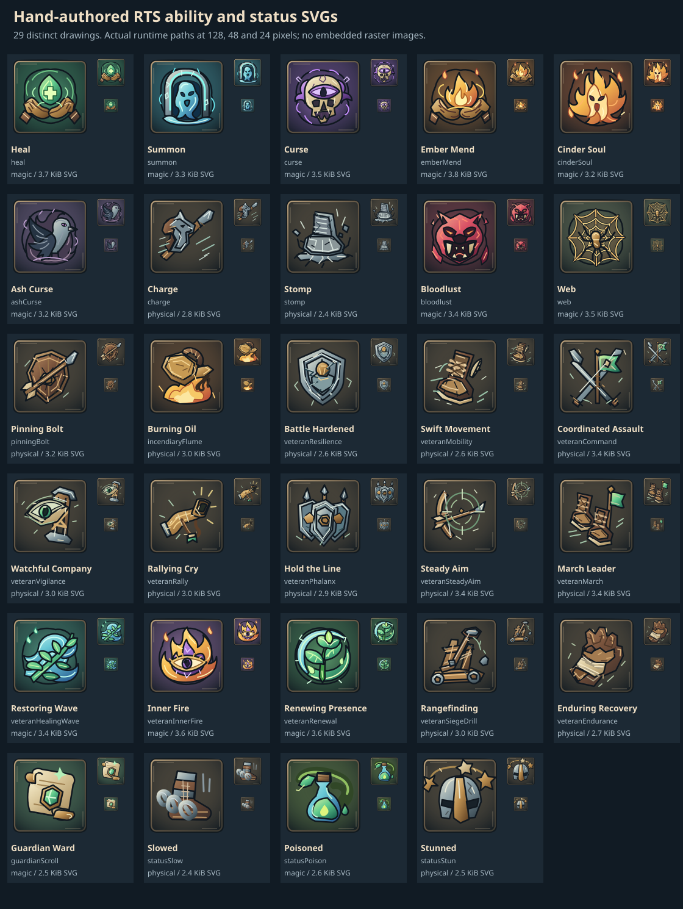

# 技能与状态手绘 SVG

当前 **25 个不同技能**和 **4 个专用状态**均使用独立的手绘 SVG：12 个基础／野怪技能、13 个三星老兵技能，以及守护卷轴、减速、中毒、眩晕。命令卡、三星学习选项和单位状态栏使用同一套资源标识。

每张图以独立手写的贝塞尔曲线路径绘制主体，再用有限的线性／径向渐变、墨线和沿形状的细笔触表现材质。物理／战斗技能主要使用铁、木、皮革、黄铜，通过马首、重足、弩矢、盾墙、战号、靴子等轮廓区分；魔法／精神技能使用绿色治疗、青色召唤、紫色诅咒、橙色余烬、金紫色心灵之火。治疗、余烬疗愈和治疗波，召唤和余火魂灵，诅咒和灰烬诅咒均有不同主体。

生产图为 **128 × 128 viewBox 的纯 SVG**，路径为 `public/art/abilities/<id>.svg`，通常在命令卡以 48–64 px、状态栏以 24 px 显示。29 张合计 **91,912 字节**，单张 **2,410–3,888 字节**。图中没有位图、自动描摹、文字、字体、外部引用、脚本或滤镜；柔和辉光使用有界径向渐变，不使用噪声或模糊滤镜。每张独立地址允许按需加载和缓存，`abilityIconUrl` 兼容 `/` 和 `/sketch-rts/` 等部署路径。

手绘路径源码位于 [物理技能](../../assets/abilities/svg-sources/physical.mjs)、[魔法技能](../../assets/abilities/svg-sources/magic.mjs)和[专用状态](../../assets/abilities/svg-sources/status.mjs)。运行 `node scripts/export-ability-icons.mjs` 可从这些路径重建 SVG、128／48／24 px 检查图和[资源清单](../../assets/abilities/ability-icons.json)。脚本只装配向量图形，不裁切或转换位图；清单记录各文件大小、SHA-256 和对应的手绘源文件。原来的 29 张 WebP、两张生成画板和 WebP 检查图已删除。

`ability-icons.test.ts` 检查目录覆盖、SVG 可解码和尺寸、完整清单哈希、局部渐变引用、禁止嵌入位图和外部资源、总量 200,000 字节／单张 10,000 字节预算及部署前缀。SVG 检查图展示实际生产路径的三个尺寸；外层文字只属于检查页，不进入生产图标。

状态栏复用明确相关的技能图案：诅咒、灼烧、蛛网、嗜血、短时保护和战斗号令；减速、中毒、眩晕及卷轴守护各有专用图标。图标负责识别，实际数值、来源、持续时间由模拟数据展示。

`assets/abilities/status-ui-acceptance.json` 及同目录的状态栏／命令卡 PNG 是上一版图标的历史功能验收，保留原始 URL 和截图，并标注受测时的 WebP 格式。它们支持当时状态切换、持续时间和技能操作的记录，不能代替本轮 SVG 的加载与外观检查。
