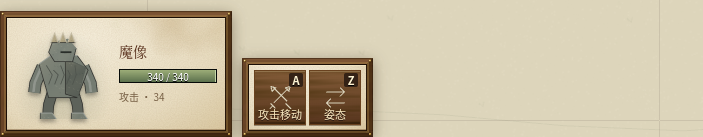
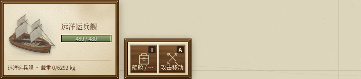

# 精简战斗界面说明

2026-10-08，将选择面板集中在当前状态，把规则解释留在悬浮详情和训练说明中。

- 头像旁保留名称、生命、有效攻击数值、星级和可学习提示；不再常驻机械分类、攻击类型、已学技能名称或“你的单位”等重复文字。
- 其他玩家身份、多选数量和船舶载重继续显示；没有自身攻击的船不显示“攻击 0”。
- 当前单位的悬浮详情显示当前经验与下一星阈值，完整升星表和成长规则放在训练说明，避免每次选中都重复通用规则。
- 合并机械维修说明、护甲倍率和自动施法开关提示；删除“穿透最多 1 个目标”、施法者“必须准备就绪”、通用／专属技能标签等冗余内容。
- 伤害分类、机械目标限制、护甲例外、技能效果、操作方式与永久学习限制仍可在相应悬浮说明中查阅。

实际浏览器检查中英两种语言下的魔像、牧师、战船和运兵舰，共八种组合：常驻区内容正确，标题、生命、详情和载重没有横向溢出；悬浮详情未超出视口或裁切；页面没有 JavaScript 异常。检查使用 1440×1000 桌面视口及触摸指针环境，未加入产品调试入口。
