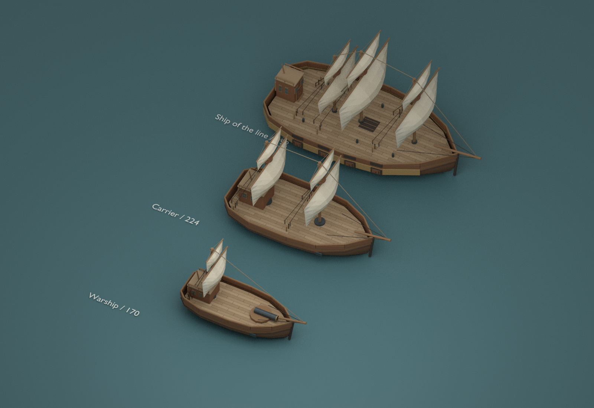
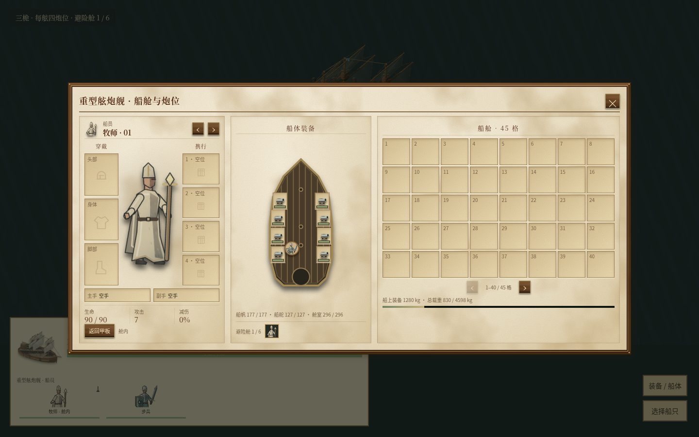

# 船员入舱避险与重型舷炮舰

海战中，甲板上的重要船员容易遭到集中射击。本次增加手动避险舱，让玩家决定何时保住人员、何时返回甲板继续作战；同时增加承担正面炮战的三桅重型舷炮舰。

## 玩家操作与规则

选中己方船上的步行船员，点击 **撤入舱内**。船员会沿真实甲板绕过炮座、桅杆和其他船员，走到舱门后才进入。舱内人物从战场、血条和小地图消失，仍可从船员名单或控制组选中，再点击 **返回甲板**；出舱需要舱门附近存在真实空位。

进入完整舱室后，船员不再被攻击或法术选中，也不会受到船外炮弹、爆炸与范围法术伤害。作为代价，攻击、施法、对外光环、主动物品和装备交换暂停。个人被动装备与已有状态保留，入舱不会清除毒伤。舱内人员仍占人口和载重，重心按实际船尾舱室计算；船沉时与其他乘员一起死亡。

| 船型 | 避险舱人数 |
| --- | ---: |
| 快艇 | 0 |
| 运输船、战舰、迫击炮船 | 2 |
| 火船 | 1 |
| 远洋运兵舰 | 4 |
| 重型舷炮舰 | 6 |

舱室耐久为船体最大生命值的 40%，通过既有修船流程恢复。船尾舱室被打坏，或敌人登上甲板时，保护失效，人员尝试从真实舱门撤出。舱门被堵住时不会叠人或瞬移：滞留者继续等待出口，后续船体伤害的 35% 会传给这些滞留者。完好舱室与损坏舱室的区别是实际防护状态，不是船员被删除再重新生成。

按钮只在相关船员被选中时出现；人数显示在船舱区，限制说明放在按钮提示中。

## 重型舷炮舰

| 项目 | 配置 |
| --- | --- |
| 定位 | 正面舷侧炮战；转弯和迎风推进比小船慢 |
| 解锁 | 三级舰船，人口上限达到 60，两族船坞均可训练 |
| 造价 / 时间 / 人口 | 1400 / 30 秒 / 7 |
| 船体 | 740 生命，重甲，基础速度 46 |
| 炮位 | 每舷四个独立炮位；仅安装舷炮，无舰首炮 |
| 出厂装备 | 四门已计入造价的可拆舷炮，两侧各两门 |
| 满配 | 八门炮，额外四门每门 220，总造价 2280 |
| 舱室 | 六名步行船员 |

每门炮独立装填、瞄准、损坏与维修，射界为对应舷侧的 ±35°。对侧炮不会穿过船体向同一目标射击，拆掉所有炮后船体没有额外免费攻击。拆炮、转移和保存恢复保留装备身份、损伤与装填，不会重新赠送出厂炮。AI 可在船坞补齐余下四门炮。

船模采用三桅横帆、木质船体、炮窗带与船尾舱门。动态帆装沿用当前风力与调帆系统；三个桅杆分别有真实的碰撞和帆索。上层炮位和船员使用同一个可行走甲板，下层关闭炮窗是外观细节，未增加下层炮火或第二层战斗甲板。



## 验收与复现

满配八炮会压缩船员通道，因此美术、炮位与实际碰撞一起验收。最终布局保持炮座整个圆盘在甲板内，并让半径 16–20 的步行船员沿真实路径穿过满炮甲板。除船首通行外，回归测试保留真实默认登船位置，再发入舱命令；测试同时约束每 tick 位移，防止通过瞬移获得通过结果。

完整 `stepGame` 验收中，两人默认登船后、航行中单独撤入牧师用了 29 tick；六人默认登船后一次撤入用了 83 tick，从前甲板一次撤入用了 335 tick。通道不足时按单船排队，己方闲置人员可以正常步行让路；驻守、作战和盟友其他玩家的命令保留。额外 12 个独立场景覆盖四炮/八炮、两种登船顺序、真正堵满舱门，以及进舱途中读档的 72 个一致校验点。这些用时来自指定场景，受站位和通道影响。

最终全量测试 **317 个文件、2788 项全部通过**，`npm run build:production` 通过。Chromium 使用最终 GLB 验证真实默认登船、移动船入舱、世界隐藏、名单选择、同 tick 返回，以及 1440/640 宽度装备界面；没有页面或 WebGL 错误。

新增六个真实海战和航行场景，使用正常生命值、真实命中、部件损伤与完整船体扫掠。六场均通过，没有越岸或船体重叠记录；两场排队航点没有途中停船或空闲 tick。

| 场景 | 实际结果 |
| --- | --- |
| 出厂四炮对战普通战舰 | 0.75 秒首炮，两门接敌侧炮开火，9.1 秒击沉目标 |
| 满配八炮对战普通战舰 | 0.75 秒首炮，四门接敌侧炮开火，5.1 秒击沉目标 |
| 正上风 1500 距离 | 110.05 秒到达，航程约 2580，没有途中停走 |
| 两个连续直角航点 | 134.2 秒到达，没有排队途中停走 |
| 斜向出发接两个航点 | 59.2 秒到达，没有排队途中停走 |
| 岛屿绕行 | 115.05 秒到达，完整船体没有越岸 |

这些是固定场景的结果，不代表所有战斗的击沉时间。重舰更大的横帆船体仍需为转弯、迎风换舷和近岸机动减速。斜向出发场景还修正了路线选择：规划起始圆弧时会检查后续排队航点是否留有转弯空间，避免先选大圆弧、到第一个航点才停下重转。

[海战与航行指标](assets/cabin-heavy/heavy-metrics.json)、[完整进出舱仿真](assets/cabin-heavy/cabin-live-check.json)、[独立动态验收](assets/cabin-heavy/cabin-dynamic-audit.json)、[模型检查](assets/cabin-heavy/model-validation.json)、[浏览器检查](assets/cabin-heavy/browser-review.json)。模型检查中的移动记录明确标为底层 `enterCabinStep` 验证，完整仿真与浏览器记录另列，避免将几何通行当作整套操作验收。

复现：

```sh
npx vitest run src/shared/ship-cabin.test.ts src/shared/heavy-broadside.test.ts
npx tsx scripts/heavy-broadside-review.ts --out work/heavy-broadside-metrics.json
npm run build:production
```



[窄屏装备界面](assets/cabin-heavy/equipment-narrow.png)、[返回甲板](assets/cabin-heavy/cabin-return.png)。

保存恢复补齐旧存档缺失的舱室耐久，保留原有命令和装备；新的入舱状态、命令与舱室耐久纳入校验和版本 14。已有六种船的模型与船体几何保持不变。
