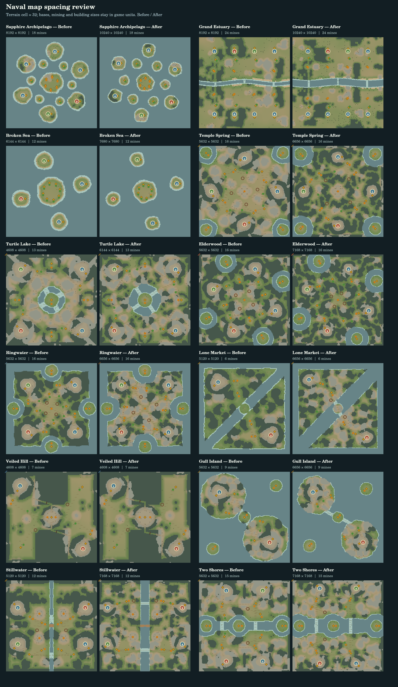

# 大型船体、接舷与海战控制复核

本次对比基线为 `7bd93bb`，实现已同步主线至 `6b69204`，保留其护航、炮兵与骑兵侦察修复。所有船体尺寸增加 20%，模型、碰撞轮廓、船舵、炮口和甲板坐标使用同一个物理尺度。旧存档只扩放一次，保留原有乘员、装备和甲板命令；旧航路重新规划。

## 运输与舱内避险

舱容是避险空间预算。每个单位消耗人口、无装备身体质量和身体体积三者的最大需求，至少占 1；甲板仍单独检查实际占地与载重。批量撤入按同一预算选择可以容纳的单位，体型太大或被固定炮位阻断的单位不会占住后续小单位的名额。舱门附近的临时拥堵由船员让路处理。

| 船型 | 舱容预算 | 完整造船价格：旧 → 新 |
| --- | ---: | ---: |
| 轻型炮艇 | 0 | 120 → 160 |
| 运输船 | 11 | 160 → 240 |
| 战船 | 5 | 390 → 540 |
| 臼炮舰 | 4 | 570 → 800 |
| 火船 | 3 | 370 → 520 |
| 远洋运兵舰 | 21 | 280 → 420 |
| 重型舷炮舰 | 8 | 1400 → 1960 |

这些预算已按最初扩大方案约 2/3 取整，不能解释为可装同样数量的士兵。战役额外放大的船体按作者设定的甲板面积调整舱容。旧存档中已超额的乘员继续避险并可安全返回甲板，额外进入受限。造船队列记录实际支付金额，取消旧队列不会按新价格多退金币；已完成但被港口阻挡的任务继续保留。

两种运兵船共享船体远程普攻、攻城普攻和塔攻击减伤 30%，乘员攻击输出为 50%。远洋运兵舰移除重甲，近战和主动法术对两者全额生效。战役额外重甲与这项防护取同组最强值，不叠乘。携带士兵不会让运输船自动脱离运输任务去追敌。

## 航行、开火与接舷

船队避让依据双方实际船体和相对运动，改变请求航向，避免每帧在已经偏转的船头上再加一段偏转。离开避让航向前检查返回原航向是否安全。连续排队航点在物理舵速允许范围内提前圆滑转弯；迎风起步保留已经选择的 RTS 低速辅助操纵。

停船敌舰周围的炮位保留旋转空间与友军占位检查。已经停下开火的船以实际船体占位，释放尚未驶到的旧目标位置，避免同时挡住两个位置。火船近距离靠近使用分离方向上的船体投影，避免把双方全长都当成前方安全距离。

空闲且具备可用武器的战船保存守卫位置、稳定目标和返回状态，迎击附近来犯武装敌舰后回到原位。显式移动、跟随、运输和接舷命令优先。AI 舰队使用固定旗舰、队形方向和稳定槽位，并保留有效追击目标，减少反复下发移动命令。判断运输航线能否得到护航时，只计算附近仍能战斗的军舰与露天乘员；已经撤入舱内的乘员不会被误算成可用火力。

接舷要求身体宽度足够的支持面，以及接缝处不超过 10 游戏距离单位/秒的相对速度；检查包含转向产生的接缝速度。同向航行的低相对速度可以满足条件，高速擦舷不会立即跨船或冻结双方。假想靠泊终点只检查支持几何，当前船速不会误阻断靠泊规划。玩家明确驶离仍能离开接舷接触。

新增“主动接舷”命令：载有露天步行乘员的船先靠到目标侧面，在低相对速度下花 3 秒部署短桥，再由闲置近战步兵攻入敌船；友船可用于手动转移乘员。射手、工人和有明确任务的乘员不会被自动派去冲锋。桥宽 48、最大船体间隙 36，只允许半径不超过 20 的步行身体通过。原来的直接甲板物理接舷仍然保留。

桥有 60 生命值，承受源船实际所受伤害的一半，部署时启动 20 秒冷却。目标船可以正常驶离，不会被能力接管船舵；拉开距离、过大转向、桥损毁或新舵令都会断开连接。桥断开时仍活着的两端允许过桥船员退回可容纳的甲板，沉船仍执行正常溺亡规则。甲板尚有原船主活乘员时不能立即夺船，舱内守军也计入；进入敌方乘员后舱内保护失效，守军可反击。

史料支持挂钩、系缆、控制相对运动、组织登舰与守住舱口；这里的短木桥是 RTS 对连接的可视化表达，并非所有历史军舰共有的标准设施。部署时长、桥耐久和冷却是游戏平衡参数。

## 碰撞与出港

船体平移和旋转采用连续扫掠，在首次接触位置停下；对象包括船、码头、其它建筑、可接触的地面单位、障碍和岸线。伤害依据相对接近速度与质量，低速靠泊不持续扣血，已经停止的撞击也不会凭重复操作产生新伤害。伤害经过普通受伤、舱内保护、死亡和乘员溺亡流程；友军碰撞和撞岸不会产生自己的击杀奖励。

船从本码头附近连通水域的安全位置出生，完整船体需离开码头、岸线和其它实体。没有空位时等待，水路不连通的其它池塘不会成为出生点。岸线、候选泊位和阻挡状态缓存随实际几何变化失效；堵港时复用船体探针，不再每帧构造新单位。

## 地图与历史依据

15 张地图中的 11 张调整了尺寸或水域间隔，保留陆地基地、矿点数量和基本经济距离。主航道扩大，新增测试实际放置码头并检查放大后的重型舷炮舰出生及航道空间。

矿旁空间按完整 96×96 基地地基、外围行走余地及工人入口检查，而非只检查中心在陆地上。修复重点包括蓝宝石群岛卫星矿岛、通用矿岛和雾丘矿台地；矿的数量和岛间航道仍有独立检查。[矿岛逐点验收](gold-island-base-access.zh.md)列出 15 张地图全部 183 个矿点，包含 54 个主矿及 129 个扩张矿。



[历史航海资料与证据](historical-naval-evidence.zh.md)记录了 16 份实际查阅的公开书籍、航海指南、战报和航海日志。七个 `stepGame` 场景检验前后队射程、两列穿线、变换抢风舷后侧炮射击、逆风抢航、停风追逐、接舷抵抗与夺舰，以及从短桥登舰后的舱内防御。使用普通生命值、真实射击与命中事件，并检验中途 JSON 存档续跑；不预设登舰方一定获胜。

这些场景复核文献描述的局部因果机制；游戏距离没有换算成历史海里或米，船数、帆极图、伤亡和整场胜负尚未作定量历史标定。停风时仍有明确的 RTS 辅助操纵，不能把它解释为真实帆动力。场景检验曾发现避让后航路终点与航点的共享引用影响存档续跑，已改为替换航点而非隐式修改共享终点。

## 势力识别

玩家颜色改为按参战名单分配 24 色，保存到对局状态；有效且未重复的存档颜色保留，重复或无效颜色补分配。小地图、头像、二维绘制和三维旗帜使用同一颜色。关系着色模式继续显示我方、盟军和敌军关系。

七种船模都有独立势力旗组件，夺船后旗色随新船主变化，木质船体保留材质颜色。船体实例跨玩家共享；旗帜按颜色批处理，避免每帧复制船模或材质。

[实机界面验收](naval-ui-acceptance.zh.md)提供主动接舷、两军旗帜、加权舱容和卫星矿旁建成基地的截图。

## 复核命令

```sh
npx vitest run --fileParallelism false --maxWorkers 1
npx tsx scripts/historical-naval-review.ts --validate --out work/historical-naval-review.json
npx tsx scripts/historical-naval-review.ts --replay work/historical-naval-review.json
npx tsx scripts/naval-runtime-stress.ts --record --out work/naval-runtime-stress.json
npx tsx scripts/render-naval-map-review.ts --baseline-ref 7bd93bb
CHROMIUM_PATH=/usr/bin/chromium node --import tsx scripts/browser-runtime-benchmark.mjs --out work/browser-runtime.json --screenshot work/browser-runtime.png
SKETCH_RTS_BASE_PATH=/sketch-rts/ VITE_SKETCH_RTS_BASE_PATH=/sketch-rts/ npm run build:production
```

浏览器资源检查使用 280 个单位、24 艘船，验证六轮真实 WebGL 创建、绘制与退出。32 个船模和建筑模型各请求、安装一次，无加载失败、运行时异常或 GL 错误；每轮退出后自有几何、实体、船体姿态、桥面与场景节点均清空，六个 GL 上下文均销毁。共享模型在轮间保留为 32 个可复用缓存，最终模型库关闭后为 0；原始资源缓冲缓存为 0 字节。六轮垃圾回收后的 JS 堆为 19.41–20.44 MiB，这项有限次数检查不等同于长期内存增长证明。检查期间未采纳绘制 CPU 耗时作为性能对比；SwiftShader 也不能提供实际显卡帧率保证。
