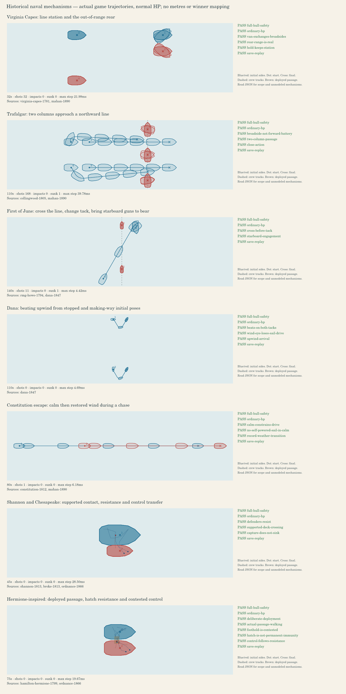

# 大型船体、接舷与海战控制复核

本次对比基线为 `7bd93bb`，实现已同步主线至 `6b69204`，保留其护航、炮兵与骑兵侦察修复。所有船体尺寸增加 20%，模型、碰撞轮廓、船舵、炮口和甲板坐标使用同一个物理尺度。旧存档只扩放一次，保留原有乘员、装备和甲板命令；旧航路重新规划。

## 运输与舱内避险

舱容是避险空间预算。每个单位消耗人口、无装备身体质量和身体体积三者的最大需求，至少占 1；甲板仍单独检查实际占地与载重。批量撤入按同一预算选择可以容纳的单位，体型太大或被固定炮位阻断的单位不会占住后续小单位的名额。舱门附近的临时拥堵由船员让路处理。

| 船型 | 舱容预算 | 完整造船价格：旧 → 新 |
| --- | ---: | ---: |
| 轻型炮艇 | 0 | 120 → 160 |
| 运输船 | 11 | 160 → 240 |
| 战船 | 5 | 390 → 540 |
| 臼炮舰 | 4 | 570 → 800 |
| 火船 | 3 | 370 → 520 |
| 远洋运兵舰 | 21 | 280 → 420 |
| 重型舷炮舰 | 8 | 1400 → 1960 |

这些预算已按最初扩大方案约 2/3 取整，不能解释为可装同样数量的士兵。战役额外放大的船体按作者设定的甲板面积调整舱容。旧存档中已超额的乘员继续避险并可安全返回甲板，额外进入受限。造船队列记录实际支付金额，取消旧队列不会按新价格多退金币；已完成但被港口阻挡的任务继续保留。

两种运兵船共享船体远程普攻、攻城普攻和塔攻击减伤 30%，乘员攻击输出为 50%。远洋运兵舰移除重甲，近战和主动法术对两者全额生效。战役额外重甲与这项防护取同组最强值，不叠乘。携带士兵不会让运输船自动脱离运输任务去追敌。

## 航行、开火与接舷

船队避让依据双方实际船体和相对运动，改变请求航向，避免每帧在已经偏转的船头上再加一段偏转。离开避让航向前检查返回原航向是否安全。连续排队航点在物理舵速允许范围内提前圆滑转弯；迎风起步保留已经选择的 RTS 低速辅助操纵。

停船敌舰周围的炮位保留旋转空间与友军占位检查。已经停下开火的船以实际船体占位，释放尚未驶到的旧目标位置，避免同时挡住两个位置。火船近距离靠近使用分离方向上的船体投影，避免把双方全长都当成前方安全距离。

空闲且具备可用武器的战船保存守卫位置、稳定目标和返回状态，迎击附近来犯武装敌舰后回到原位。显式移动、跟随、运输和接舷命令优先。AI 舰队使用固定旗舰、队形方向和稳定槽位，并保留有效追击目标，减少反复下发移动命令。判断运输航线能否得到护航时，只计算附近仍能战斗的军舰与露天乘员；已经撤入舱内的乘员不会被误算成可用火力。

接舷要求身体宽度足够的支持面，以及接缝处不超过 10 游戏距离单位/秒的相对速度；检查包含转向产生的接缝速度。同向航行的低相对速度可以满足条件，高速擦舷不会立即跨船或冻结双方。假想靠泊终点只检查支持几何，当前船速不会误阻断靠泊规划。玩家明确驶离仍能离开接舷接触。

新增“主动接舷”命令：载有露天步行乘员的船先靠到目标侧面，在低相对速度下花 3 秒部署短桥，再由闲置近战步兵攻入敌船；友船可用于手动转移乘员。射手、工人和有明确任务的乘员不会被自动派去冲锋。桥宽 48、最大船体间隙 36，只允许半径不超过 20 的步行身体通过。原来的直接甲板物理接舷仍然保留。

桥有 60 生命值，承受源船实际所受伤害的一半，部署时启动 20 秒冷却。目标船可以正常驶离，不会被能力接管船舵；拉开距离、过大转向、桥损毁或新舵令都会断开连接。桥断开时仍活着的两端允许过桥船员退回可容纳的甲板，沉船仍执行正常溺亡规则。甲板尚有原船主活乘员时不能立即夺船，舱内守军也计入；进入敌方乘员后舱内保护失效，守军可反击。

史料支持挂钩、系缆、控制相对运动、组织登舰与守住舱口；这里的短木桥是 RTS 对连接的可视化表达，并非所有历史军舰共有的标准设施。部署时长、桥耐久和冷却是游戏平衡参数。

## 碰撞与出港

船体平移和旋转采用连续扫掠，在首次接触位置停下；对象包括船、码头、其它建筑、可接触的地面单位、障碍和岸线。伤害依据相对接近速度与质量，低速靠泊不持续扣血，已经停止的撞击也不会凭重复操作产生新伤害。伤害经过普通受伤、舱内保护、死亡和乘员溺亡流程；友军碰撞和撞岸不会产生自己的击杀奖励。

船从本码头附近连通水域的安全位置出生，完整船体需离开码头、岸线和其它实体。没有空位时等待，水路不连通的其它池塘不会成为出生点。岸线、候选泊位和阻挡状态缓存随实际几何变化失效；堵港时复用船体探针，不再每帧构造新单位。

## 地图与历史依据

15 张地图中的 11 张调整了尺寸或水域间隔，保留陆地基地、矿点数量和基本经济距离。主航道扩大，新增测试实际放置码头并检查放大后的重型舷炮舰出生及航道空间。

矿旁空间按完整 96×96 基地地基、外围行走余地及工人入口检查，而非只检查中心在陆地上。修复重点包括蓝宝石群岛卫星矿岛、通用矿岛和雾丘矿台地；矿的数量和岛间航道仍有独立检查。 可选矿区整地仅在生成完毕的现有布局缺少完整基地落点时触发，已有合格落点就保留树林、岩石和路线；松影林、灰岩隘口与芦苇泽的全图哈希保留原版本。[矿岛逐点验收](gold-island-base-access.zh.md)列出 15 张地图全部 183 个矿点，包含 54 个主矿及 129 个扩张矿。


[历史航海资料与证据](historical-naval-evidence.zh.md)记录了 16 份实际查阅的公开书籍、航海指南、战报和航海日志。七个 `stepGame` 场景检验前后队射程、两列穿线、变换抢风舷后侧炮射击、逆风抢航、停风追逐、接舷抵抗与夺舰，以及从短桥登舰后的舱内防御。使用普通生命值、真实射击与命中事件，并检验中途 JSON 存档续跑；不预设登舰方一定获胜。

冻结候选 `5adbdd4` 的七场最终执行中，43 项原有检查全部通过，七场中途 JSON 存档及外部 JSON 文件续演均精确匹配最终 checksum，没有改动场景判据。船与乘员使用普通生命值；完整船体陆地/身体违规、非连续移动、船体重叠和伤害性碰撞事件均为零。[逐场检查和 checksum](historical-naval-evidence.zh.md#最终七场验证记录)保留了实际沉船、控制变更和未改善的战术指标。



这些场景复核文献描述的局部因果机制；游戏距离没有换算成历史海里或米，船数、帆极图、伤亡和整场胜负尚未作定量历史标定。停风时仍有明确的 RTS 辅助操纵，不能把它解释为真实帆动力。场景检验曾发现避让后航路终点与航点的共享引用影响存档续跑，已改为替换航点而非隐式修改共享终点。

## 最终静默性能对照

最终计时对比冻结候选 `5adbdd4` 与基线 `7bd93bb`，使用相同的 `scripts/naval-runtime-stress.ts` 九场场景、Node v24.19.0、Linux x64 和 AMD EPYC 9V74。有效的基线九场及重复记录沿用此前安静窗口；最终窗口只顺序运行候选九场、候选船队交叉重复，以及相同外部普通 HP Trafalgar 布置的候选对照，复用此前同布置的有效基线记录，没有浏览器、构建或其它测试并行。完整 commit、脚本 SHA、执行时间、checksum 和质量指标见[精简指标记录](../../assets/naval-runtime/larger-ships-metrics.json)。这次三个候选运行的全部原始质量对象和 checksum 均与此前 `ba673ca` 的对应记录完全相同。

九场每版共 **2010 模拟秒、40200 步**。每步均值按步数加权，由 **1.756 降至 1.208 ms（−31.2%）**；超过 50 ms 的步数从 **215 降至 36**。整进程 wall / user / sys 为基线 **72.451 / 86.979 / 0.843 秒**、候选 **50.221 / 60.855 / 0.559 秒**。下表只计 `stepGame`，场景构造、质量探针和轨迹整理在计时区间外；p95、p99 按场景列出，不把百分位均值当成整体百分位。

| 场景 | 步数 | 每步均值 ms：旧 → 新 | p95 ms：旧 → 新 | p99 ms：旧 → 新 | >50 ms 步数：旧 → 新 |
| --- | ---: | ---: | ---: | ---: | ---: |
| 6 对 6 移动舰队 | 3000 | 14.397 → 8.940 | 52.043 → 26.599 | 91.244 → 38.193 | 166 → 25 |
| 6 舰围攻停船目标 | 3600 | 1.865 → 2.108 | 2.433 → 3.706 | 22.865 → 14.720 | 0 → 2 |
| 长距离追逐与转向 | 4800 | 0.187 → 0.202 | 0.293 → 0.273 | 0.455 → 0.785 | 0 → 0 |
| 12 舰交叉船队 | 4800 | 1.045 → 1.484 | 1.481 → 2.852 | 26.245 → 13.770 | 2 → 5 |
| 岛屿船队与风向变化 | 6000 | 2.153 → 0.691 | 10.966 → 0.556 | 46.139 → 1.010 | 46 → 2 |
| 天气边界船队 | 3600 | 0.414 → 0.392 | 0.784 → 0.824 | 6.278 → 1.734 | 1 → 2 |
| 轻型炮艇风向变化 | 4800 | 0.024 → 0.030 | 0.030 → 0.043 | 0.053 → 0.067 | 0 → 0 |
| 战船风向变化 | 4800 | 0.026 → 0.036 | 0.030 → 0.060 | 0.049 → 0.101 | 0 → 0 |
| 重型舷炮舰风向变化 | 4800 | 0.026 → 0.036 | 0.029 → 0.053 | 0.050 → 0.082 | 0 → 0 |

九场最差单步仍来自岛屿场景，由基线 **1129.322 ms** 增至候选 **1478.004 ms**；均值与百分位下降没有消除偶发长帧。

12 舰交叉船队各额外重复一次。每个版本的重复都精确匹配本版本完整原始质量记录和 checksum：基线 `b92a2c09`、候选 `e99c2082`。重复均值分别为 **1.058 / 1.507 ms**，相对首次变动 **+1.26% / +1.54%**。这一重复只反映该场景的波动，不能替其它场景给出置信区间。

整体 CPU 改善仍有明确代价。交叉船队每步均值增加 **42.1%**，平均目标进展 **0.981778 → 0.980532**、最小进展 **0.803007 → 0.857095**；重规划 **31 → 61**，各舰累计低速时间 **32.75 → 129.70 秒**，最长单舰连续停滞 **5.65 → 6.35 秒**。运动中快速反向转舵 **87 → 44**，12 艘都存活。低速合计不是单舰连续停止时间。停船围攻场景均值也增加 13.1%；三种单舰风向场景增加 21.2%–37.9%，绝对均值仍为 0.030–0.036 ms，不能称所有场景都更快。

岛屿场景在固定 300 秒窗口内，平均/最小进展从 **0.852543 / 0.674567** 变为 **0.856780 / 0.570174**：平均略有改善，慢舰仍明显落后。重规划 **35 → 12**、运动中快速反向转舵 **23 → 0**、最长连续停滞 **7.60 → 0.05 秒**。另行延长的候选完成观测中，两艘慢战船 `1002` / `1000` 分别于 **378.20 / 418.35 秒**到达，全部六艘在 480 秒检查界限前完成。这份延长观测完成于最终导航修改后、合并其它主线变更前；300 秒的六舰进展逐一与冻结候选相同，未在 `5adbdd4` 上重跑延长窗口。它不并入九场计时，也不替代 300 秒的落后记录。

外部 Trafalgar 对照采用同一初始位置、航向、目标、海图与命令，七艘船均为普通 **740 HP**，运行 110 秒、2200 步。基线→候选每步均值 / p95 / p99 为 **16.954 / 82.616 / 99.473 → 6.202 / 29.341 / 34.607 ms**，超过 50 ms 的步数 **445 → 1**；整进程 wall / user / sys 为 **37.650 / 46.776 / 0.420 → 13.977 / 15.026 / 0.225 秒**。

这项 CPU 改善没有带来全部舰只及时支援：候选仅 **3/4 攻击舰开炮**，后舰 `unit-player-shipOfTheLine-1001` 为 **0 发，基线为 16 发**；攻击舰总炮击 **109 → 91**，平均/最小目标进展 **0.717395 / 0.639970 → 0.688515 / 0.548216**，最长连续停滞 **3.70 → 8.65 秒**。两版最终均有六艘存活；该场景与历史验证的候选最终 checksum 同为 `5754bea0`。

全部九场和 Trafalgar 的两版记录均为零岸线违规与船体重叠。这是 10 Hz 质量采样结果，不是连续几何的数学证明。一次完整静默对照与一个重复场景也不是所有机器上的性能保证。基线与候选的船体尺度、碰撞、航行和战斗结果不同，因此这里比较的是完整产品行为，不能把耗时下降解释为相同几何下的单一算法增益或页面帧率。[较早的海战与运行性能复核](naval-and-runtime-performance.zh.md)提供前一阶段背景；本节保留最终源码的实测值和质量代价。

## 势力识别

玩家颜色改为按参战名单分配 24 色，保存到对局状态；有效且未重复的存档颜色保留，重复或无效颜色补分配。小地图、头像、二维绘制和三维旗帜使用同一颜色。关系着色模式继续显示我方、盟军和敌军关系。

七种船模都有独立势力旗组件，夺船后旗色随新船主变化，木质船体保留材质颜色。船体实例跨玩家共享；旗帜按颜色批处理，避免每帧复制船模或材质。

[实机界面验收](naval-ui-acceptance.zh.md)提供主动接舷、两军旗帜、加权舱容和卫星矿旁建成基地的截图。

## 复核命令

最终源码 `5adbdd4` 的全套 Vitest 为 **354 个文件、3222 项测试全部通过**，使用默认本地路径、单 worker 顺序执行。随后按部署 action 原始两组测试清单，在 `/sketch-rts/` 前缀下执行：分别 **15 个文件 / 158 项**及 **29 个文件 / 137 项**全部通过；同一前缀的 `npm run build:production` 也成功，包含 TypeScript、前端及服务器 bundle 构建。

```sh
npx vitest run --fileParallelism false --maxWorkers 1
npx tsx scripts/historical-naval-review.ts --validate --out work/historical-naval-review.json
npx tsx scripts/historical-naval-review.ts --replay work/historical-naval-review.json
npx tsx scripts/naval-runtime-stress.ts --record --out work/naval-runtime-stress.json
npx tsx scripts/render-naval-map-review.ts --baseline-ref 7bd93bb
CHROMIUM_PATH=/usr/bin/chromium node --import tsx scripts/browser-runtime-benchmark.mjs --out work/browser-runtime.json --screenshot work/browser-runtime.png
SKETCH_RTS_BASE_PATH=/sketch-rts/ VITE_SKETCH_RTS_BASE_PATH=/sketch-rts/ npm run build:production
```

浏览器资源检查使用 280 个单位、24 艘船，验证六轮真实 WebGL 创建、绘制与退出。32 个船模和建筑模型各请求、安装一次，无加载失败、运行时异常或 GL 错误；每轮退出后自有几何、实体、船体姿态、桥面与场景节点均清空，六个 GL 上下文均销毁。共享模型在轮间保留为 32 个可复用缓存，最终模型库关闭后为 0；原始资源缓冲缓存为 0 字节。六轮垃圾回收后的 JS 堆为 19.41–20.44 MiB，这项有限次数检查不等同于长期内存增长证明。检查期间未采纳绘制 CPU 耗时作为性能对比；SwiftShader 也不能提供实际显卡帧率保证。
