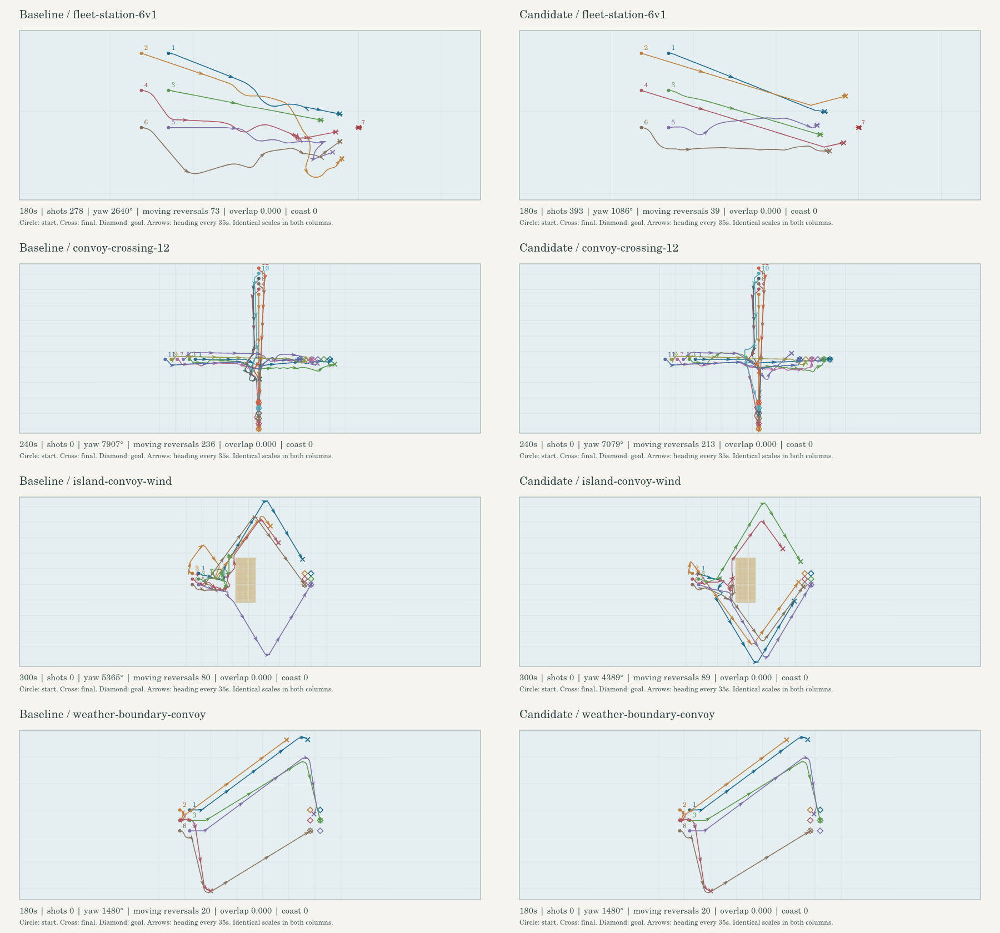

# 航海与运行时性能复核

本次把路线质量和CPU计时放进同一套可重复场景，并用真实 Chromium 验证模型复用与资源退出。完整小型指标在 [metrics.json](assets/naval-runtime/metrics.json)，轨迹对照如下。基线为 `4df96f7`；包含 v7/v8 AI 的产品基准另用 `c3a3188` 对齐 #209 共享情报和 #210 诅咒分配代码。所有计时按同机顺序执行，测量期间暂停其他测试；源码指纹写入指标文件。



## 航线与舰队

真实 `stepGame` 的九个固定场景覆盖6对6移动目标、6对1停船炮位、比追击者更快的目标连续转弯、12船交叉航行、岛屿绕行、真实8分钟天气事件，以及三种船型90°/180°风变、无风与恢复。天气船队观察180秒，避免只看起步而漏掉后续驶离目标。开炮时间来自真实舷炮冷却状态。

单位为毫秒；初始化含造船和初始玩家命令的处理。单步只计游戏更新，碰撞/岸线采样在计时之外；首次航路搜索若在游戏更新发生，也计入单步。

| 场景 | 游戏秒数 | 初始化 | 平均单步 | p99单步 | 最大单步 |
| --- | ---: | ---: | ---: | ---: | ---: |
| fleet-moving-6v6 | 150 | 26.84 → 20.02 | 15.638 → 14.445 | 114.885 → 91.201 | 231.19 → 226.50 |
| fleet-station-6v1 | 180 | 17.26 → 15.34 | 3.990 → 1.866 | 59.262 → 22.218 | 94.05 → 46.01 |
| long-chase-turns | 240 | 12.95 → 10.80 | 0.229 → 0.189 | 0.563 → 0.439 | 3.79 → 5.19 |
| convoy-crossing-12 | 240 | 5.33 → 7.77 | 0.681 → 1.060 | 2.238 → 26.270 | 130.53 → 118.99 |
| island-convoy-wind | 300 | 9.98 → 9.33 | 2.109 → 2.045 | 54.785 → 43.408 | 693.10 → 945.02 |
| weather-boundary-convoy | 180 | 8.75 → 9.45 | 0.503 → 0.418 | 7.398 → 6.599 | 73.25 → 66.18 |
| wind-shifts-cutter | 240 | 7.26 → 7.50 | 0.033 → 0.024 | 0.066 → 0.069 | 1.17 → 1.11 |
| wind-shifts-warship | 240 | 5.11 → 5.22 | 0.037 → 0.027 | 0.065 → 0.057 | 0.83 → 0.77 |
| wind-shifts-shipOfTheLine | 240 | 5.43 → 5.50 | 0.038 → 0.026 | 0.069 → 0.052 | 0.85 → 0.85 |

目的地进度为 `1 − 最终距离 / 初始距离`，是目标接近程度，不是路径执行百分比。最小值反映队尾。转向总量计20Hz实际朝向变化；反向须上一段转向超过1.5°，另列间隔短于2秒的快速反向，避免漏掉慢摆舵。

| 航行场景 | 最差目标进度 % | 平均目标进度 % | 船队总转向 ° | 行驶中反向 | 其中快速反向 |
| --- | ---: | ---: | ---: | ---: | ---: |
| convoy-crossing-12 | 75.40 → 80.30 | 96.81 → 98.18 | 7907 → 7079 | 236 → 213 | 100 → 87 |
| island-convoy-wind | 25.47 → 67.46 | 70.13 → 85.25 | 5365 → 4389 | 80 → 89 | 10 → 23 |
| weather-boundary-convoy | 6.52 → 6.52 | 63.64 → 63.64 | 1480 → 1480 | 20 → 20 | 2 → 2 |
| wind-shifts-cutter | 100.00 → 100.00 | 100.00 → 100.00 | 268 → 268 | 6 → 6 | 1 → 1 |
| wind-shifts-warship | 71.31 → 71.31 | 71.31 → 71.31 | 183 → 183 | 3 → 3 | 0 → 0 |
| wind-shifts-shipOfTheLine | 57.22 → 57.22 | 57.22 → 57.22 | 179 → 179 | 2 → 2 | 0 → 0 |

交叉船队的CPU结果退步：平均0.681 → 1.060ms，p99从2.238升至26.270ms。绕岛场景最大单步693 → 945ms、快速反向10 → 23；路径进度的收益伴随这些代价，不能据此推断CPU和转向指标全面改善。

个别船的进度也有下降：绕岛首艘战船85.98% → 71.86%，交叉船队1004号重船97.01% → 80.30%。船队平均和最差进度改善，并不代表每艘船都改善。

6对1炮位首炮时间：基线 [55.85, 125.00, 34.45, 125.55, 38.35, 120.95] 秒，候选 [38.45, 55.10, 35.30, 50.85, 64.95, 54.75] 秒；180秒内己方炮数 278 → 393。已进入炮位后的停船射击不计导航停滞，静止瞄准反向单独保存。

个体结果有取舍：1005号船首炮 38.35 → 64.95 秒；1006号船首炮 120.95 → 54.75 秒，但快速反向 7 → 15、全反向 18 → 22。不能说每艘船的每种转向指标都改善。

6对6移动目标战斗的己方首炮：[30.45, —, 47.55, 80.95, 72.95, 41.00] → [29.20, 86.40, 108.65, 99.85, 121.10, 37.15] 秒（—表示观察内未开炮）；己方炮数 94 → 94，结束己方存活 4 → 2，双方总存活 5 → 3。本场景平均CPU 15.638 → 14.445 ms，p99 114.885 → 91.201 ms；战斗轨迹、开炮和存活不同，表中时间是实际负载观测，未做确定的耗时归因。

天气切换后，拥堵队尾仍可能在进入第一条稳定抢航直腿前累计约一圈转向；本次不声称消除所有起步绕行。后排重船180秒目标进度仅 6.52%（基线 6.52%），逆风大弧路线仍需继续改进。180秒观测保留每艘船进度、转向和反向明细。

长距离追击的初始间距 3002，最终间距 696（基线）、696（候选）。目标船更快，240秒观察内未进入射程；本场景验证连续追航，不保证抓住更快目标。

全部场景的两版10Hz采样均无船体重叠、无船体入岸。1Hz图像只用于复核路线形状；不替代20Hz转向指标，也不构成任意地图上的安全证明。

## 产品负载与快照

现有 `naval-navigation-benchmark.ts` 运行 brokenSea 的真实命令接纳、v5/v7/v8 AI 与仿真300秒，结束单位/船只/建筑为 55/7/26（基线）和 55/7/26（候选）。

| 产品更新 | 基线 | 候选 |
| --- | ---: | ---: |
| 平均单步 ms | 1.306 | 1.082 |
| p99 ms | 13.668 | 10.668 |
| 最大单步 ms | 276.69 | 298.33 |
| 超过50ms次数 | 16 | 13 |

路线全搜索仍可能产生长单步，不能据平均值声称卡顿消失。两版结束校验和各保存在指标文件；导航行为改变会影响后续战斗结果。

另以1000单位连续读取同一帧快照1000次，耗时 123.368 → 0.178 ms；候选1000次复用已有不可变快照。真实玩家命令仍使快照失效并前进到下一tick，旧快照保持原tick。这个差距仅适用于没有新仿真帧的读取，不是整个游戏CPU降幅。

## 浏览器模型、绘制与退出

Chromium + SwiftShader，1280×720，24船、76船员和160陆地单位共280单位。六轮创建/准备/绘制/销毁；每轮120次相同快照、120次真实 `snapshotGame` 生成的新tick快照。计CPU时临时禁用 `renderer.render`，每轮前后仍执行真实WebGL draw并检查错误。两版均无JS/WebGL错误，draw calls/三角形相同（336/485052）。

| 浏览器测项 | 基线 | 候选 |
| --- | ---: | ---: |
| 相同快照CPU绘制均值 ms | 2.978 | 3.032 |
| 新tick快照CPU绘制均值 ms | 3.009 | 3.173 |
| 六轮GLB HTTP请求 | 32 | 32 |
| 成功安装解析后模型次数 | 192 | 32 |
| 后五轮首页+对局准备均值 ms | 29.14 | 0.34 |
| 持有原始下载缓冲字节 | 4885309 | 0 |
| 每个销毁层残留scene子对象 | 4 | 0 |
| 六轮销毁后原生上下文丢失 | 0/6 | 6/6 |

CPU绘制约3ms，没有测得改善；本轮收益主要是解析模型复用、少持有原始字节、明确释放层资源。首次冷准备 136.80 → 185.30 ms 是每版一次观测，不能据此保证首次加载变快。软件GPU没有提供真实硬件FPS或GPU耗时结论。

故意保留六个已销毁层对象后请求GC，堆大小为基线 22.75 → 30.32 MB，候选 19.82 → 20.87 MB。它验证显式清空是否有效，不代表生产环境泄漏速率。候选所有层的单位、甲板动画、卡片、批次和scene缓存都归零；共享模型在应用范围保持32个，最终全局销毁归零。Three纹理计数销毁后仍为1，但六个原生GL上下文均已丢失，不能把内部计数当仍存活的GPU纹理。

真实应用另验证了 `persisted=true` 事件保留状态、永久退出和两条异步退出：开始对局时拖住GLB请求后退出，以及拖住音效目录JSON解析后退出。释放延迟任务后没有恢复对局、没有新音效请求、没有未处理异常，资源队列/缓冲/模型缓存归零，RAF计数停止。这些通过派发 `PageTransitionEvent` 验证，不宣称验证真实浏览器暂停或完成BFCache往返导航。

## 回归检查

最终源码在 `c3a3188` 上完成 `npx vitest run --maxWorkers=2 --minWorkers=1`：319 个文件、2,846 项测试全部通过。`npm run build:production` 通过，包含 TypeScript 检查、浏览器生产包和服务端 bundle。Vite 仍报告已有的大 chunk 提示；本轮没有声明下载包体缩小。

## 复跑

`CHROMIUM_PATH` 指向已安装的 Chromium；脚本使用已有 Vite/ws 依赖，临时文件在 `work/` 创建并清理。长轨迹和原始浏览器日志不进入仓库。

```sh
npm run benchmark:naval-runtime -- --record --out work/naval.json
npm run benchmark:naval-runtime -- --only weather-boundary-convoy --duration 180 --out work/weather.json
CHROMIUM_PATH=/usr/bin/chromium npm run benchmark:browser-runtime -- --out work/browser.json --screenshot work/browser.png
node --import tsx scripts/local-snapshot-benchmark.ts --units 1000 --reads 1000
npm run benchmark:naval-navigation -- 300
node scripts/render-naval-runtime-review.mjs work/before.json work/after.json work/comparison.png
```

旧版对比先建立基线worktree并安装同一依赖，将本次基准脚本/fixture复制过去，再分别顺序执行。只比较相同场景和时长；时间数据来自固定场景、同一台机器的一次顺序轮次，六轮浏览器数值保留在JSON。不同电脑、队伍规模和地形需要重测。
