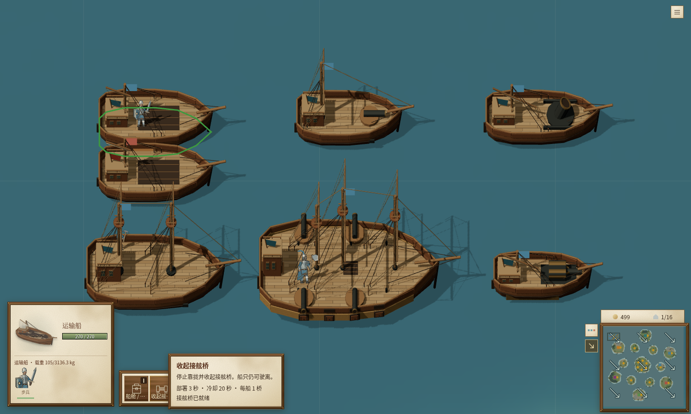
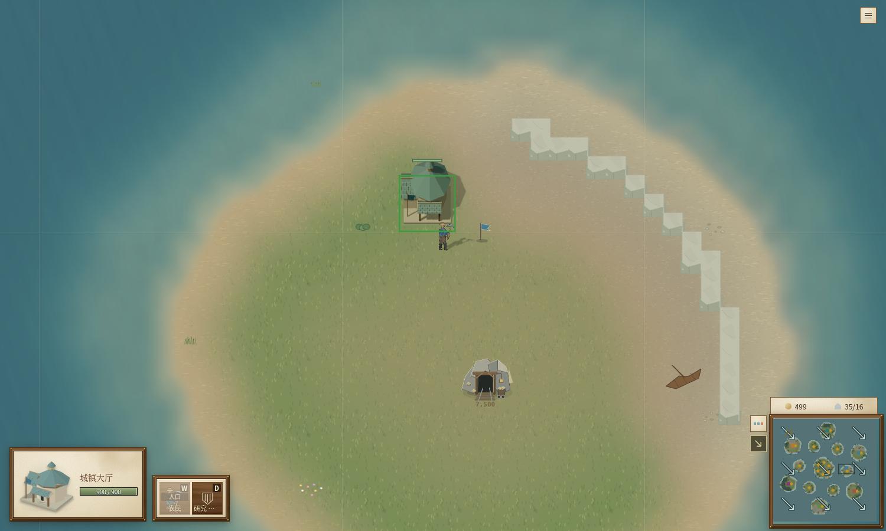
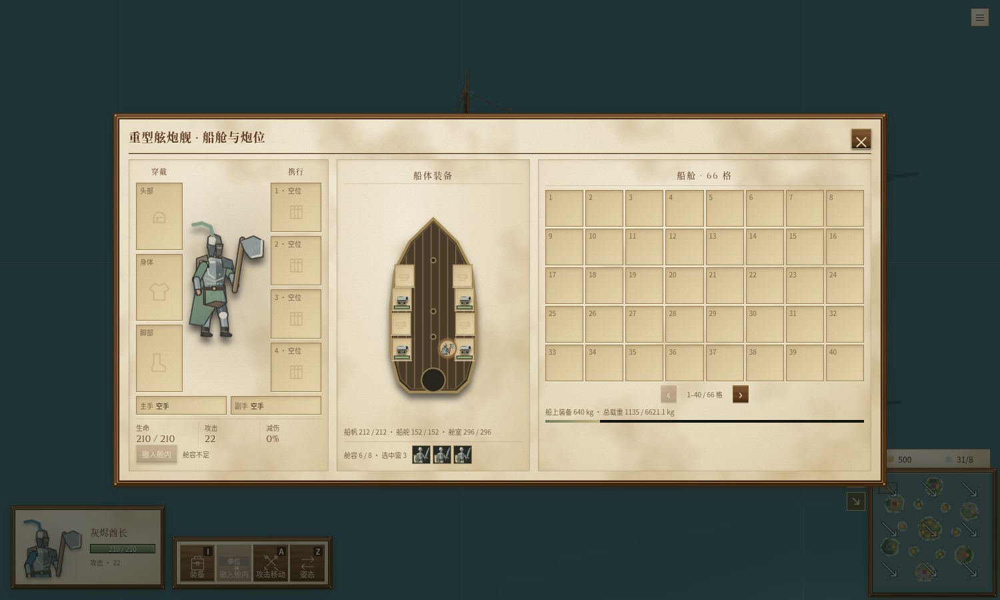

# 舰船与矿岛实机界面验收

通过真正的静态本地房间入口启动 `main.ts`，使用 Chromium 的实际 WebGL 舰船／建筑模型渲染。自动化夹具保留蓝宝群岛的真实地形、矿物与建筑，固定接舷双方的合法平行初始姿态，并关闭其他电脑玩家的指令；没有替换模拟或渲染器。为了降低截图会话的 CPU 占用，绘制频率限制为约 10 帧／秒，因此本项不作为浏览器性能结果。

实际选择运输船后，“主动接舷”可用；点击敌运输船，经过普通模拟部署，按钮变为“收起接舷桥”，说明显示“部署 3 秒 · 冷却 20 秒 · 每船 1 桥／接舷桥已就绪”。同一时刻 `gangwaySurface.phase` 为 `ready`、`decksCanTransfer` 为 `true`。两船蓝旗与红旗均在真实画面中显示。之后步兵登舰使目标船进入当前玩家的单位列表；夺船后的模型重新着色另外由 `world-layer.test.ts` 与 `world-renderer.test.ts` 覆盖，图中截取的是目标仍挂红旗的阶段。

在卫星岛 `gold-satellite-0`，普通工人收到真实建造命令并完成城镇大厅。画面同时显示工人、7500 金矿、大厅及岛外水域；大厅中心为 `(7312,5072)`，距矿约 314 游戏单位，实际选择栏显示 `900/900`。没有放松矿物禁建距离、修改工人生命或替换岛屿地形。

先前同一实际界面还验证了加权舱容 `6/8 · 选中需3` 时撤入舱内按钮禁用，以及运输船／运兵舰的短属性行“船体远程／攻城普攻及塔伤害70%（含魔法）；乘员输出50%”。风图可开关，光标提示显示当前风吹向东南。

最终截图会话中 32 个 GLB 请求全部返回 200，控制台错误、页面异常与失败请求均为 0。两张截图均已人工查看，浏览器及 Vite 服务已关闭。
