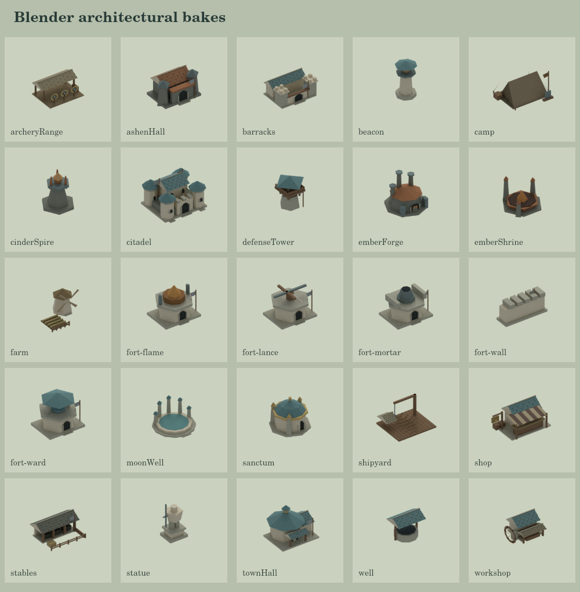
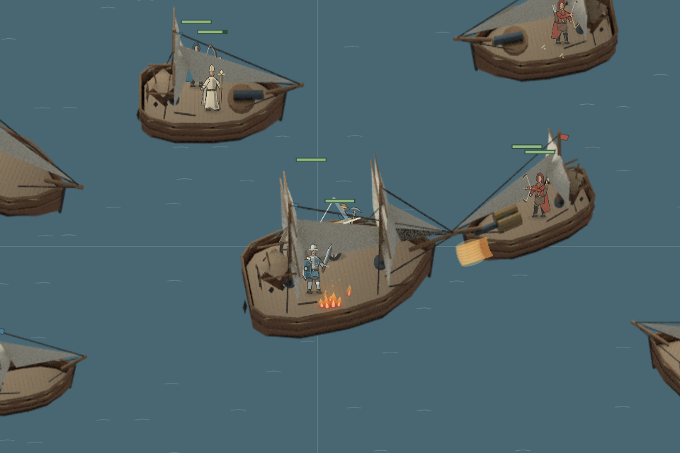

# 实体甲板与 Blender 建筑

这次把船从隐藏乘客的运输容器改成可战斗的移动甲板，并把六种船、14 种常规建筑、11 种场景建筑接入 Blender 离线建模与烘焙。



保留原有建筑类型的结构和轮廓，补全背面、底面和屋顶，使用统一的粗糙材质、柔和环境光和方向光。石墙、木构件、蓝灰瓦、铜色屋顶仍能区分种族与功能。队色独立蒙版，可在游戏中更换；无需实时 WebGL。



船上乘员仍在单位列表中，可以选中、移动、攻击、施法和被攻击。甲板位置与移动目标保存在船的局部坐标中；船的平移和旋转不会消耗射手的站位容差，乘员自己走动仍会重置瞄准。船沉后乘员损失与击杀只统计一次。

登船同时检查实际圆形占地、甲板轮廓、桅杆与武器障碍以及公斤载重。步兵、骑兵和工程武器使用独立于价格与人口的质量；体型变体按体积缩放质量。装载量及重心偏移影响航速、加速和转向。六种船都有甲板，但运输船与远洋运兵舰仍负责 AI 的渡海任务。共享 AI 会为安全港口附近的战船挑选射手或治疗者，并保留岸上的守军。

选船后可查看乘员并逐个点击卸载。无附近陆地时返回拒绝原因；甲板空间或载重不足时会拒绝登船，并在到达时重新检查。旧存档的嵌套乘员会转换成活跃单位，过满的旧任务船会扩大船体以保存所有乘员。校验版本已随状态改变升级。

## 重建美术

需要 Blender 4.x、Python + Pillow，以及项目 Node 依赖。仓库保存建模源与部署图片；`.art-build/` 中的可编辑 `.blend` 场景和中间帧可随时重建。

```sh
BLENDER_BIN=/path/to/blender npm run art:ships
BLENDER_BIN=/path/to/blender npm run art:buildings
node --import tsx src/recorder/cli.ts --scene deck-battle --seconds 12 --out recordings/deck-battle.mp4
```

船由 `assets/naval/ships.json` 和 `tools/art/build-ships.py` 定义。每种船导出 32 个方向的船体、上层物件、深度图，以及共享模拟使用的甲板、船体、障碍与武器安装点。深度图让近侧栏杆和桅杆遮挡乘员、远侧物件留在乘员之后；渲染时校正相机投影与世界坐标。建筑的可编辑构件位于 `src/client/art/building-models.ts`，由 Blender 重建网格、赋材质并渲染。

## 音频

`tools/audio/prepare-war3.py` 从服主提供的完整音频目录提取适用的船炮、沉船、施法、登船及单位回应，并转码成 117 个 Ogg 文件。基础九类事件留在 `pack.json`；新增八类事件放在 `extras.json`，旧客户端仍能读取基础包。新客户端按需加载单位声音和变体，合并进行中的下载，并限制重复回应。音频资源放在服务器共享目录，仓库只保存处理脚本。

```sh
python3 tools/audio/prepare-war3.py /path/to/war3-1.27-enUS-sounds /path/to/prepared/war3
```

部署时保留既有 `audio-packs/war3` 文件，复制新增 Ogg 和清单，继续由 `served.json` 提供该包。服务器已准备好资源目录，当前线上音频包保持原样。

## 当前边界

这一版落实甲板占地、载重、局部移动、碰撞、瞄准与战斗。船之间使用导出的凸多边形碰撞，海岸路径仍使用现有海洋导航网格；尚未实现吃水、风力、倾覆、甲板高度弹道或敌舰接舷夺船。建筑当前使用固定视角，船使用 32 向图片；模拟航向保持连续。

验证包含全量回归、图集解码、几何与建模源的一致性、旧存档恢复、甲板瞄准与移动、沉船记账、AI 渡海和按空间配员，以及通过游戏本身的录屏器生成的甲板战斗。
