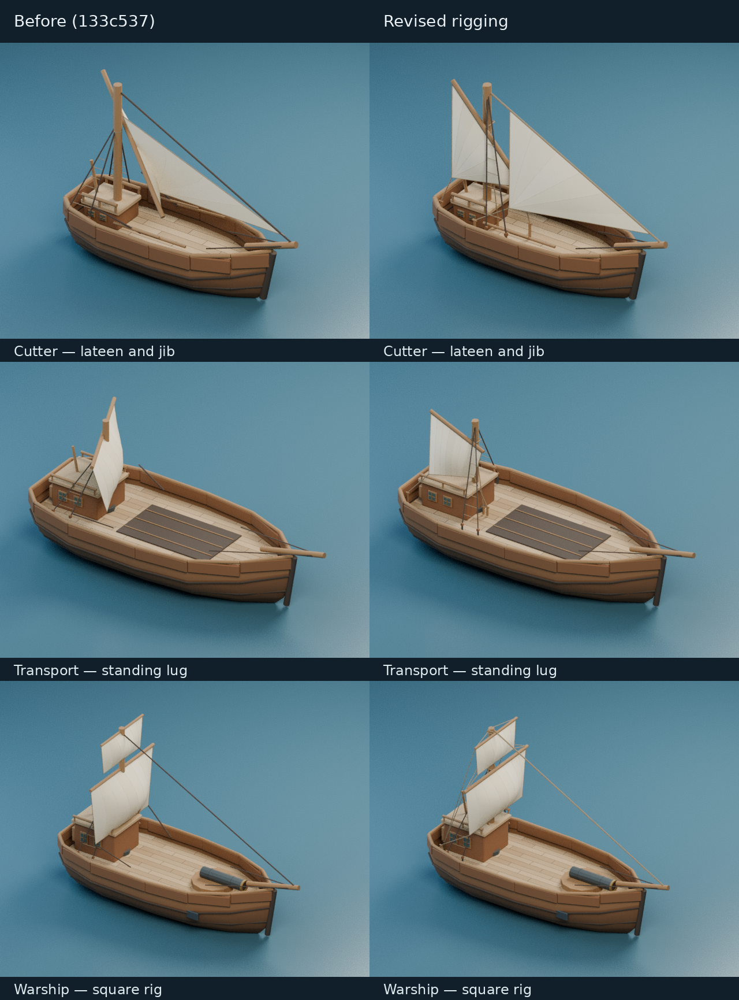

# 帆形与索具连接修正

2026-10-08，在船体外观细化之后，对帆装重新做结构检查。原版统一沿船首方向偏移帆面，艏三角帆因此仍是一片平面；不同帆型共用了横帆的控帆索坐标，部分绳索没有连接到实际帆角。

图中使用实际导出的 GLB，相同相机、船体位置和灯光；对比基线为 `133c537`。

## 帆装关系

- **帆面**：按帆角构成的面法线生成鼓度，统一的展示受压方向只负责选择鼓出的那一侧。旋转船模不会改变帆形；艏三角帆真正离开原平面，帆角、帆边和缝线保持相连。
- **拉丁帆**：快船、火攻船和臼炮船改为纵向斜桁三角帆，高桁端在后、低桁端在前，另设后下帆角。前角接下拉索，后角接船尾控帆索。固定后桅的船尾空间较小，因此采用较窄帆形。
- **运输船**：采用 standing lug 纵向斜桁帆，桁前端稍伸到桅前，前下角在桅旁拉紧，后下角由船尾控帆索控制。
- **横帆**：下层帆角的控帆索向后舷引出，上层帆角连接下一级横桁端；横桁带有升降索、吊索和转桁索。横桁位于桅杆前方，以桁箍相连。
- **支承**：斜桁与横桁都有实际连接的升降索和桁箍，帆头用绑绳接桁；升降索从桅杆同侧引下。绳端有固定柱，支索死眼下面有链板，避免部件悬空。
- **净空**：调整纵帆的支索挂点与引向，避开帆腹；抬高横帆下沿，避开艉楼屋面。桅杆、甲板、船体和炮位的物理几何保持不变。

这些是有明确挂点的简化静态帆装。没有加入风速、视风、迎风禁航区或气动力计算；固定桅位下的帆面积和受力中心也未经过真实船舶设计验证。航速、转向与载重规则沿用游戏现有设定。

## 验证

- 三角帆和四角帆经过任意轴旋转、平移、鼓出侧翻转及边界检查；艏帆具有真实的面外鼓度，退化或无效输入会被拒绝。
- 对六船、七根桅杆的实际 Blender 网格检查：未发现帆与桅杆、舱室、栏杆、支索、升降索的非预期穿插；帆角接控帆索、前帆边缘接支索保留正常接触。
- 逐根确认帆角控制绳、帆头绑绳和桁箍的连接。两根升降索使用独立走线与固定点；运兵舰瞭望台有实际穿索孔，扣除绳半径后最小净空约 0.127 模型单位。
- 六个导出 GLB 均无非有限坐标、退化三角面或绕序与法线相反的面；各 15 个材质，最大文件约 902 KiB。
- 最终重建后，12 个相关测试文件、33 项检查及生产构建通过，覆盖模型载入、头像、帆布透明、甲板和炮位行为。
- 实际生产 `World3DLayer` 在 Chromium 软件 GPU 中显示六船型，检查两个朝向和选中船员后的帆布透明：三次画面均无 WebGL 错误、页面异常或失败请求。这是显示功能验证，不是实体显卡性能测量。

本轮修正相对 `133c537` 新增约 471 KiB 的六船资源；整个 PR 相对主分支约增加 1.18 MiB，详见[船模资源表](ship-model-refinement.zh.md#资源与验证)。

## 参考

- [USF 历史拉丁帆图](https://etc.usf.edu/clipart/87200/87276/87276-boat-with-lateen-sail.htm)与 [Mallorca 海事博物馆的 llaüt 帆装说明](https://museumaritim.conselldemallorca.es/en/-/san-miguel-un-llaut-gran-de-1899)：纵向斜桁与三角帆的基本关系。
- [Really Simple Sails：五种 lug 帆装](https://reallysimplesails.com/what-type-of-lug-sail-is-that-standing-balance-dipping-or-misainier/)：区分 standing lug、balanced lug 等帆角和桁杆布局。
- [美国国家公园管理局：传统操帆说明](https://www.nps.gov/safr/blogs/setting-sail-traditional-sail-in-the-21st-century.htm)：横帆、帆角索和操纵横桁的索具。

生成逻辑位于 `tools/art/ship_rigging.py`，曲面逻辑位于 `tools/art/ship_sails.py`。使用[船模重建命令](ship-model-refinement.zh.md#重建)重新导出全部六种船。
