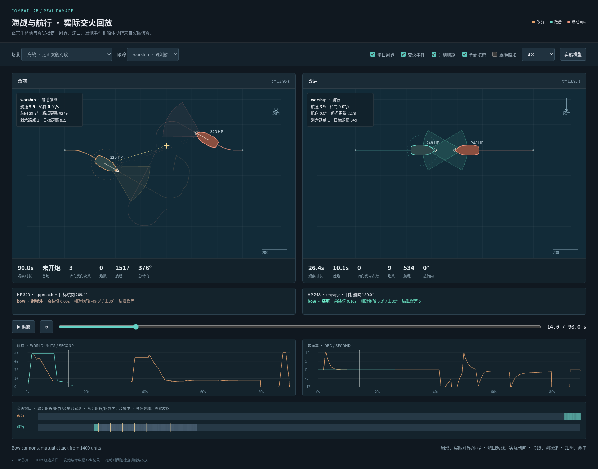
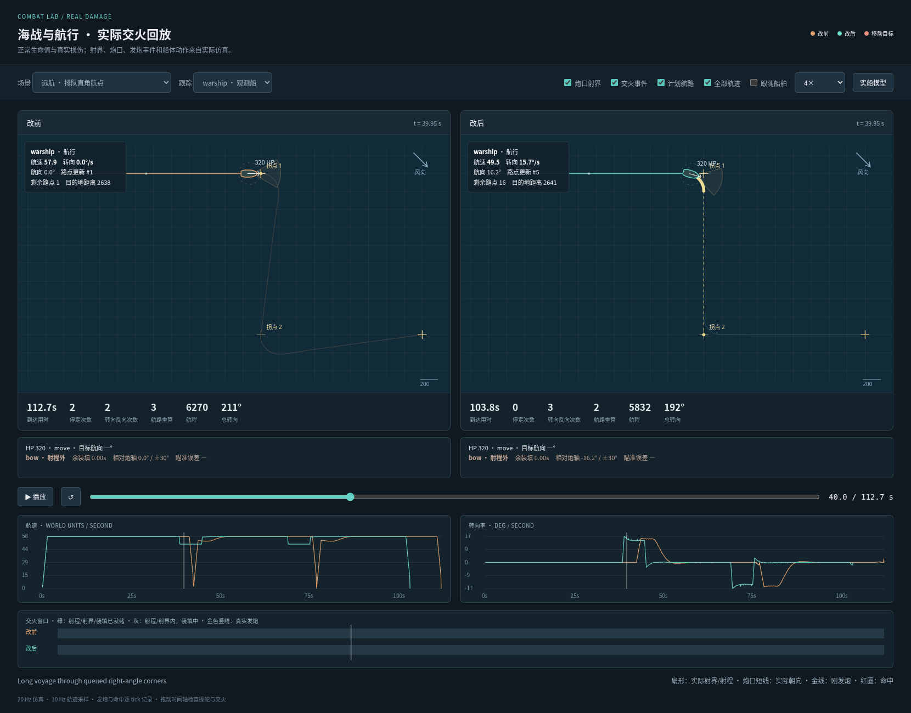

# 海战与航路修正：实战回放验收

本次固定线上基线 `e721bd4`，以同一场景、同一初始状态和指令运行真实 `stepGame`。战舰使用正常生命值、装填、炮位射界、甲板部件损伤和真实发炮/命中事件；目标船也使用对应版本的导航。20 Hz 仿真逐 tick 记录交火，10 Hz 采样航迹。

此次验收同时检查“开火窗口有没有被浪费”和“整个航行过程是否合理”。最终到达或射出一炮都不足以证明海战质量：需要查看装填完毕且进入射界的等待、炮口与船首协调、航速锯齿、反复转向、迎风有效推进及角点之前的转弯准备。

## 线上基线的可见问题

| 场景 | 实际观察 |
| --- | --- |
| 远距双舰互攻 | 90 秒内观测船没有开炮，总转向约 376°。两舰接近后偏离炮口方向，未形成稳定交火。 |
| 迫击炮拦截横移目标 | 90 秒没有开炮；已装填且在射程、射界内累计约 23 秒，其中一个连续可开火窗口约 19.5 秒。船体移动让瞄准不断重置。 |
| 迫击炮目标在最小射程内 | 为拉开距离进行了约 330° 的转向，首炮等待约 36 秒。 |
| 火船拦截横移目标 | 90 秒没有开火，累计转向约 501°。路线接近和炮口接敌没有形成一致动作。 |
| 战舰向正上风 1500 距离航行 | 用时约 131 秒，航程约 5123；73° 的抢航角使大量航程花在侧向移动。 |
| 排队经过两个直角航点 | 到达第一个角点后才出现大转弯，角点之间存在短暂停走。路线层没有提前使用后续航点。 |

上述数字来自基线真实仿真；独立的短窗口开火探针还验证了移动炮口在有合法射界时持续重置瞄准的原因。

## 最终实战回放

最终矩阵包含 28 个真实仿真场景：12 个交火场景和 16 个航行/迎风场景。16 个点目标场景均到达，全部 28 个场景没有船体重叠或越岸记录。浏览器对重点场景实际播放、暂停并逐段检查炮口、射界、航速与转向曲线；另用生产 `World3DLayer` 和实际 GLB 船模复看互攻、迫击炮、火船和迎风航行。

[独立对比回放](assets/ship-combat-v2/comparison.html)约 4.02 MB，包含 16 个代表场景；下载后可用支持 `DecompressionStream` 的现代浏览器打开。页面内嵌全部数据与脚本，已在断网 Chromium 中验证切换、播放、暂停与拖动时间轴，无外部请求。[完整指标](assets/ship-combat-v2/metrics.json)、[数据来源校验](assets/ship-combat-v2/data-provenance.json)、[浏览器验收记录](assets/ship-combat-v2/browser-review.json)。

| 场景 | 改前 | 改后 | 逐段检查结果 |
| --- | --- | --- | --- |
| 远距双舰互攻 | 90 秒没有开炮，总转向约 376° | 10.05 秒首炮，9 发、9 中，总转向 0° | 接敌后保留船首对炮口，减速交火；没有对向擦过后重新绕圈。 |
| 近距双舰互攻 | 4.9 秒首炮，26 次停走 | 1.35 秒首炮，1 次减速停船 | 原来密集归零的速度锯齿消失，船首保持稳定。 |
| 炮舰拦截横移目标 | 16.3 秒首炮，256 次停走 | 9.95 秒首炮，1 次停船，8 发命中 | 先接近并开炮，再逐渐转向跟上目标；持续移动不再清空瞄准。 |
| 迫击炮拦截横移目标 | 90 秒未开炮，连续浪费约 19.5 秒可开火窗口 | 7.8 秒首炮，5 发命中 | 炮口在合法射程/射界内及时完成瞄准；没有无用掉头。 |
| 迫击炮脱离最小射程死角 | 36.3 秒首炮，总转向约 330° | 11.4 秒首炮，总转向约 30° | 短距离倒退拉开射程，再停稳射击。 |
| 火船拦截横移目标 | 90 秒未开火，总转向约 501° | 10.6 秒首发，8 发命中、80 伤害，3 次停船 | 接战后顺势转向追随；离开炮程后保持约 45 航速，途中不再周期停在精确路点。 |
| 狭海三对三 | 观测船 43.75 秒首炮，全队 2 发 | 观测船 12.75 秒首炮，全队 20 发、20 中 | 船体没有互相穿越；前排能在炮口方向形成交火。 |
| 战舰正上风 1500 距离 | 131.4 秒，航程约 5123 | 77.05 秒，航程约 2635 | 尽早进入有效长舷，带着入弯惯性完成换舷，随后恢复约 48 航速。 |
| 迎风追击移动运输船，前 45 秒 | 上风推进约 516 | 上风推进约 1042；前 20 秒有 15.55 秒有效快航 | 先完成当前可航长舷，追击目的地更新不会把船永久停在中间点。 |
| 排队经过两个直角航点 | 112.65 秒，2 次停走、2 tick 进入空闲 | 103.85 秒，0 次途中停走、0 空闲 tick | 转到 10° 时仍距两个角点约 0.835/0.830 个船长；在角点前已沿计划圆弧转入下一段。 |





其他截图：[迎风换舷](assets/ship-combat-v2/upwind.png)、[火船追击](assets/ship-combat-v2/flame-pursuit.png)、[生产 GLB 船模实战复看](assets/ship-combat-v2/model-combat.png)。

岛屿绕行用时由 85.65 秒变为 86.2 秒，航程由约 4774 变为 4783；本次没有将所有航行描述为更快。重型横帆舰穿风仍会降低推进速度，近岸、死角脱离和接战站位也需要减速。验收重点是这些动作有明确用途，且不会由中间路点或目标更新触发连续停走。

## 回放判读与复现

- 交火场景在一方舰队被击沉时提前结束，因此两侧“观察时长”和总炮数可能对应不同持续时间。首炮时间从同一指令发出时计算；命中和伤害使用真实事件。表格时长取仿真结束 tick，时间轴末帧可能因 10 Hz 采样相差 0.05 秒。
- “已装填且在射程/射界内”仍可能需要正常瞄准时间。最终代表场景最长连续等待约 0.5–1.4 秒；不能将每一个装填完成的 tick 都算成漏炮。
- 回放上方的“路点更新”包括计划末端移动和经过路点，完整指标中的 `routeRevisions` 只计路线对象重建，两者不是同一计数。
- 目标为甲板船员时，距离取实际炮口记录的目标点；没有采样到的目标航向显示为缺失，不用船体位置冒充船员位置。
- GLB 复看使用真实船体位置、船首、炮位朝向、发炮事件和部件损伤。当前采样保留帆状态；模型复看用于检查运动和交火观感，平面回放用于检查完整航迹与射界。
- 角点提前量只有在船已建立前一条航段后才计入；旧版到达航点才启动下一个移动指令，提前量为缺失。相关新指标在冻结的 `e721bd4` 上用同一脚本重新采样。

使用 `scripts/ship-combat-review.ts` 分别对冻结基线和待验收版本采样，然后导出独立页面：

```sh
npx tsx scripts/ship-combat-review.ts --out work/ship-combat-review.json
node scripts/render-ship-combat-review.mjs before.json after.json
```

默认导出目录为 `docs/reviews/assets/ship-combat-v2`。原始 35–54 MB 采样仅在工作目录保存，仓库保留压缩独立回放、指标、校验值与少量截图。

## 航海资料与 RTS 参数边界

换舷需同时处理入弯速度、穿越风眼和出弯恢复，远航需提前规划下一航段的切线与转弯空间。这些原则来自此前实际阅读的[航海教材与驾驶指南](sailing-navigation-sources.zh.md)，并经本次逐段回放检查。

本次的横帆舰最佳近风角约 59° 是明确的 RTS 玩法参数；历史教材中横帆船距风向约 62–68° 的描述仍保留在资料记录中。当前没有完整的潮流、侧漂、海况、船员调帆或真实流体模型，不将这些游戏参数描述为历史船舰的精确性能。

追击也不承诺总能追上：移动目标可能具有更高的有效上风速度。验收要求的是追击船尽早转入可产生推进的方向，保留合理航段，并在形成真实射程/射界时及时开火。
