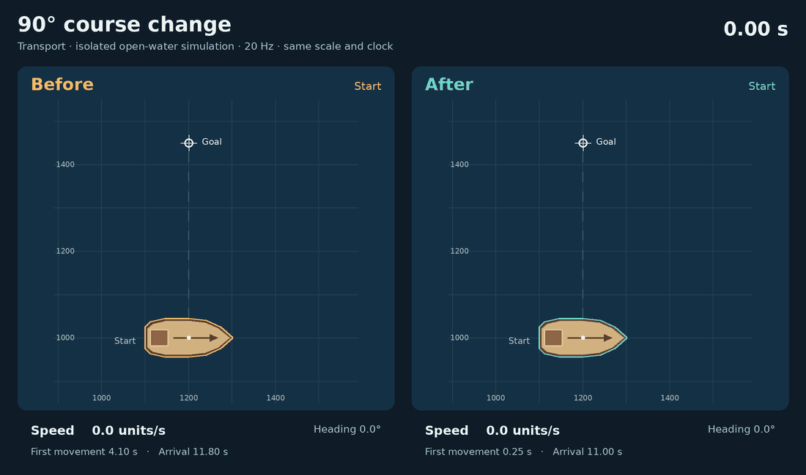
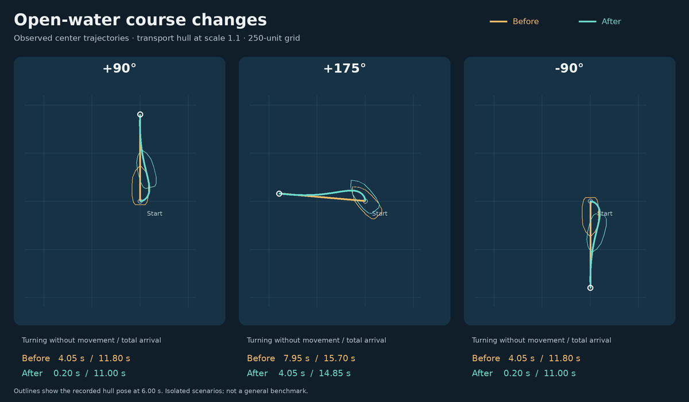

# 船舶边转向边前进

此页记录早期实现；当前导航分层、航海依据与回放验收见[船舶导航重做](ship-navigation-rebuild.zh.md)。

2026-10-08，普通航行改为沿参考航线连续转舵和推进。原控制器只要还没对齐下一段航向就把速度清零，导致每个拐角都先停船转完，再直线前进。

动画直接使用仿真每帧的位置和朝向，20 Hz、相同比例、相同时钟，没有对轨迹额外插值。它展示开阔水域中的单船测试，不是游戏画面录像。

本页的耗时、批量航行和压力数据来自 `133c537`，用于隔离连续转舵本身的变化；后续[风力与自动调帆](wind-sailing.zh.md)会随风向改变航速及路线，当前版本的到达时间不能直接沿用下表。

## 算法选择

采用适配本项目的 **Regulated Pure Pursuit（调速纯追踪）**：保留现有航线规划，在参考折线上选择前视点；根据前视点在船体坐标中的横向偏移求曲率，同时输出推进和转向。

- 曲率 `κ = 2y / (x² + y²)`，转向角速度 `ω = vκ`。船始终沿船首方向运动，不会横向滑移。
- 前视距离随当前航速变化，限制在船长的 0.45～1 倍。船会提前开始过弯，穿过折线上的纯转向节点。
- 弯道航速受 `turnRate / |κ|` 限制；同时保留加速上限、接近终点时减速，以及载重、帆装和舵损伤对操纵的影响。
- 最多预测未来 1 秒的转向与推进，逐步检查整个船体的旋转和前进扫掠；实际位移仍由共用物理入口检查地形、其他船和本帧运动预算。
- 曲线通道不安全时，从实际姿态重新规划并使用精确航段；通过安全节点后可重新尝试连续跟随。靠泊指定朝向、短距离倒船和绕接触点转动继续使用精确操纵。目标几乎正后方时先沿最短方向转到可前进范围，再进入弧线。
- 航线进度随存档保存，不引入隐藏的控制器状态。

参考资料：

1. [CMU：Implementation of the Pure Pursuit Path Tracking Algorithm](https://publications.ri.cmu.edu/implementation-of-the-pure-pursuit-path-tracking-algorithm)——前视点与曲率的几何推导。
2. [Nav2：Regulated Pure Pursuit Controller](https://api.nav2.org/nav2-rolling/html/md_nav2_regulated_pure_pursuit_controller_README.html)——随速度调整前视距离、曲率限速与前向碰撞预测；本实现按游戏的船体和确定性仿真约束改写，并非接入整个 Nav2。
3. [Breivik / Fossen：Guidance Laws for Planar Motion Control（2008）](https://fossen.biz/publications/2008%20Breivik%20and%20Fossen%20IEEE%20CDC.pdf)——对照研究了船舶 LOS 路径跟随；这里需要直接给出受限转向与推进，并预测长船体扫掠，因此选择上述方案。

## 可复查的行为对比

场景：运输船从静止开始，目标距离 450 游戏单位，无障碍、无交通，默认船体和操纵参数；原版为 `dce756f`。

| 初始目标方向 | 原版停船转向 | 新版停船转向 | 原版到达 | 新版到达 |
| --- | ---: | ---: | ---: | ---: |
| +90° | 4.05 秒 | 0.20 秒 | 11.80 秒 | 11.00 秒 |
| +175° | 7.95 秒 | 4.05 秒 | 15.70 秒 | 14.85 秒 |
| −90° | 4.05 秒 | 0.20 秒 | 11.80 秒 | 11.00 秒 |

“停船转向”统计发生转向但位移不足 0.001 的仿真帧。新版 +90° 的路径长约 478.70，原版为 450；以少量弧线路程换取连续操纵，不保证所有地图中的到达时间都缩短。

验证覆盖正负转角、180°、折线提前过弯、短距离倒船、船舵损坏、存档恢复逐帧校验和一致，以及原有靠泊、登船、交通和窄水道行为。另以六种船、五种距离和十一种初始角度做 330 组开阔水域检查：全部到达，终点误差小于 0.25，未出现非法船体姿态。

## 压力检查

执行现有 `node --import tsx scripts/naval-navigation-benchmark.ts 300`，运行含 AI 的 brokenSea 对局 300 仿真秒。发现倒船／支点转弯航线已由规划器验证，跟随器无需再重新搜索，因此改为直接交回精确执行器；保留完整的前向船体预测检查。

| 单次运行 | 平均 tick | P99 tick | 最慢 tick | 超过 50 ms 的 tick |
| --- | ---: | ---: | ---: | ---: |
| 原版 `dce756f` | 0.855 ms | 16.19 ms | 102.80 ms | 4 |
| 本次修改 | 0.877 ms | 6.52 ms | 63.42 ms | 2 |

这是同环境、同初始配置的压力检查。航行控制改变后，AI 后续行为和终局单位数量也会变化，因此不能将结果解释为相同快照下的纯性能增益，或实体设备的帧率保证。
