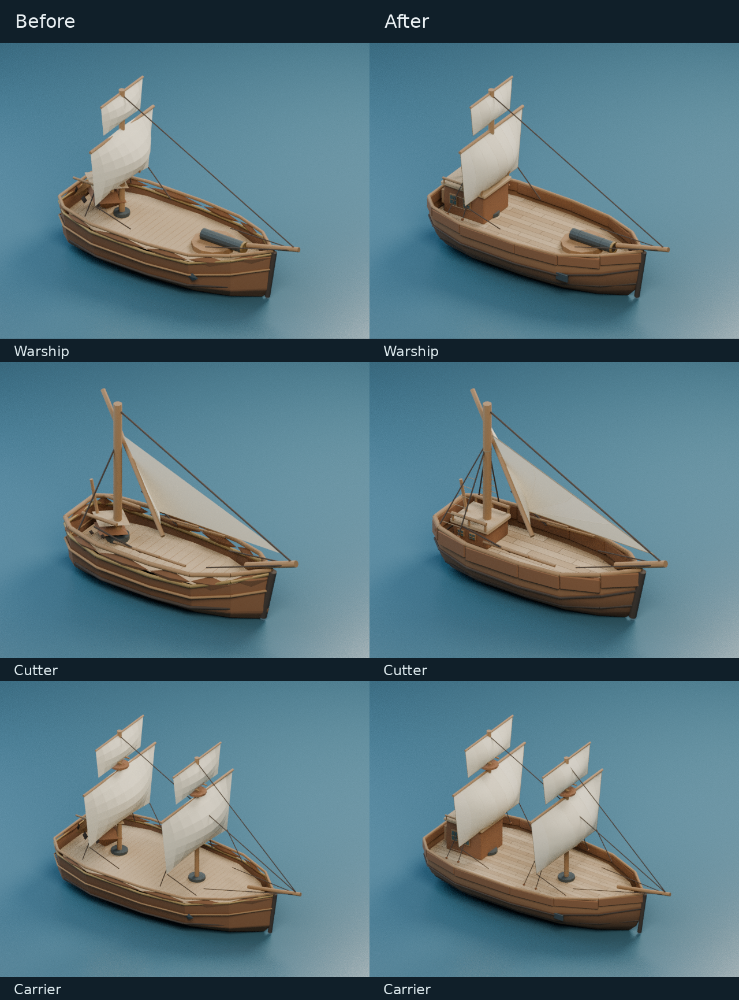

# 船模外观细化

2026-10-08，六种船只继续使用程序生成的自包含 GLB，改善船体、帆装及甲板细节。



对比图来自实际 GLB，在相同 Blender 正交相机和灯光下离线渲染；不是游戏帧率或画面效果的测量。

## 变化

- 船壳增加截面与平滑法线，使用深浅木色分出水线和干舷，舷侧腰线贴合船体。
- 甲板采用沿船长铺设的木板，错开端接缝，以小幅色差表现板材；行走表面高度不变。
- 三角帆、货船斜桁帆和横帆都有鼓风曲面、分片缝线及包边；保留不同船型原有帆装布局。
- 加入桅杆绑扎、侧支索绳梯、艉楼窗框与栏杆支撑，炮口有内膛和口沿。
- 修正方块未应用缩放就倒角导致细长构件变形的问题。所有帆布材质仍使用 `unbleached sail` 前缀，选中船或甲板船员时可以透明显示。

`assets/naval/ships.json` 与生成的物理几何逐字不变；船长、船宽、甲板高度、障碍占地和炮位没有随美术重建改变。模型仍使用 `Hull` 和独立的 `Gun` 节点。

## 资源与验证

六个 GLB 总大小从 2.14 MiB 增至 2.86 MiB，新增 740 KiB。这是外观细化的资源开销；没有新增图片纹理或运行时模型依赖。

| 船型 | 原三角面 | 新三角面 | 新 GLB 大小 |
| --- | ---: | ---: | ---: |
| `bombardShip` | 5869 | 6460 | 416 KiB |
| `carrier` | 7820 | 11375 | 714 KiB |
| `cutter` | 5174 | 6604 | 420 KiB |
| `fireShip` | 5913 | 6544 | 422 KiB |
| `transport` | 5834 | 6808 | 437 KiB |
| `warship` | 6464 | 8105 | 518 KiB |

- 11 个测试文件、26 项模型／甲板／船体／投影测试通过，包括炮位转动与后坐安全距离、船员移动和真实开炮，以及头像和帆布透明显示。
- 检查六个 GLB 的顶点、法线和三角面：没有非有限值、退化面或绕序与法线方向不一致的三角形。
- 实际生产 `World3DLayer` 在 Chromium SwiftShader 中显示六船型、独立舰炮和甲板弓手，检查两个朝向及选船员后的帆布透明；没有页面错误、请求失败或 WebGL 错误。这是软件 GPU 的功能验收，不代表实体显卡性能。
- TypeScript 检查、客户端生产构建及服务端打包通过。

## 重建

```bash
python3 tools/art/build-ships.py --blender /usr/bin/blender
node --import tsx tools/art/export-building-geometry.ts
SKETCH_MODEL_ONLY=cutter,transport,warship,bombardShip,fireShip,carrier \
  blender --background --factory-startup --python-exit-code 1 --python tools/art/export-world-gltf.py
```

帆面生成集中在 `tools/art/ship_sails.py`；导出器沿用当前材质与组件分组。
