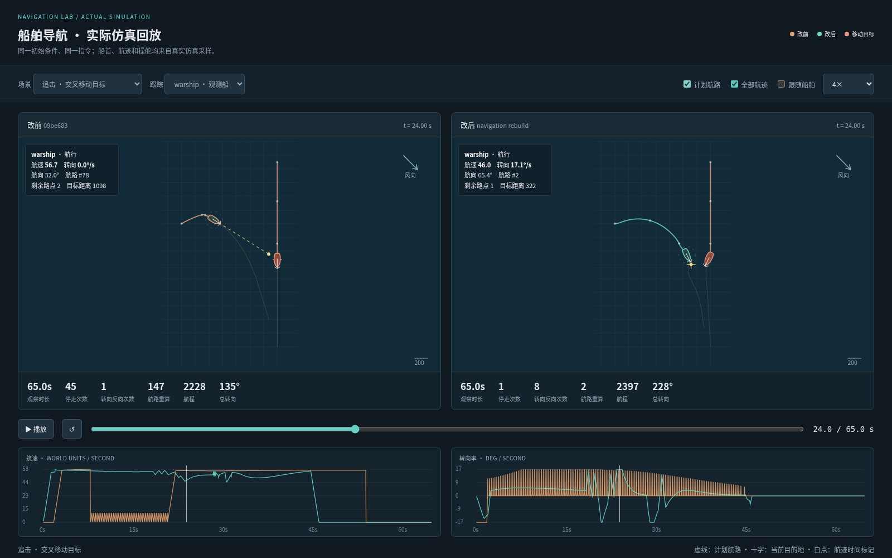
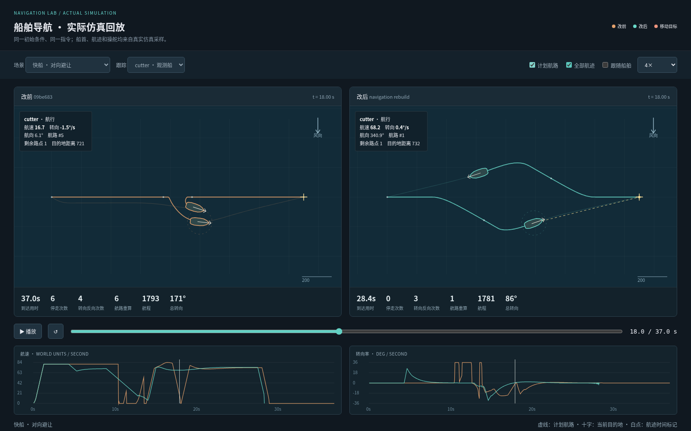

# 船舶导航人工回放验收

本次先固定改动前版本 `09be683`，再对同一初始状态、同一指令运行真实 `stepGame`，以 20 Hz 记录每艘船的位置、船首、前进速度、每 tick 转向量及计划航路。浏览器回放使用真实船体多边形，支持同时播放改动前后、暂停、拖动时间轴、跟踪不同船舶和观察速度/转向率曲线。轨迹不是手工绘制，也不使用另一套导航算法生成。

## 改动前人工观察

已在 Chromium 中实际播放并逐时刻暂停以下场景；随后根据曲线回查对应 tick，避免只凭最终是否到达判断航行质量。

| 场景 | 观察时段 | 观察到的行为 |
| --- | --- | --- |
| 战舰追击交叉移动的运输船 | 8–24 秒 | 7.95–20.85 秒之间，每隔约 0.30 秒，追击船先将速度置零并进入辅助操纵，下一 tick 又恢复扬帆加速。8–21 秒速度曲线密集锯齿；目标从身侧驶过，追击船仍在反复启动。65 秒共 45 次停走、147 次航路重建。 |
| 运输船从静止向正后方移动 | 0–12 秒，并检查完整曲线 | 最初约 4.3 秒没有前进，船首按恒定速率原地旋转。开始前进后在约 9、17、24 秒处，航速又反复降到近零；后两次处于几乎直线航段。到达终点并不代表路点衔接平顺。 |
| 战舰远距离逆风航行 | 0–95 秒，并检查完整航迹 | 首个侧向航段后明显停下再换舷，之后再次停转；整个航程总转向约 785°、4 次停走。航程倍率本身不能判为绕路：当前横帆船近风角为 73°，理想两舷路线也需要约 `1 / cos(73°) = 3.42` 倍直距。 |

还用生产 `World3DLayer` 与实际 GLB 船模复看了交叉追击 10–22 秒：模型的船首朝向会直接响应模拟中的断续转舵。该模型复看沿用采样位置和船首；船帆姿态在回放中按生产调帆函数重算，因此它用于检查船体运动观感，不充当逐 tick 帆形一致性的证据。

## 最终回放

最终矩阵包含 87 个真实仿真场景，75 个点目标场景均到达，全部场景没有船体碰撞或越岸记录。独立回放保留其中 17 个代表场景，浏览器在离线模式下验证切换、播放和拖动时间轴；实际复看了追击、开阔抢航、对向避让和目标停车后的跟随等重点片段。

[下载独立对比回放](art/ship-navigation-comparison.html)（约 2.53 MB，下载后用浏览器打开）；[浏览器验收记录](art/ship-navigation-browser-review.json)。

| 场景 | 改动前 | 改动后 | 回放中的区别 |
| --- | --- | --- | --- |
| 交叉移动目标追击，观察 65 秒 | 45 次停走、147 次航路重建 | 1 次停船、2 次航路重建 | 原来密集归零的速度锯齿消失；目标停车后追击船减速停稳。靠近目标时仍有避让和站位改向。 |
| 战舰在开阔海域逆风航行 | 173.4 秒，4 次停走，总转向 785.3° | 147.9 秒，0 次停走，总转向 267.6° | 用完整的两舷航段前进；换舷带着前进速度完成。 |
| 两艘快船对向交换目的地 | 37.05 秒，6 次停走，6 次航路重建 | 28.45 秒，0 次停走，1 次航路重建 | 提前向右让路，通过后从当前位置接向终点，不再绕回原中心线。 |
| 普通跟随，前船随后停车 | 54.05 秒停稳，107 次航路重建 | 45 秒停稳，3 次航路重建 | 前船停止后，跟随船进入安全间距并停稳。 |
| 运输船从静止向正后方移动 | 28.35 秒，原地转向 4.3 秒 | 40.05 秒，原地转向 0 秒 | 改成有前进速度的转弯弧；需要额外水面与航程。 |





其他截图：[开阔海域抢航](art/ship-navigation-upwind.png)、[180° 转向](art/ship-navigation-turn.png)。

迎风跟随还专门复看了 120–150 秒：末段保持约 73° 的可航方向进入安全站位，在 149.75 秒停稳；迭代版本中曾出现的、被避碰指令拉离目标再绕回的额外 U 形路线已经消失。与旧版比较时，前船本身的抢航路线也已改变，因此不能将两侧航程直接作为同一路线的效率比。

## 时间与操纵代价

连续转弯并不保证每个指令都更快。上述运输船 180° 掉头的航程从 929 增至 1483 个世界单位，换来了持续前进的转弯；近距离斜向移动仍采用低速接近。另一个贴岸放船场景由 45.1 秒变为 52.7 秒，航程从 762 降至 701，总转向从 253° 增至 270°：狭窄岸口仍需满足精确姿态与船体扫掠安全。这些是本次保留的操纵代价，不能以单一的“到达更快”概括。

## 回放判读边界

- 速度为相对于船首方向的实际位移速度，可识别停止和倒车；转向率由相邻仿真 tick 的船首差计算。
- 「航路重建」只计路线对象重建；为显示当前计划，插入换舷点、推进路点等原地变更也会记录路线快照，两者不能混为一谈。
- 有初始航速的场景先运行预热，回放时间从新指令发出时算起。
- 航程较长可能来自迎风限制、岛屿或地图边界，不能仅凭折线长度认定为无意义操作。必须结合可航角度、实际转向、船速和目标接近情况。
- 对比的两侧各自运行对应版本的完整仿真，移动目标也使用该版本导航。逆风场景中，目标船自己的路线会变化；不能只用两侧最终目标距离判断追逐方优劣。

## 复现回放

先用 `scripts/ship-navigation-review.ts` 对固定的改动前版本和待验收版本各导出一份采样，再生成可分享的单文件回放：

```sh
node scripts/render-ship-navigation-review.mjs before.json after.json
```

输出为 `docs/reviews/art/ship-navigation-comparison.html`。它将精选场景压缩嵌入文档，不请求脚本、字体或采样数据等外部资源。可在支持 `DecompressionStream` 的现代浏览器打开，空格播放/暂停，左右键按 0.25 秒步进。
