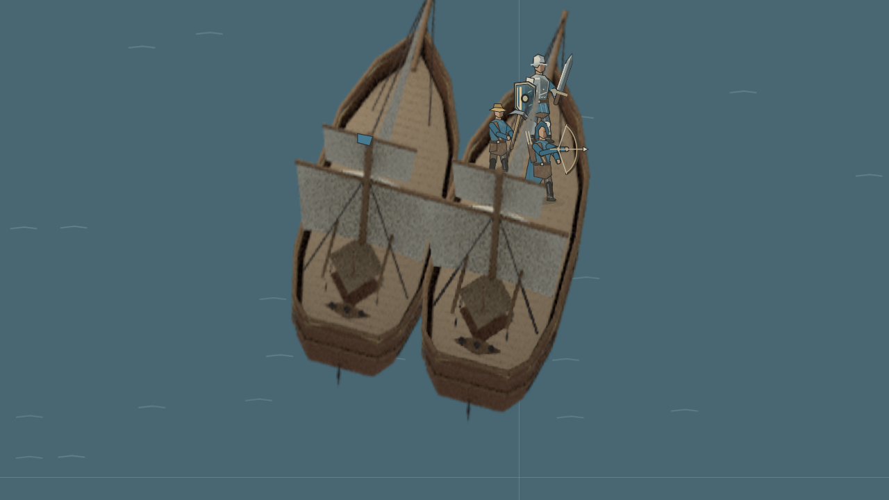

# 操船、接舷与船体修理

选中船上的船员，右键另一艘船，即创建接舷任务。己方空闲船可以共同靠拢；敌方或盟友的船不会被这个任务指挥。新的船舶指令会取消隐含的靠拢，船员更换任务后也不会留下无人负责的航行。

两船通过普通航行指令到达并排接触的姿态，仍受完整船体、推进速度和转向速度约束。船员随后沿联合支撑面步行，不通过换船命令瞬移。跨越接缝后继续使用联合支撑面，直到整个身体走入目的甲板的站位。多人共用入口时，较大的身体先通过，等待的船员在原甲板让出通道；目的站位避开入口。保留敌方船员的船不会变更所有权。

[实际引擎与游戏渲染器录制的接舷片段](../art/combat-refinement/crew-rendezvous.mp4)。场景位于 `src/recorder/scenes/crew-rendezvous.ts`，采用实际客户端右键命令生成器和普通命令帧执行。完整场景从两船分离开始，三人约在第 37 秒完成转移；视频展示第 25 至 40 秒。

航路按实际操纵耗时计价：推进距离除以相应航速，加上转角除以转向速度。直接长距离航行先以最短转角朝前行驶，短距离操船和受限航道仍可倒航。倒航速度由引擎限制为前进速度的 40%，重复请求不能突破单步预算。同一个航路入口的八个朝向共用前进与后退扫掠检查，再分别验证末端转向。

舰炮选择能进入射界的最近船体朝向。较近的炮群可以在最多额外十度的调整内协同，不能为遥远一侧更大的炮群放弃近侧射界。计算依据真实炮位、射程和最近目标表面，与物品排列顺序无关。明确的移动、跟随和卸载任务保留航向；可以在现有射界内反击。闲置、守卫和攻击任务继续允许主动调整炮向。

医疗治疗、自动治疗、治疗建筑、治疗卷轴与生命再生不修复船体。农民修船仍可修复船体及组件。V5、V7 和 V8 的治疗规划也使用同一个目标规则，避免追着受损船体施法或集结。

验证：完整测试 248 个文件、2,012 项通过，生产 TypeScript、客户端和服务器构建通过。回归覆盖远距离左右最短转向、自动炮向不抢航行命令、近侧射界、倒航预算、己方共同靠拢、敌船单侧接近、多人完整转移、夺船条件、新指令取消和接舷中途存档恢复。

十五分钟 V5/V7/V8 四方 Broken Sea 对局实测：平均单步 1.86 毫秒，P99 32.01 毫秒，最大 126.74 毫秒，18,000 步中 72 步超过 50 毫秒；结束时有 52 个单位、13 艘船。这是容器中的模拟耗时，个别寻路峰值仍存在，不代表所有地图与设备都能保持相同耗时。
