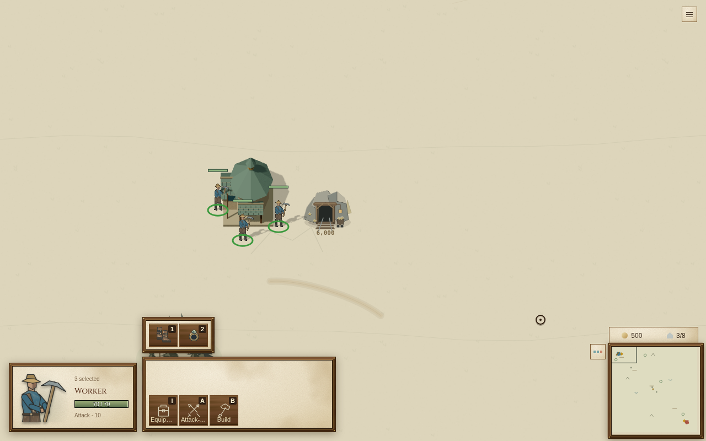
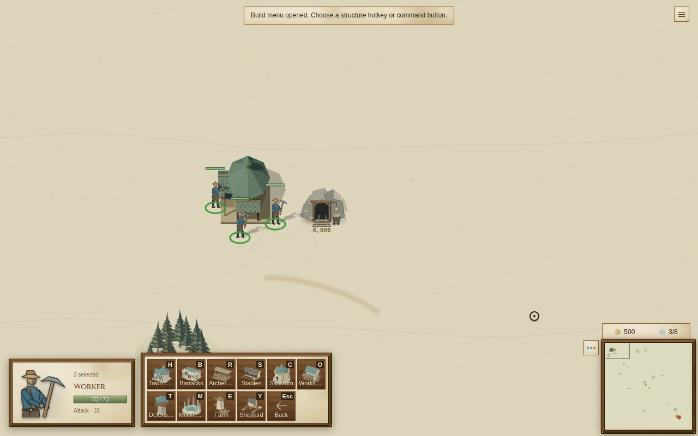
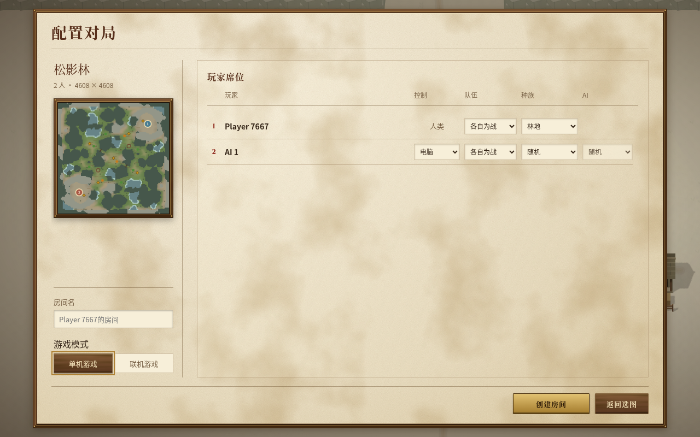
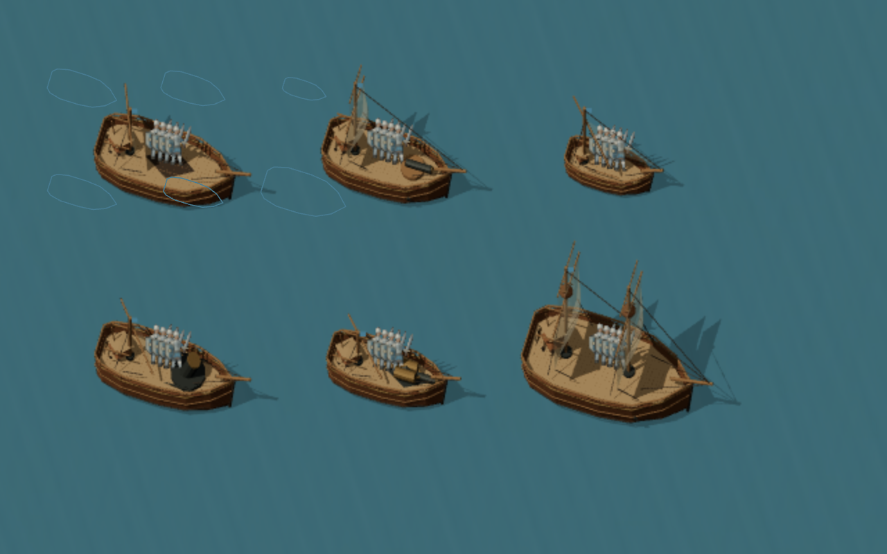

# 系统方向与战斗面板验证

本轮先修复操作面板的几何关系、明确单机与联机入口，再调研航海系统和 RTS 架构。研究依据是官方介绍、官方截图和开源实现；没有把商业游戏的介绍当作亲自游玩的结论。

## 本批改动

选中卡、命令区、物品区分别使用独立边框。命令区固定两行，少量按钮贴底，物品向上扩展；进入建造页时保留该单位的物品空间。尺寸、换行和断点统一由 `battle-hud.css` 管理，`game-ui.css` 只设置材质。删除主题中的布局覆盖，没有增加运行时尺寸测量。

创建对局使用原生单选按钮切换「单机游戏 / 联机游戏」，保留现有路由和运行时模型。浏览器实际验证：单机创建不发送 `POST /api/rooms`，联机创建发送 public 房间请求；刷新恢复选择，方向键可切换。

### 布局指标

1280 × 800 浏览器，三个农民，其中一人携带两件物品。修改前通过替换为 main `21c9b37` 的两份完整样式表测量，DOM、单位、物品和操作流程保持一致；修改后用同一流程测量。

|指标|原普通页 → 建造页|本批普通页 → 建造页|
|---|---:|---:|
|命令区高度|59 → 117 px|137 → 137 px|
|命令区宽度|166 → 331 px|351 → 351 px|
|命令区顶部|663 → 655 px|647 → 647 px|
|命令区底部|722 → 772 px|784 → 784 px|
|整个控件区域高度|133 → 141 px|209 → 209 px|
|整个控件区域宽度|429 → 605 px|593 → 593 px|

640 × 800 下，命令区普通页和建造页均为 127 px，选中卡顶部均为 478.5 px；没有页面横向溢出。额外向真实命令区插入 20 个按钮验证滚动后末项可见，这只是布局压力检查，不代表真实训练队列测试。

物品空间使用已有的物品投影结果，不额外扫描一次库存。几何职责从两份样式表收敛到一份；这是布局职责调整，不宣称改善模拟性能。本批没有增加 fallback、compatibility 或异常恢复分支。

相关界面、路由与部署适配测试 42 项通过；部署工作流使用的发布和渲染测试 89 项通过；`npm run build:production` 通过。完整旧 `e2e-room-flow.mjs` 未运行：其部分流程仍假设单机房间存储在服务器；本批单机与联机验证直接观察真实浏览器请求。

## 当前系统

- 共享模拟为 20 Hz；单机与联机使用同一套规则。联机已经有命令帧、检查点、checksum 和回放结构，优化应围绕单局的计算与状态投影展开。
- 船体、甲板、装载、炮位、索具与船舵损坏已经存在。`shipMotionLimits` 把损坏、载重和重心连接到速度与转向；新航海系统应扩展这个规则入口。
- AI 的 `navalServices` 已经规划船员转移、维修与夺船，并按快照缓存结果；其任务预留可作为舰队协作的起点。
- 正式画面是 Canvas 地形与叠加层、Three.js WebGL2 实体。人物和 GLB 部件已按几何、材质、队色等实例化。
- `main.ts` 当前约 3407 行，`sim.ts` 约 3787 行。但拆文件本身不能证明优化。`frame → syncActiveGameAdapterSnapshot → updateHud` 每次浏览器帧都会运行，`frontend-world-view` 和 `world-layer` 又各自构造部分实体查询结构；需要记录它们实际的调用和分配成本。

## 已查阅的游戏与实现

|参考|实际查阅内容|适合本项目的机制|
|---|---|---|
|[大航海时代 II](https://store.steampowered.com/app/628170/)|官方介绍和角色界面截图；冒险、海盗、商业三类声望|探索、战斗、贸易应消费同一个世界状态；先做可相互影响的规则|
|[航海时代 Sailing Era](https://store.steampowered.com/app/2161440/)|官方介绍，以及贸易、港口、造船截图|货舱容量、港口价格与发展、风向和航线形成取舍；港口是规则节点|
|[Ultimate Admiral: Age of Sail](https://store.steampowered.com/app/1069650/)|官方介绍与舰队作战截图|按船型建立风向速度曲线；索具、船员、载重影响机动；运输和登陆形成海陆协同|
|[Naval Action](https://store.steampowered.com/app/311310/)|官方介绍|航向、帆装、装载和部位损伤联动，舰队损耗反过来影响任务选择|
|[OpenRA OrderManager](https://github.com/OpenRA/OpenRA/blob/bleed/OpenRA.Game/Network/OrderManager.cs) / [SyncReport](https://github.com/OpenRA/OpenRA/blob/bleed/OpenRA.Game/Network/SyncReport.cs)|命令按逻辑帧处理，同步报告记录帧号、随机状态、命令与实体状态摘要|用同一命令流和逐帧 checksum 证明架构变更保持规则一致；不用用户量增长来论证重写网络|
|[BAR buildmenu](https://github.com/beyond-all-reason/Beyond-All-Reason/blob/master/luaui/Widgets/gui_buildmenu.lua) / [ordermenu](https://github.com/beyond-all-reason/Beyond-All-Reason/blob/master/luaui/Widgets/gui_ordermenu.lua)|建造与一般命令分开；菜单更新状态与绘制缓存分开，避免重复获取选择列表|借鉴职责与数据更新边界；其重试和容错代码不作为本项目新增设计|

## 建议的实施顺序与验收

### 1. 快照查询与命令投影

先量 `frontend-world-view`、HUD、世界渲染与 AI 对同一快照的扫描、查询结构创建次数和临时对象分配，再选择实际热点。将共同的实体、所属玩家和甲板关系索引归属到明确的快照投影入口；逻辑帧变化时更新，选中和命令模式变化只重新计算对应视图。渲染时间、动画插值和输入事件仍有自己的更新边界。

验收：同一快照的公共索引构建次数为 1；连续显示同一快照时为 0；记录修改前后 200 / 1000 / 5000 单位的模拟、投影、绘制 CPU p50/p95 和分配量。规则不变的重构要求相同命令流逐帧 checksum 一致。不能把新增缓存数量或减少代码行数当成性能证明。

不先铺通用 ECS，不增加旧接口适配层；每批删除被替代的数据构造和调用路径。若测量无法证明收益，就不合并该项性能改动。

### 2. 风向进入现有航行规则

从固定风场和每船型的航向速度曲线开始，接入现有索具、载重和转向限制，并让路径代价、实际推进和 AI 使用同一个计算入口。随后再做抢上风、侧舷阵位等战术。现阶段不需要另起复杂天气或船体生命值系统。

验收：固定输入下，同船型不同风向的航程耗时有明确差异；索具损坏和载重仍按同一规则影响结果；寻路预测与实际航程耗时的误差需报告。固定种子、命令流和风场变化的回放必须逐帧一致。对狭水道、转向与逆风行程单独测模拟 p95。

### 3. 舰队任务与港口物流

先把已经存在的装载、航行、卸载、维修、护航目标组成有明确阶段和资源归属的舰队任务，供 AI 和玩家命令共同使用。再加入少量港口与货物规则，让航程、运力、损伤和目的港供需影响收益。这样可借鉴大航海时代的取舍，而不立即铺完整世界经济。

验收：固定场景中记录完成运输量、任务完成时间、装卸次数、闲置时间、货物和船员守恒。AI 不得为完成一个任务重复发同一阶段命令；同一船体的任务所有权唯一。以现有运输、维修和海战测试作为行为基线。

## 实际 WebGL2 检查

云环境没有物理 GPU。Chromium 显式使用 ANGLE + SwiftShader，加载正式 `WorldPresentation`、真实 GLB、人物纹理、阴影和水面着色器；读取实际 WebGL2 上下文，确认绘制像素、非零三角形和 `gl.NO_ERROR`。

冻结快照，640 × 400 绘制缓冲区，zoom 0.5；浏览器截图将画布显示为 1280 × 800。每场景预热 2 帧，记录 20 帧；不含模拟、战略 AI、联网与 HUD。该短诊断与其他浏览器验证共享云 CPU，时间数据也不是受控性能比较。

|场景|实际单位数|draw calls|三角形|CPU 提交 p50 / p95 ms|
|---|---:|---:|---:|---:|
|陆地军队|200|9|802|4.5 / 11.9|
|陆地军队|1000|9|4002|7.3 / 21.5|
|六船型，每船四名甲板船员|30|110|75514|10.1 / 59.4|

六艘船各自的甲板投影点均能拾取到对应甲板船员，甲板平面反投影误差小于 `1.4e-12` 地图单位。截图可检查选择时帆布透明显示与甲板船员。完整遮挡正确性仍需更多角度和动态场景验收。

原始诊断见 [webgl-diagnostic.json](system-directions/webgl-diagnostic.json)。200 到 1000 人的 draw calls 不变说明当前人物实例批处理确实运行；六种不同 GLB 部件和阴影使舰队提交量明显不同，应该继续分解材质、部件和 shadow pass。

SwiftShader 的 RAF 间隔不能换算成玩家显卡的实际游戏 FPS。现有证据支持保留引擎并分析具体热点，尚不足以决定更换引擎或宣称真实设备达到 60 FPS。硬件验收需要真实 WebGL2 GPU，在固定视角、分辨率、单位数与船员数下记录模拟、CPU、GPU 时间和帧间隔，分别验证水面、帆布、遮挡与选取。
