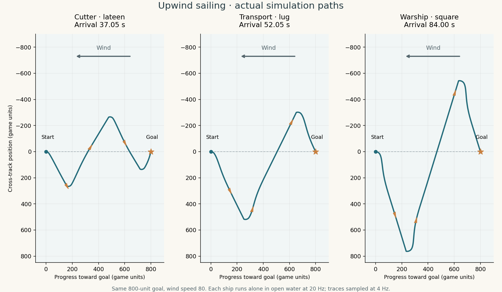
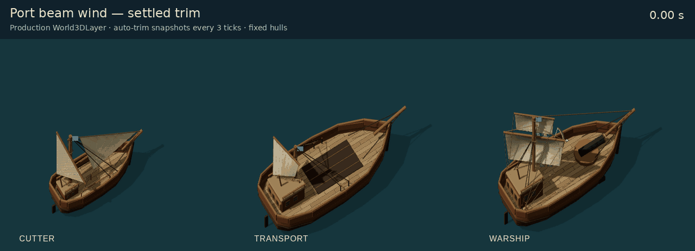

# 风力、自动调帆与迎风换舷

船的推进现在取决于风向、风速和帆装。船员自动调帆，普通移动命令在开阔水域迎风时会生成交替换舷航段；靠泊、倒船、狭窄水域及无风时保留低速辅助操纵。玩家仍使用原有移动和登船命令。

上图为独立单船仿真，目标均在正迎风 800 游戏单位处，初始船首朝向目标，风速 80；20 Hz 仿真、4 Hz 采样，橙色小船标记真实航向。灰虚线是目标连线。船型的物理速度和船长不同，因此该图展示实际表现，不是只改变帆型的受控速度实验。

## 动力与操作

地图保存均匀真风的方向和速度。方向表示风**吹向**哪里，单位为世界 XY 平面的弧度；风速使用游戏距离／秒，不能当作米／秒或蒲福风级。新对局初始风吹向东南、速度为 80；本版不生成随机天气。

- **真风决定航速**：按航向与来风方向的夹角查询简化极图，再乘以风力、调帆效率和展帆比例。轻风减速，强风下仍受原船体速度上限约束。载重及帆装损坏的影响继续生效。
- **视风决定帆角**：`视风速度 = 真风速度 − 船的实际世界速度`。船速来自本帧最终位移，保留倒船和外力推动的正负方向。不会把船速产生的视风再次作为动力，因此无风时帆推进严格为零。
- **调帆需要时间**：帆角每秒最多改变 60°，展开／收拢也逐帧进行。帆角偏差会降低推进效率；停止后收帆，辅助操纵时保留少量帆面。
- **不同帆装表现不同**：快船、火攻船和臼炮船采用拉丁帆极图；运输船采用 lug 帆极图；战船和运兵舰采用横帆极图。迎风禁区半角分别为 45°、50°、60°，横帆更擅长顺风航行。

这些角度、速度曲线和辅助推进比例是游戏平衡参数，未按历史船型实测数据标定。本版没有求解气动升阻力、横倾、侧滑或船体水阻。

## 导航

抢风角根据极图搜索最大的迎风速度分量（VMG），分别为 59°、64°、73°，避免把航线放在帆推进为零的禁区边缘。规划器在安全参考航段上尝试一对换舷点，检查两侧可用水域、整船转向扫掠和其他船只；空间不足时缩短尝试或交回低速操纵。

换舷点是路径跟随的强制边界，前视点不会越过它直接抄近路顶风。换舷途中允许持续转舵穿越禁区，避免把转向速度和零帆推进相乘而永远卡住。低速辅助上限为当前船体速度上限的 20%；它是 RTS 操作上的明确折中，沿用毁帆时失去推进的损坏规则。

无法展开抢风时记录尝试位置，每移动 1.5 船长重新评估，既避免在狭水道中每帧重算，也让船出海后恢复抢风。巡航切换精确倒船先制动，倒船与支点转弯都严格受辅助速度限制，不沿用原有高速动量。

帆状态、实际船速、换舷点和风场均属于确定性仿真状态，随快照保存并参与校验；没有依赖渲染帧率的物理状态。风场改变时，现有航线会失效并重新规划。

显式指定泊位朝向和接船目标仍使用精确航路：远处可航风向使用帆动力，距离落点 0.75 船长以内减速辅助，逆风精确航段也允许辅助。因此自动抢风主要作用于普通巡航，暂未把远程接舷拆成“抢风接近＋最后靠泊”的多阶段任务。

校验版本更新为 10。普通旧对局存档缺少风和帆状态时可继续载入并使用默认风；依赖逐帧重放的剧情存档保留原有版本限制，不会跳过校验强行接受旧规则的回放。

## 显示

动画使用生产 `World3DLayer`、最终 GLB 和自动调帆产生的快照，船体固定以便观察帆装；每三仿真帧取样，共 67 张实际 WebGL 画面。不是完整对局录像。[四种状态静态对照](art/sail-trim-states.png) · [选中甲板船员时的透明帆](art/sail-crew-reveal.png) · [资产指纹与渲染记录](art/sail-render-review.json)。

横桁和纵帆随帆角转动，艏帆绕其支索转动；帆布使用正鼓、反鼓及收帆的原生形变目标。动态控帆索端点跟随桁端和帆角。画面在仿真快照之间插值，拾取与头像也使用实际形变后的几何。

拥有或选中船只时，小地图上方显示风向箭头与简短风力刻度。悬浮说明解释方向和自动操帆规则；单位卡片仅在换舷或辅助操纵时增加临时状态，不常驻帆角、机械分类等说明。

## 参考

- [ArduPilot：Sailboat configuration](https://ardupilot.org/rover/docs/sailboat-configure.html)：真风禁区、自动换舷与帆角控制的职责区分；本项目只借鉴控制思路。
- [ArduPilot：Sailboat hardware](https://ardupilot.org/rover/docs/sailboat-hardware.html)：帆船的舵、帆控制和辅助推进。
- [UK Sailmakers：True wind](https://www.uksailmakers.com/encyclopedia/glossary/true-wind/)：真风、视风与船速的向量关系。
- [ORC：Velocity Prediction Program](https://orc.org/organization/velocity-prediction-program-vpp)：用风速和航向表示船速性能的极图概念。

实现位于 `src/shared/ship-wind.ts`、`ship-navigation.ts`、`ship-guidance.ts` 和 `sailing.ts`。帆装生成与渲染分别位于 `tools/art/` 和 `src/client/world3d/`。

## 航行与存档验证

- 最终全量 Vitest：298 个文件、2,488 项测试通过；`npm run build:production` 的 TypeScript、客户端与服务端构建通过。
- 90 组开阔水域组合（六船型、五种目标方向、三种距离）全部到达。曾发现短距离接近迎风禁区时推进和转向同时趋零，修复后增加六项专门回归；微风 8／20／40 下的直行与转向也检查到达和模式切换。
- 新增核心风力、自动调帆、换舷导航和存档测试；覆盖无风不产生帆动力、两舷对称、载重／断帆／断舵、岸线与船只阻挡、风变重规划、真实倒船速度、收帆，以及换舷途中恢复后的逐 tick 校验和一致。
- 既有接舷、跨船维修、捕获、岛屿殖民和菜单船队回归通过。对确认因低速靠泊、离泊、接舷和维修变慢的场景延长时间预算，保留船体合法性、无重叠和存档校验断言；远程追船误用全程辅助的问题直接修复。
- 最终修复后的 300 仿真秒 AI 海战压力检查：平均 tick 0.962 ms、P99 8.48 ms、最慢 252.47 ms，5 帧超过 50 ms。仍存在单帧重规划尖峰；风力改变战局，结果仅表示这一对局的负载，不是同快照性能比较。

## 动态资产与检查

六船 GLB 合计 **3,152,532 字节（3.01 MiB）**，比上一阶段静态船模小 326,168 字节；整个 PR 相对主分支增加约 892 KiB。动态帆边、缝线和操纵索改为共享几何实例，抵消了新增形变目标的部分开销。无新增贴图或运行时依赖，物理几何 JSON 保持逐字不变。

| 船型 | GLB 字节 | 帆数 | 动态索实例 |
| --- | ---: | ---: | ---: |
| 臼炮船 | 446,268 | 1 | 52 |
| 运兵舰 | 783,932 | 4 | 240 |
| 快船 | 460,592 | 2 | 101 |
| 火攻船 | 453,120 | 1 | 52 |
| 运输船 | 454,472 | 1 | 74 |
| 战船 | 554,148 | 2 | 120 |

- 主帆在两侧最大帆角、正反鼓帆和部分／完全收帆组合下检查净空。横帆反鼓深度有限，避免布面穿过桅杆；纵帆经导索轮引向系索点，避免收帆时控帆索切过桅杆或舱顶。
- 艏帆绕实际支索轴旋转，按元数据限制角度。1° 步进、七种鼓帆量和五种收帆量合计 4,585 个姿态通过，和主帆最小间隙约 2.08 模型单位。
- 最终二进制资产在七种鼓帆量、五种收帆量下无非有限坐标、退化面或反向法线；1,205 个帆面索端与实际形变顶点的最大误差约 `1.21e-5` 模型单位。
- 实际 Chromium / SwiftShader 的生产 `World3DLayer` 展示六船型，检查两侧受风、顺风、换舷、收帆和选中船员的帆布透明；未出现页面异常、资源请求失败或 WebGL 错误。中英风向反馈无溢出，悬浮说明可用键盘聚焦。这是功能验收，不代表实体显卡帧率。
