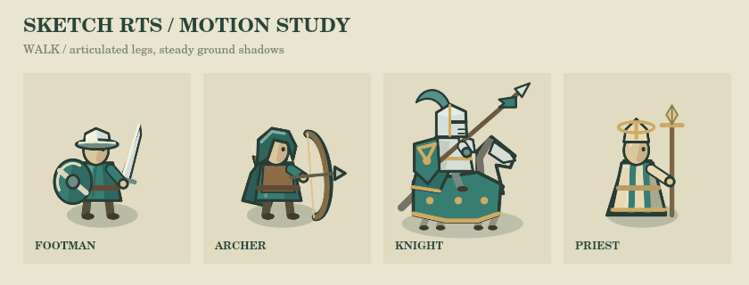
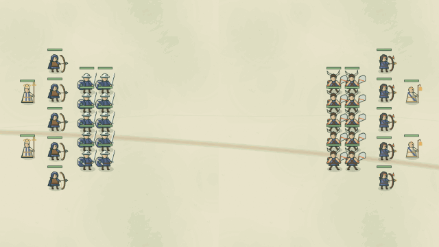

# 兵种动作 · 第二阶段

分支 `visual/unit-animation` 基于第一阶段 `visual/unit-readability`，两轮改动独立提交，第一阶段尚未提交到远端。

## 变化

- 实际位移驱动八帧走路姿态，脚步按单位 ID 错开；共用人形腿部及马匹四肢交替运动。
- 观察武器冷却增加触发六帧出手与恢复姿态，不根据攻击命令空挥刀；法术冷却独立触发抬杖和短暂光效。
- 林野基础步兵、射手、长枪兵、守卫、骑士、三种法师，以及余烬主要步兵与施法者，持握的手和装备共用旋转支点。
- 阴影不随身体上下起伏，头像保持静止；浏览器中尊重系统的减少动态效果偏好。
- 动作跟随模拟快照和有界的帧内插值；暂停、长时间断档、回退、死亡移除、击退与眩晕有对应处理。
- 浏览器、菜单和无头录像共用动作跟踪器。姿态精灵使用有数量和像素预算限制的 LRU 缓存，约 48 MiB 像素数据上限，不含 Canvas 实现自身开销。

不修改命中时刻、伤害、寻路或模拟快照。第一帧出手跟随实际攻击，后续为恢复动作；没有增加会推迟伤害判定的攻击前摇。

## 预览

动作展示页采用真实单位画法放大，按预设状态循环，便于检查关节；不是实战录像。

下面是原有 infantry-clash 场景在真实模拟中运行并录制的 5 秒片段：

重建动作展示：`node --import tsx scripts/render-animation-review.ts`。

重建实战录像：`node --import tsx src/recorder/cli.ts --scene infantry-clash --seconds 5 --fps 20 --size 960x540 --out docs/art/animation/infantry-clash.gif --gif-size 640x360 --hide-orders`。

## 验证和限制

- `npm run build:static` 通过，保留原有大包体提示。
- `npx vitest --run src/client src/recorder`：53 个测试文件、249 项测试通过。
- 新增 8 项动作状态测试，包括堵路、冷却事件、独立施法、暂停、回退、传送、击退、眩晕及快照不变性。
- 录像现有确定性像素测试通过；检查动作展示与实战画面。
- 本轮优先覆盖共用人形骨架、骑乘及主要可训练兵种。野兽、构装体、船只没有专门的关节动画；自定义战役模型仍使用原画法。没有进行大军团 FPS 基准或完整联机回归。
