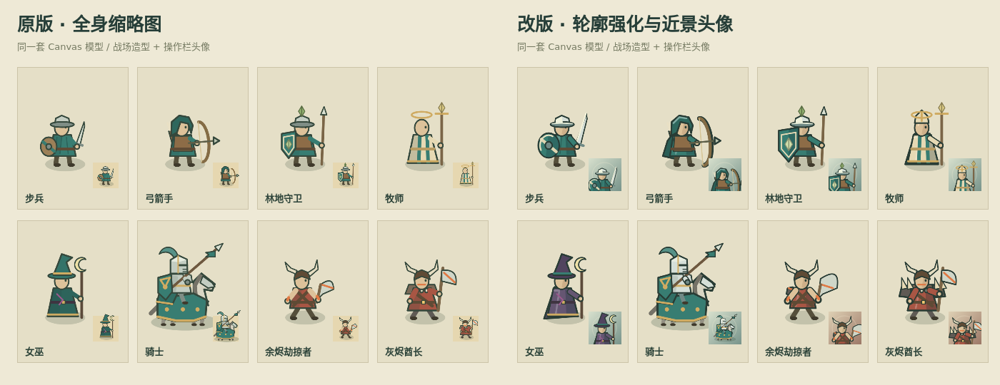
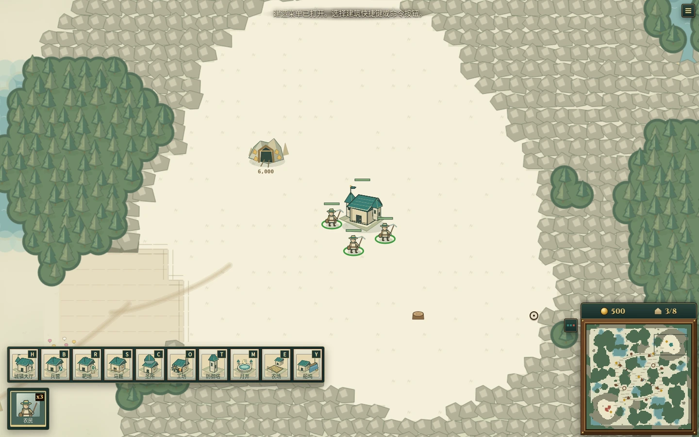
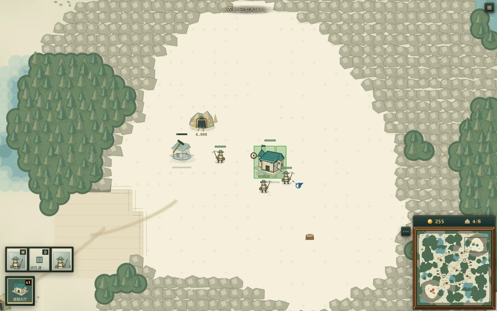
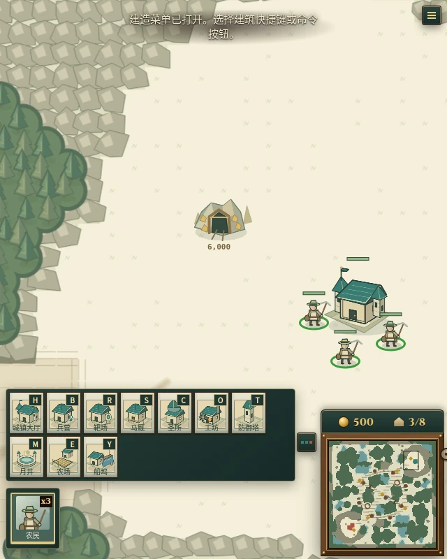

# 兵种辨识度与操作界面改进

基于上游 `7b38a8e`，本地分支 `visual/unit-readability`。

## 评价

这已经是一套能运行完整对局的 RTS 原型：经济、建筑、双种族、兵种克制、野怪、物品、运输船，以及共用命令帧模拟的浏览器、SDK 与 AI。代码中尤其值得保留的是单位卡片同时驱动名称、说明、图标和绘制，以及有界的精灵缓存。相比单纯的网页小游戏，其可编程对手与实验工具链是更有辨识度的方向。

人口上限兼作科技门槛，减少了独立科技树的负担，同时使扩张、经济与高级兵解锁发生联系；是否有足够丰富的策略分支，需要更多完整对局与统计来判断。此次只进行了开局流程和呈现验证，没有据此宣称平衡性或长期耐玩度已经得到验证。

原有美术的优点是纸面地图、绿色屋顶与手绘小人的统一性。主要不足在于：若干步兵和法师的头身轮廓接近；全身造型缩进 34–36px 小格后，装备与面孔难以识别；厚木框、纸面噪点和信息争抢注意力。建筑中，若干生产建筑也依赖细小的功能徽记区分，这次没有重做建筑轮廓。

## 本轮修改

- 步兵扩大圆盾、加长剑；林地守卫使用更大的长盾；弓箭手增加肩披与长弓轮廓。
- 牧师增加头饰；召唤师增加肩饰；女巫使用紫色袍服与保留队色的帽带。
- 余烬劫掠者强化肩甲和斧刃；灰烬酋长强化骨刺肩部轮廓；火花弓手强化弓的外形。
- 共用画笔增加局部明暗、盾面分面和武器边缘对比。这些细节在缓存精灵生成时绘制，不新增每帧滤镜或动态光源。
- 新增共用近景头像：步行单位突出头部和装备，骑乘单位及其他非人形保留整体轮廓。按钮和选中头像仍来自真实单位模型。
- 头像画布提高到 96px，显示为 46–48px；指令卡增加名称、明显的快捷键角标；选中卡显示名称与数量，保留完整提示框。
- 操作面板改为深绿底与细黄铜边；纸面提示减轻纹理；命令、物品、选中栏自动堆叠，窄屏下换行与滚动。

本轮没有修改模拟规则、单位数值、碰撞半径、攻击判定或 AI，也没有新增运行依赖。

## 实际画面

以下图形由修改前后的 Canvas 绘制函数生成，大图等比例放大；右下小格对应各自版本的指令头像显示尺寸，不是概念效果图。

## 验证与边界

- `npm run build`：类型检查与生产构建通过。
- `npm run build:static`：类型检查与静态构建通过。Vite 仍提示主包超过 500 kB，未进行代码拆包。
- `npx vitest --run src/client`：50 个测试文件、229 项测试通过。
- Chromium：创建单人房间、开始对局、获取鼠标锁定、选择及框选农民、打开建造菜单、放置兵营、选择主城并加入农民训练队列；检查过程中未记录到页面异常。
- 检查 1440×900 桌面画面、640px 窄窗口建造栏及 390px 英文窄屏呈现。窄屏呈现检查不等于提供触屏操作；原项目的触屏指挥尚未实现。
- 没有进行完整对局平衡测试、联机回归或帧率基准。自定义战役模型没有逐个进行视觉验收。

## 运行与后续方向

源码仍使用原来的启动流程：`npm ci`，然后 `npm run dev`。查看全兵种可在开发服务中打开 `/unit-sheet.html`。仅运行本地电脑对手可用 `npm run dev:static`。

下一步优先做独立于模拟的走路、挥砍、施法和受击动画，再做生产建筑的轮廓差异；这些会比继续增加装饰纹理更明显地改善战场观感。当前头像复用了模型，后续修改兵种不必另画一份头像素材。
